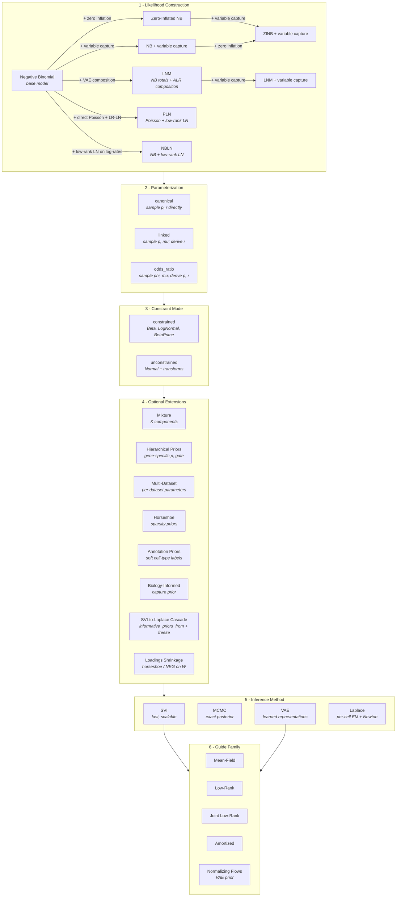

<p align="center">
  
</p>

# SCRIBE: Single-Cell RNA-seq Inference with Bayesian Estimation

SCRIBE is a comprehensive Python package for Bayesian analysis of single-cell
RNA sequencing (scRNA-seq) data. Built on `JAX` and `NumPyro`, SCRIBE provides a
unified framework for probabilistic modeling, variational inference, uncertainty
quantification, differential expression, and model comparison in single-cell
genomics.

## Generative Model

<p align="center">
  
</p>

SCRIBE is grounded in a biophysical generative model of scRNA-seq count data.
Transcription (rate $b$) and degradation (rate $\gamma$) set the steady-state
mRNA content per gene, giving rise to a Negative Binomial distribution over
true molecular counts $m_g$ with parameters $r_g$ and $p_g$. During library
preparation each molecule is independently captured with cell-specific
probability $\nu^{(c)}$, so the observed UMI count $u_g$ follows a Binomial
sub-sampling of $m_g$. Marginalizing over the latent counts yields a Negative
Binomial likelihood for the observations with an effective success probability
$\hat{p}_g^{(c)}$ that absorbs the capture efficiency.

For modeling gene-gene covariance directly, SCRIBE also implements **GRN-derived
joint models** (PLN and NBLN) in which the per-cell latent log-rate vector
$\mathbf{x}^{(c)}$ is drawn from a multivariate Gaussian with low-rank
covariance $\Sigma = \mathbf{W}\mathbf{W}^\top + \mathrm{diag}(\mathbf{d})$.
The loadings matrix $\mathbf{W}$ is the model's account of co-expression
structure -- a generative property that distinguishes these models from
NBDM/NBVCP families, where any apparent gene-gene coupling lives only in the
variational guide. Inference for PLN and NBLN uses a Laplace-EM procedure that
maintains a per-cell latent MAP alongside the global parameters; the NBLN
branch additionally supports an SVI-to-Laplace cascade with column-wise
shrinkage priors on $\mathbf{W}$ for adaptive rank selection.

## Why SCRIBE?

- **Unified Framework**: Single `scribe.fit()` interface for SVI, MCMC, VAE, and
  Laplace inference methods
- **Compositional Models**: Constructive likelihoods -- from the base Negative
  Binomial up to zero-inflated models with variable capture probability
- **GRN-Inspired Joint Models (PLN / NBLN)**: Correlated log-normal rates with
  low-rank covariance $\Sigma = \mathbf{W}\mathbf{W}^\top + \mathrm{diag}(\mathbf{d})$
  give a generative story for *gene-gene covariance itself*, not just per-gene
  marginals -- principled co-expression structure instead of variational-guide
  artifacts
- **SVI-to-Laplace Cascade**: Anchor the harder NBLN-Laplace fit on a converged
  NBVCP-SVI source, freeze the gauge-vulnerable parameters, and let a horseshoe
  shrinkage prior pick the effective rank of the loadings matrix adaptively
- **Compositional Differential Expression**: Bayesian DE in log-ratio
  coordinates with proper uncertainty propagation and error control (lfsr, PEFP)
- **Model Comparison**: WAIC, PSIS-LOO, stacking weights, and goodness-of-fit
  diagnostics for principled model selection
- **GPU Accelerated**: JAX-based implementation with automatic GPU support
- **Flexible Architecture**: Three parameterizations, constrained/unconstrained
  modes, hierarchical priors, horseshoe sparsity, and normalizing flows
- **Scalable**: From small experiments to large-scale atlases with mini-batch
  support

## Key Features

- **Four Inference Methods**:
  - SVI for speed and scalability
  - MCMC (NUTS) for exact Bayesian inference
  - VAE for representation learning with normalizing flow priors
  - Laplace approximation for PLN- and NBLN-family models with per-cell latents
- **Constructive Likelihood System**: Negative Binomial as the base, extended
  with zero inflation and/or variable capture probability
- **GRN-Inspired Joint Models**: PLN (Poisson + low-rank log-normal) and NBLN
  (NB + low-rank log-normal) for gene-gene covariance from a correlated
  log-rate prior, with EM-based Laplace inference and gauge-invariant
  compositional accessors
- **SVI Cascade Workflow**: `informative_priors_from`,
  `informative_priors_freeze`, and `priors={"loadings": {...}}` chain a
  well-identified NBVCP-SVI fit into the harder NBLN-Laplace problem -- pinning
  the gauge, regularizing the loadings matrix with horseshoe / NEG sparsity,
  and adaptively selecting the effective rank
- **Multiple Parameterizations**: Canonical, linked (mean-prob), and odds-ratio
  with constrained or unconstrained priors
- **Advanced Guide Families**: Mean-field, low-rank, joint low-rank, and
  amortized variational guides
- **Mixture Models**: K-component mixtures for cell type discovery with
  annotation-guided priors
- **Hierarchical Priors**: Gene-specific and dataset-level hierarchical
  structures with optional horseshoe sparsity
- **Bayesian Differential Expression**: Parametric, empirical (Monte Carlo), and
  shrinkage (empirical Bayes) methods in CLR/ILR coordinates
- **Compositional PPC Diagnostics**: 1D and corner-grid posterior predictive
  checks on cell compositions, count-space joints, and the W-shrinkage spectrum
  for rank-selection sanity
- **Model Comparison**: WAIC, PSIS-LOO, stacking, per-gene elpd, and
  goodness-of-fit via randomized quantile residuals
- **Seamless Integration**: Works with AnnData and the scanpy ecosystem
- **Custom Distributions**: BetaPrime, LowRankLogisticNormal,
  LowRankPoissonLogNormal, SoftmaxNormal with registered KL divergences

## Model Construction Space

SCRIBE models are built compositionally. The likelihood is constructed by
layering extensions on top of a base Negative Binomial (NB) model, then
configured with a parameterization, constraint mode, optional extensions, and an
inference method:



This compositional design means you can combine **6 likelihood families x 3
parameterizations x 2 constraint modes** as a starting point, then layer on
mixture components, hierarchical priors, multi-dataset structure, and more.
The LNM, PLN, and NBLN families extend the NB core with low-rank
log-normal latent structure for gene-gene covariance; PLN and NBLN are
fit with Laplace inference, while LNM is fit through the VAE path.

## Available Models

### Likelihood Construction

SCRIBE's four likelihoods build on each other -- the base Negative Binomial model
can be extended with zero inflation and/or variable capture probability:

| Likelihood                       | Code string     | Construction               | Extra Parameters                   | Best For                         |
| -------------------------------- | --------------- | -------------------------- | ---------------------------------- | -------------------------------- |
| **Negative Binomial**            | `"nbdm"`        | Base model                 | --                                 | Baseline analysis, fast          |
| **Zero-Inflated NB**             | `"zinb"`        | NB + zero inflation        | `gate`                             | Data with excess zeros           |
| **NB + variable capture**        | `"nbvcp"`       | NB + capture probability   | `p_capture`                        | Variable sequencing depth        |
| **ZINB + variable capture**      | `"zinbvcp"`     | ZINB + capture probability | `gate`, `p_capture`                | Complex technical variation      |
| **Two-state promoter**           | `"twostate"`    | Poisson-Beta compound      | `burst_size`, `k_off`              | Bursty / bimodal genes (Phase 1) |
| **Two-state + variable capture** | `"twostatevcp"` | Two-state + capture prob   | `burst_size`, `k_off`, `p_capture` | Bursty genes with variable depth |

#### Logistic-Normal Multinomial (LNM) Family

The LNM models extend the NB models with a VAE-decoded compositional structure
using the additive log-ratio (ALR) transform. Counts are factored into total
counts (NB) and composition (Multinomial), with gene-gene correlations captured
by a low-rank Gaussian in ALR space.

| Likelihood           | Code string | Construction       | When to Use                         |
| -------------------- | ----------- | ------------------ | ----------------------------------- |
| **LNM**              | `"lnm"`     | NB totals + VAE    | Compositional inference with DE     |
| **LNM + var capture** | `"lnmvcp"` | LNM + capture prob | LNM with variable sequencing depth  |

#### Poisson-LogNormal (PLN) Family

The PLN model emits per-gene Poisson counts from correlated log-normal rates.
Unlike LNM, it does **not** factorize into total counts and composition -- total
counts emerge naturally as the sum of per-gene Poissons. This coupling through
the shared covariance eliminates the leftward PPC bias observed with separate
NB totals.

| Likelihood | Code string | Construction     | When to Use                              |
| ---------- | ----------- | ---------------- | ---------------------------------------- |
| **PLN**    | `"pln"`     | Poisson + VAE    | Absolute counts, no totals decomposition |

**When to use PLN vs LNM**: Use PLN when you care about absolute expression
levels and want to avoid the composition/totals decoupling assumption. Use LNM
when you need compositional DE in ALR/CLR coordinates or when the data naturally
separates into composition and library size.

#### Two-state Promoter (Poisson-Beta) Family

The two-state promoter likelihood is a Poisson-Beta compound — per-gene counts
emerge from `p_gc ~ Beta(α_g, β_g)` and `u_gc | p_gc ~ Poisson(r̂_g · p_gc ·
ν_c)`, with `p_gc` independent per `(gene, cell)`. It captures the bursty /
bimodal genes the NB family cannot fit (excess zeros simultaneously with a
heavy right tail, or literal bimodal histograms from slow promoter switching).
The closed-form NB is recovered in the `k_off → ∞` limit, so the two-state
model nests inside the NB family rather than competing with it.

The marginal log-likelihood is evaluated via fixed Gauss-Legendre quadrature
over `p`, with the Beta density evaluated at fixed nodes inside the integrand.
This sidesteps the Gauss-Jacobi eigendecomposition-adjoint NaN trap in the
U-shaped Beta regime (`α, β < 1`) where the bursty regime lives. The
implementation also draws an independent latent `p_gc` per `(g, c)` during
ancestral sampling — a subtle but critical correctness point for posterior
predictive distributions.

| Likelihood                 | Code string     | Construction            | When to Use                                 |
| -------------------------- | --------------- | ----------------------- | ------------------------------------------- |
| **TwoState**               | `"twostate"`    | Poisson-Beta compound   | Bursty / bimodal genes the NB cannot fit    |
| **TwoState + var capture** | `"twostatevcp"` | TwoState + capture prob | Bursty genes with variable sequencing depth |

##### Four TwoState parameterizations

All four sample `mu` (gene mean expression) plus two additional per-gene
parameters; the likelihood is identical, only the sampled coordinates differ.
Each successive parameterization fixes a distinct geometric pathology of
mean-field variational inference:

| Parameterization      | Aliases             | Extras sampled                          | Targets                                                 |
| --------------------- | ------------------- | --------------------------------------- | ------------------------------------------------------- |
| `two_state_natural`   | `natural`           | `burst_size`, `k_off`                   | Physics-natural; biophysical interpretation             |
| `two_state_ratio`     | `ratio`             | `burst_size`, `switching_ratio = k_off / k_on` | Regime axis scale-invariant across genes         |
| `two_state_mean_fano` | `mean_fano`, `fano` | `excess_fano = Var/Mean - 1`, `concentration = α + β` | Mean and predictive variance as sampled axes |
| `two_state_moment_delta` | `moment_delta`, `delta` | `excess_fano`, `inv_concentration = 1 / (κ + 1) ∈ (0, 1)` | Same as mean_fano but bounded shape coord; the NB-limit ridge becomes a boundary |

The natural parameterization is recommended for biophysical interpretation
(NUTS or careful SVI). For mean-field SVI on many genes with widely varying
expression, the ratio variant decouples regime from magnitude. When
posterior-predictive variance is the visible failure mode, the mean-Fano
variant samples `excess_fano` directly, which bounds the PPC width by
construction. The moment-delta variant adds a bounded shape coordinate that
prevents wasted variational mass on the unbounded NB-limit ridge. See
[paper/_two_state_promoter.qmd](paper/_two_state_promoter.qmd) §
*Alternative reparameterizations* for the full math.

##### Constrained vs unconstrained guides

All TwoState parameterizations support both `unconstrained=True` (the
default — Normal + transform variational posteriors) and
`unconstrained=False` (direct constrained distributions). The mapping is:

| Parameter                                                                      | `unconstrained=True`                                                | `unconstrained=False` |
| ------------------------------------------------------------------------------ | ------------------------------------------------------------------- | --------------------- |
| `mu`, `burst_size`, `k_off`, `switching_ratio`, `excess_fano`, `concentration` | `PositiveNormalSpec` / `SoftplusNormalSpec` (Normal + softplus/exp) | `LogNormalSpec`       |
| `inv_concentration` (∈ (0, 1))                                                 | `SigmoidNormalSpec` (Normal + sigmoid)                              | `BetaSpec`            |

This mirrors the NBDM family's constrained guide support. Set
`unconstrained=False` in the model config (or omit `.unconstrained()` in
the builder) to use the constrained path.

##### Per-parameter `positive_transform`

Under ``unconstrained=True`` every positive parameter is sampled as a
``Normal`` on the unconstrained real line and mapped to the constrained
support through a positivity transform. Scribe lets you pick the
transform either globally or per parameter:

```python
# Global (every positive parameter uses softplus)
scribe.fit(..., positive_transform="softplus")

# Global exp
scribe.fit(..., positive_transform="exp")

# Per-parameter override: mu uses exp, everything else stays softplus
scribe.fit(..., positive_transform={"mu": "exp"})

# Descriptive aliases work too
scribe.fit(..., positive_transform={"mean_expression": "exp"})
```

**Default for the TwoState family**: ``{"mu": "exp"}``. Other positive
parameters (``burst_size``, ``k_off``, ``p_capture``, ...) keep
softplus. The ``softplus`` Jacobian saturates to 1 in the large-loc
regime, leaving the optimizer with *additive*-step geometry on a
quantity that varies multiplicatively across ~3-5 orders of magnitude
between genes — SVI then needs many thousands of iterations to climb
to the right gene-mean. ``exp`` (i.e. LogNormal on the constrained
side) gives the optimizer *multiplicative*-step geometry, recovering
the correct gene mean in a small number of steps even when the
data-driven anchor is off by the capture factor. For other models
the default is ``"softplus"`` (legacy behavior).

**Phase 1 limitations**: mixtures, VAE inference, multi-dataset indexing, BNB
overdispersion, and the Poisson-Gamma denoiser are not yet wired for the
TwoState family. Biology-informed capture priors *are* supported (via
``priors={"capture_efficiency": (log_M0, sigma_M)}``); their math is
likelihood-agnostic, anchored by closure under binomial thinning. Build-time
validation rejects the still-unsupported combinations with a clear directive.

#### Negative-Binomial LogNormal (NBLN) Family

NBLN is the heavier-tailed sibling of PLN: per-gene NB counts with a per-gene
dispersion ``r_g`` instead of Poisson, drawn from the same correlated log-normal
rate structure ``Σ = WW^⊤ + diag(d)``. Use it when PLN's residual variance
underfits gene-level overdispersion (the common case on real scRNA-seq).

| Likelihood | Code string | Construction     | When to Use                                                                              |
| ---------- | ----------- | ---------------- | ---------------------------------------------------------------------------------------- |
| **NBLN**   | `"nbln"`    | NB + low-rank LN | Absolute-count compositional model with per-gene overdispersion; uses Laplace inference. |

NBLN-Laplace ships with a three-stage stable workflow:

1. **SVI cascade** — fit NBVCP-SVI first, then pass the result via
   ``informative_priors_from=svi_result`` to seed NBLN-Laplace with
   data-derived empirical priors on ``r``, ``mu``, ``eta``.
2. **Cascade freeze** — the default ``informative_priors_freeze=("r",
   "eta")`` pins the rigid-translation gauge structurally; only the
   free parameters (``mu``, ``W``, ``d``) refine during the NBLN
   M-step. Descriptive aliases like ``("dispersion",
   "capture_efficiency")`` are also accepted.
3. **Loadings shrinkage** — pass
   ``priors={"loadings": {"type": "horseshoe_columnwise", ...}}`` to
   regularize the low-rank loadings matrix and pick the effective
   rank adaptively (also ``gaussian`` and ``neg_columnwise``).

```python
# 1. SVI cascade source (NBVCP).
svi_results = scribe.fit(
    adata,
    model="nbvcp",
    parameterization="mean_odds",
    priors={"capture_efficiency": (np.log(100_000), 0.5)},
    inference_method="svi",
    n_steps=250_000,
)

# 2 + 3. NBLN-Laplace with cascade freeze + horseshoe loadings shrinkage.
nbln_results = scribe.fit(
    adata,
    model="nbln",
    inference_method="laplace",
    informative_priors_from=svi_results,
    informative_priors_freeze=("dispersion", "capture_efficiency"),
    priors={"loadings": {"type": "horseshoe_columnwise", "tau_scale": 1.0}},
    latent_dim=16,
    n_steps=25_000,
)

# Gauge-invariant compositional loadings + rank diagnostic.
W_perp = nbln_results.get_W_compositional()
print(nbln_results.w_prior_diagnostics["effective_rank"])
```

See ``docs/theory/nb-lognormal.md`` and
``docs/theory/loadings-shrinkage.md`` for the math and the
calibration workflow.

### Parameterizations

The NB-family likelihoods (nbdm / zinb / nbvcp / zinbvcp) accept three
parameterizations of the gene-level dispersion/mean structure:

| Parameterization | Aliases     | Core Parameters | Derived                   | When to Use                   |
| ---------------- | ----------- | --------------- | ------------------------- | ----------------------------- |
| **canonical**    | `standard`  | p, r            | --                        | Direct interpretation         |
| **linked**       | `mean_prob` | p, mu           | r = mu(1-p)/p             | Captures p-r correlation      |
| **odds_ratio**   | `mean_odds` | phi, mu         | p = 1/(1+phi), r = mu*phi | Numerically stable near p ~ 1 |

The TwoState family (twostate / twostatevcp) has its own four
parameterizations — see [the TwoState section](#two-state-promoter-poisson-beta-family)
above. The LNM family uses a separate decoder-based parameterization (see
[the LNM section](#logistic-normal-multinomial-lnm-family)).

### Constrained vs Unconstrained

| Mode              | Prior Distributions             | Use Case                                                |
| ----------------- | ------------------------------- | ------------------------------------------------------- |
| **Constrained**   | Beta, LogNormal, BetaPrime      | Default; interpretable parameters                       |
| **Unconstrained** | Normal + sigmoid/exp transforms | Optimization-friendly; required for hierarchical priors |

## Installation

### Using pip

```bash
pip install scribe
```

### Optional CLI/Hydra extras

Install CLI tools (`scribe-infer`, `scribe-visualize`) with Hydra support:

```bash
pip install "scribe[hydra]"
```

### Development Installation

For the latest development version:

```bash
git clone https://github.com/mrazomej/scribe.git
cd scribe
pip install -e ".[dev]"
```

If you also need CLI/Hydra workflows in development:

```bash
pip install -e ".[dev,hydra]"
```

### Docker Installation

```bash
docker build -t scribe .
docker run --gpus all -it scribe
```

## Quick Start

Get started with SCRIBE in just a few lines:

```python
import scribe
import scanpy as sc

# Load your single-cell data
adata = sc.read_h5ad("your_data.h5ad")

# Run SCRIBE with default settings (SVI inference, NB model)
results = scribe.fit(adata, model="nbdm")

# Analyze results
posterior_samples = results.get_posterior_samples()
```

### Customize with Simple Arguments

```python
# Zero-inflated model with more optimization steps
results = scribe.fit(
    adata,
    model="zinb",
    n_steps=100000,
    batch_size=512,
)

# Linked parameterization with low-rank guide
results = scribe.fit(
    adata,
    model="nbdm",
    parameterization="linked",
    guide_rank=15,
)

# Mixture model for cell type discovery
results = scribe.fit(
    adata,
    model="zinb",
    n_components=3,
    n_steps=150000,
)
```

### Poisson-LogNormal for Absolute Counts

```python
# PLN model -- no composition/totals factorization
results = scribe.fit(
    adata,
    model="pln",
    n_steps=50000,
    batch_size=512,
)

# Extract learned covariance structure
mu = results.get_pln_mu()     # (G,) mean log-rates
W = results.get_pln_W()       # (G, k) low-rank factor
corr = results.get_pln_correlation()  # (G, G) gene-gene correlations
```

### Negative-Binomial LogNormal with the Cascade Workflow

NBLN extends PLN with per-gene NB dispersion. Because the NBLN likelihood
has a rigid-translation gauge that couples per-cell capture, per-cell latent
log-rates, and per-gene dispersion, we fit it through a three-stage cascade:
a converged NBVCP-SVI source seeds the priors; a freeze pins the
gauge-vulnerable parameters; and a horseshoe shrinkage prior on the loadings
matrix `W` picks the effective rank from data.

```python
import numpy as np

# Stage 1: NBVCP-SVI source with a biology-informed capture prior.
svi_results = scribe.fit(
    adata,
    model="nbvcp",
    parameterization="mean_odds",
    priors={"capture_efficiency": (np.log(100_000), 0.1)},
    inference_method="svi",
    n_steps=250_000,
)

# Stages 2 + 3: NBLN-Laplace with cascade freeze + loadings shrinkage.
nbln_results = scribe.fit(
    adata,
    model="nbln",
    inference_method="laplace",
    informative_priors_from=svi_results,
    informative_priors_freeze=("dispersion", "capture_efficiency"),  # default
    priors={
        "capture_efficiency": (np.log(100_000), 0.1),
        "loadings": {"type": "horseshoe_columnwise", "tau_scale": 1.0},
    },
    latent_dim=32,
    n_steps=20_000,
)

# Gauge-invariant compositional loadings + adaptive-rank diagnostic.
W_perp = nbln_results.get_W_compositional()
print(nbln_results.w_prior_diagnostics["effective_rank"])

# Gene-gene correlation from the model's own covariance structure
# (not from a variational guide on an independent-counts model).
corr = nbln_results.get_correlation_compositional()
```

End-to-end tutorial: [`docs/tutorials/jurkat_cells_nbln.py`](docs/tutorials/jurkat_cells_nbln.py).
Theory: [`docs/theory/nb-lognormal.md`](docs/theory/nb-lognormal.md) and
[`docs/theory/loadings-shrinkage.md`](docs/theory/loadings-shrinkage.md).

### Choose Your Inference Method

```python
# Fast exploration with SVI (default)
svi_results = scribe.fit(adata, model="zinb", n_steps=75000)

# Exact inference with MCMC
mcmc_results = scribe.fit(
    adata,
    model="nbdm",
    inference_method="mcmc",
    n_samples=3000,
    n_chains=4,
)

# Representation learning with VAE
vae_results = scribe.fit(
    adata,
    model="nbdm",
    inference_method="vae",
    n_steps=50000,
)

# Joint gene-gene covariance with Laplace (PLN or NBLN)
laplace_results = scribe.fit(
    adata,
    model="pln",
    inference_method="laplace",
    latent_dim=16,
    n_steps=50000,
)
```

## Inference Methods and Guide Families

### Inference Methods

| Method      | Engine                            | Precision | Use Case                                                                            |
| ----------- | --------------------------------- | --------- | ----------------------------------------------------------------------------------- |
| **SVI**     | Adam optimizer                    | float32   | Fast exploration, large datasets                                                    |
| **MCMC**    | NUTS sampler                      | float64   | Exact posterior, gold standard                                                      |
| **VAE**     | Encoder-decoder                   | float32   | Latent representations, embeddings                                                  |
| **Laplace** | EM + per-cell Newton + outer Adam | float32   | PLN- / NBLN-family models with per-cell latents; gene-gene covariance via $WW^\top$ |

SVI results can initialize MCMC chains for faster convergence, even across
different parameterizations. They can also seed an NBLN-Laplace fit via the
`informative_priors_from` cascade (see the [NBLN section above](#negative-binomial-lognormal-nbln-family)):

```python
svi_results = scribe.fit(adata, model="nbdm", parameterization="linked")
mcmc_results = scribe.fit(
    adata,
    model="nbdm",
    parameterization="odds_ratio",
    inference_method="mcmc",
    svi_init=svi_results,
)
```

### Guide Families (Variational Approximation)

For SVI and VAE inference, SCRIBE offers several variational guide families:

| Guide              | Parameter                   | Description                                                    |
| ------------------ | --------------------------- | -------------------------------------------------------------- |
| **Mean-field**     | *(default)*                 | Fully factorized; fast, memory-efficient                       |
| **Low-rank**       | `guide_rank=k`              | Captures gene correlations via rank-k covariance               |
| **Joint low-rank** | `joint_params="biological"` | Shared low-rank covariance across parameter groups             |
| **Amortized**      | `amortize_capture=True`     | Neural net predicts capture variational params from UMI counts |

```python
# Low-rank guide capturing gene correlations
results = scribe.fit(
    adata,
    model="nbdm",
    parameterization="odds_ratio",
    guide_rank=15,
)

# Joint low-rank for correlated mu and phi
results = scribe.fit(
    adata,
    model="nbdm",
    parameterization="odds_ratio",
    unconstrained=True,
    hierarchical_p=True,
    guide_rank=10,
    joint_params="biological",  # resolves to ["phi", "mu"] for mean_odds
)
```

## Advanced Usage

### Mixture Models for Cell Type Discovery

```python
# Specify number of components
mixture_results = scribe.fit(
    adata,
    model="nbdm",
    n_components=5,
    n_steps=100000,
)

# Or let annotations define components automatically
mixture_results = scribe.fit(
    adata,
    model="nbdm",
    annotation_key="cell_type",
    annotation_confidence=3.0,
    n_steps=100000,
)

# Analyze cell type assignments
cell_types = mixture_results.cell_type_probabilities()

# Access individual components
for i in range(5):
    component = mixture_results.get_component(i)
    print(f"Component {i} MAP estimates:", component.get_map())
```

### Hierarchical Priors

Gene-specific priors allow each gene to have its own dispersion or dropout
parameters, with a shared hyperprior that regularizes across genes:

```python
# Gene-specific p with hierarchical prior
results = scribe.fit(
    adata,
    model="nbdm",
    parameterization="odds_ratio",
    unconstrained=True,
    hierarchical_p=True,
    n_steps=100000,
)

# Gene-specific gate for zero-inflated models
results = scribe.fit(
    adata,
    model="zinb",
    unconstrained=True,
    hierarchical_gate=True,
    n_steps=100000,
)
```

### Horseshoe Priors for Sparsity

Regularized horseshoe priors encourage sparsity in gene-specific deviations:

```python
results = scribe.fit(
    adata,
    model="nbdm",
    parameterization="odds_ratio",
    unconstrained=True,
    hierarchical_p=True,
    horseshoe_p=True,
    horseshoe_tau0=1.0,
    n_steps=100000,
)
```

### Biology-Informed Capture Prior

For models with variable capture probability, SCRIBE can use organism-specific
prior knowledge about total mRNA content to anchor the capture efficiency
estimates:

```python
results = scribe.fit(
    adata,
    model="nbvcp",
    parameterization="odds_ratio",
    priors={"organism": "human"},
    n_steps=100000,
)
```

### Multi-Dataset Hierarchical Models

Fit models across multiple datasets with shared or dataset-specific parameters:

```python
results = scribe.fit(
    adata,
    model="nbdm",
    parameterization="odds_ratio",
    unconstrained=True,
    dataset_key="batch",
    hierarchical_dataset_mu=True,
    hierarchical_dataset_p="gene_specific",
    n_steps=100000,
)
```

### VAE with Normalizing Flows

VAE inference supports normalizing flow priors for more expressive latent
distributions:

```python
results = scribe.fit(
    adata,
    model="nbdm",
    inference_method="vae",
    vae_latent_dim=10,
    vae_flow_type="coupling_spline",
    vae_flow_num_layers=4,
    n_steps=50000,
)

# Extract latent embeddings
adata.obsm["X_scribe"] = results.get_latent_embeddings(adata.X)
```

Available flow types: `none` (standard Gaussian), `coupling_affine` (Real NVP),
`coupling_spline` (neural spline), `maf` (masked autoregressive), `iaf`
(inverse autoregressive).

### Early Stopping

```python
results = scribe.fit(
    adata,
    model="nbdm",
    n_steps=200000,
    early_stopping={"enabled": True, "patience": 5000, "min_delta": 1e-4},
)
```

### Power User: Explicit Configuration Objects

For full control, you can use explicit configuration objects:

```python
from scribe.models.config import ModelConfigBuilder, InferenceConfig, SVIConfig

model_config = (
    ModelConfigBuilder()
    .for_model("zinb")
    .with_parameterization("linked")
    .unconstrained()
    .as_mixture(n_components=3)
    .build()
)

inference_config = InferenceConfig.from_svi(
    SVIConfig(n_steps=100000, batch_size=512)
)

results = scribe.fit(
    adata,
    model_config=model_config,
    inference_config=inference_config,
)
```

## Differential Expression

SCRIBE provides a fully Bayesian differential expression framework that respects
the compositional nature of scRNA-seq data. All comparisons are performed in
log-ratio coordinates (CLR/ILR), propagating full posterior uncertainty.

### Three DE Methods

| Method         | Description                         | Use Case                                                   |
| -------------- | ----------------------------------- | ---------------------------------------------------------- |
| **Parametric** | Analytic Gaussian in ALR space      | Fast, requires low-rank logistic-normal fit                |
| **Empirical**  | Monte Carlo CLR differences         | Assumption-free, from posterior samples                    |
| **Shrinkage**  | Empirical Bayes scale-mixture prior | Improved per-gene inference, borrows strength across genes |

### Example

```python
import jax.numpy as jnp
from scribe import compare

# Fit two conditions
results_ctrl = scribe.fit(adata_ctrl, model="nbdm", n_components=3)
results_treat = scribe.fit(adata_treat, model="nbdm", n_components=3)

# Empirical DE between component 0 across conditions
de = compare(
    results_treat, results_ctrl,
    method="empirical",
    component_A=0, component_B=0,
)

# Gene-level results with practical significance threshold
gene_results = de.gene_level(tau=jnp.log(1.1))

# Call DE genes controlling false sign rate
is_de = de.call_genes(lfsr_threshold=0.05)
```

### Capabilities

- **Compositional transforms**: CLR (centered log-ratio), ILR (isometric
  log-ratio) for reference-invariant analysis
- **Bayesian error control**: Local false sign rate (lfsr) and posterior expected
  false discovery proportion (PEFP) -- not p-values
- **Practical significance**: Threshold-based lfsr with user-defined effect size
  cutoff tau
- **Gene-set analysis**: Pathway and gene-set tests via compositional balances
- **Biological-level DE**: Mean log-fold change, variance ratio, and Gamma KL
  divergence on the underlying NB parameters
- **Gaussianity diagnostics**: Skewness, kurtosis, and Jarque-Bera tests to
  validate parametric assumptions

## Model Comparison

SCRIBE provides principled Bayesian model comparison tools:

```python
from scribe import compare_models

mc = compare_models(
    [results_nb, results_hierarchical],
    counts=counts,
    model_names=["NB", "Hierarchical"],
    gene_names=gene_names,
)

# Ranked comparison table
print(mc.summary())

# PSIS k-hat diagnostics
print(mc.diagnostics())

# Per-gene elpd differences
gene_df = mc.gene_level_comparison("NB", "Hierarchical")
```

### Capabilities

- **WAIC**: Fast analytical approximation to leave-one-out cross-validation
- **PSIS-LOO**: Pareto-smoothed importance sampling LOO with per-observation
  k-hat diagnostics
- **Model stacking**: Optimal predictive ensemble weights via convex
  optimization
- **Gene-level comparison**: Per-gene elpd differences with standard errors and
  z-scores
- **Goodness-of-fit**: Randomized quantile residuals (RQR) for per-gene fit
  assessment
- **PPC-based GoF**: Posterior predictive checks with calibration failure rates
  and L1 density distances

## Performance & Scalability

SCRIBE is designed for real-world single-cell datasets:

- **GPU Acceleration**: Automatic GPU detection and usage
- **Memory Efficient**: Mini-batch processing for large datasets
- **Scalable**: Tested on datasets from hundreds to hundreds of thousands of
  cells
- **Fast**: SVI inference typically completes in minutes
- **Float64 for MCMC**: Automatic precision promotion for NUTS stability

```python
# For large datasets - just add batch_size
large_results = scribe.fit(
    large_adata,
    model="nbdm",
    n_steps=150000,
    batch_size=1024,
)
```

## SLURM Utilities

Use the helper scripts in `scripts/` to submit jobs to SLURM.

- Submit a marimo notebook export job (always requests one GPU):

```bash
./scripts/slurm_marimo.sh altos/exploratory/bleo_splits/bleo_splits_de_eda.py
```

This submits a job that runs:

```bash
marimo export html <notebook>.py -o <notebook>.html
```

and writes logs under `slurm_logs/`.

## Documentation

Comprehensive documentation is available in each module:

### Package and Inference

- **[Package Overview](src/scribe/README.md)**: Complete package documentation
- **[Inference](src/scribe/inference/README.md)**: Unified inference interface
  and dispatch

### Models

- **[Models](src/scribe/models/README.md)**: Probabilistic model configuration
- **[Model Config](src/scribe/models/config/README.md)**: Configuration system
  and builder
- **[Parameterizations](src/scribe/models/parameterizations/README.md)**:
  Canonical, linked, odds-ratio strategies
- **[Builders](src/scribe/models/builders/README.md)**: NumPyro model/guide
  construction
- **[Presets](src/scribe/models/presets/README.md)**: Model factory and
  registries
- **[Components](src/scribe/models/components/README.md)**: Likelihoods, guides,
  VAE architectures
- **[Likelihoods](src/scribe/models/components/likelihoods/README.md)**: NB,
  ZINB, variable capture, LNM, and PLN likelihood details

### Inference Engines

- **[SVI](src/scribe/svi/README.md)**: Stochastic variational inference
- **[MCMC](src/scribe/mcmc/README.md)**: Markov Chain Monte Carlo (NUTS)
- **[VAE](src/scribe/vae/README.md)**: Variational autoencoders with
  normalizing flows
- **[Laplace](src/scribe/laplace/README.md)**: Per-cell EM with Newton inner
  step, SVI-to-Laplace cascade, cascade-parameter freeze, and W-shrinkage
  priors (PLN / NBLN / LNM)

### Tutorials and Theory

- **[Modeling Assumptions Tutorial](docs/tutorials/jurkat_cells.py)**: Walk
  through count models, capture, parameterizations, and structured guides on a
  monoculture dataset
- **[NBLN Cascade Tutorial](docs/tutorials/jurkat_cells_nbln.py)**: Principled
  gene-gene correlations via the SVI cascade + freeze + loadings shrinkage
  workflow
- **[NBLN Theory](docs/theory/nb-lognormal.md)**: Generative story,
  identifiability, and the cascade-freeze rationale
- **[Loadings Shrinkage Theory](docs/theory/loadings-shrinkage.md)**:
  Column-wise horseshoe / NEG priors on $\mathbf{W}$, the W-perp projection,
  and adaptive rank selection

### Analysis

- **[Differential Expression](src/scribe/de/README.md)**: Bayesian DE for
  compositional data
- **[Model Comparison](src/scribe/mc/README.md)**: WAIC, PSIS-LOO, stacking,
  goodness-of-fit
- **[Statistics](src/scribe/stats/README.md)**: Custom distributions,
  divergences, credible regions
- **[Normalizing Flows](src/scribe/flows/README.md)**: Flax-based flow
  architectures

### Utilities

- **[Core](src/scribe/core/README.md)**: Preprocessing, normalization, cell type
  assignment
- **[Utils](src/scribe/utils/README.md)**: Parameter collection, distribution
  converters

## Contributing

We welcome contributions! Please see our [Contributing
Guidelines](CONTRIBUTING.md) for more information.

## Citation

If you use SCRIBE in your research, please cite:

```bibtex
@software{scribe2025,
  author = {Razo-Mejia, Manuel},
  title = {SCRIBE: Single-Cell RNA-seq Inference using Bayesian Estimation},
  year = {2025},
  publisher = {GitHub},
  url = {https://github.com/mrazomej/scribe}
}
```

## License

This project is licensed under the terms of the [LICENSE](LICENSE) file.

## Acknowledgments

SCRIBE builds upon several excellent libraries:

- [JAX](https://github.com/google/jax) for automatic differentiation and GPU
  acceleration
- [NumPyro](https://github.com/pyro-ppl/numpyro) for probabilistic programming
- [Flax](https://github.com/google/flax) for neural network architectures (VAE,
  normalizing flows, amortizers)
- [Pydantic](https://docs.pydantic.dev/) for type-safe model configuration
- [AnnData](https://anndata.readthedocs.io/) for data management
- [Matplotlib](https://matplotlib.org/) and
  [Seaborn](https://seaborn.pydata.org/) for visualization

## Support

For questions and support:

- Create an issue in the [GitHub
  repository](https://github.com/mrazomej/scribe/issues)
