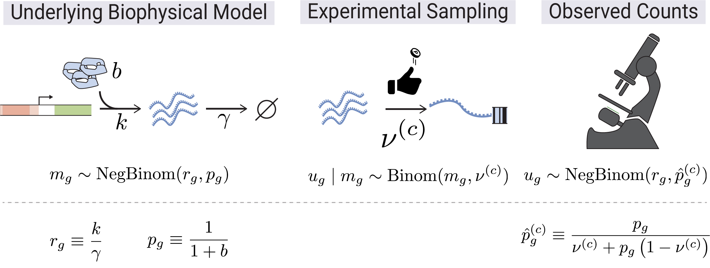
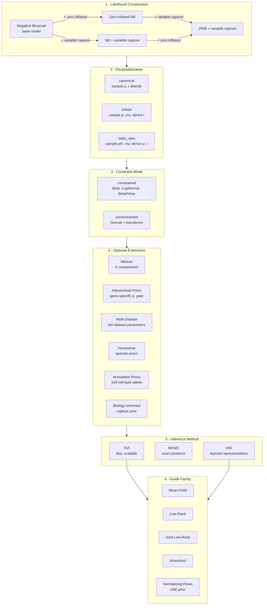

# SCRIBE: Single-Cell RNA-seq Inference with Bayesian Estimation

SCRIBE is a comprehensive Python package for Bayesian analysis of single-cell
RNA sequencing (scRNA-seq) data. Built on `JAX` and `NumPyro`, SCRIBE provides a
unified framework for probabilistic modeling, variational inference, uncertainty
quantification, differential expression, and model comparison in single-cell
genomics.

## Generative Model

<p align="center">
  
</p>

SCRIBE is grounded in a biophysical generative model of scRNA-seq count data.
Transcription (rate $b$) and degradation (rate $\gamma$) set the steady-state
mRNA content per gene, giving rise to a Negative Binomial distribution over
true molecular counts $m_g$ with parameters $r_g$ and $p_g$. During library
preparation each molecule is independently captured with cell-specific
probability $\nu^{(c)}$, so the observed UMI count $u_g$ follows a Binomial
sub-sampling of $m_g$. Marginalizing over the latent counts yields a Negative
Binomial likelihood for the observations with an effective success probability
$\hat{p}_g^{(c)}$ that absorbs the capture efficiency.

## Why SCRIBE?

- **Unified Framework**: Single `scribe.fit()` interface for SVI, MCMC, and VAE
  inference methods
- **Compositional Models**: Four constructive likelihoods -- from the base
  Negative Binomial up to zero-inflated models with variable capture probability
- **Compositional Differential Expression**: Bayesian DE in log-ratio
  coordinates with proper uncertainty propagation and error control (lfsr, PEFP)
- **Model Comparison**: WAIC, PSIS-LOO, stacking weights, and goodness-of-fit
  diagnostics for principled model selection
- **GPU Accelerated**: JAX-based implementation with automatic GPU support
- **Flexible Architecture**: Three parameterizations, constrained/unconstrained
  modes, hierarchical priors, horseshoe sparsity, and normalizing flows
- **Scalable**: From small experiments to large-scale atlases with mini-batch
  support

## Key Features

- **Three Inference Methods**:
  - SVI for speed and scalability
  - MCMC (NUTS) for exact Bayesian inference
  - VAE for representation learning with normalizing flow priors
- **Constructive Likelihood System**: Negative Binomial as the base, extended
  with zero inflation and/or variable capture probability
- **Multiple Parameterizations**: Canonical, linked (mean-prob), and odds-ratio
  with constrained or unconstrained priors
- **Advanced Guide Families**: Mean-field, low-rank, joint low-rank, and
  amortized variational guides
- **Mixture Models**: K-component mixtures for cell type discovery with
  annotation-guided priors
- **Hierarchical Priors**: Gene-specific and dataset-level hierarchical
  structures with optional horseshoe sparsity
- **Bayesian Differential Expression**: Parametric, empirical (Monte Carlo), and
  shrinkage (empirical Bayes) methods in CLR/ILR coordinates
- **Model Comparison**: WAIC, PSIS-LOO, stacking, per-gene elpd, and
  goodness-of-fit via randomized quantile residuals
- **Seamless Integration**: Works with AnnData and the scanpy ecosystem
- **Custom Distributions**: BetaPrime, LowRankLogisticNormal, SoftmaxNormal with
  registered KL divergences

## Model Construction Space

SCRIBE models are built compositionally. The likelihood is constructed by
layering extensions on top of a base Negative Binomial (NB) model, then
configured with a parameterization, constraint mode, optional extensions, and an
inference method:



This compositional design means you can combine **4 likelihoods x 3
parameterizations x 2 constraint modes** as a starting point, then layer on
mixture components, hierarchical priors, multi-dataset structure, and more.

## Available Models

### Likelihood Construction

SCRIBE's four likelihoods build on each other -- the base Negative Binomial model
can be extended with zero inflation and/or variable capture probability:

| Likelihood                              | Code string  | Construction                    | Extra Parameters        | Best For                   |
| --------------------------------------- | ------------ | ------------------------------- | ----------------------- | -------------------------- |
| **Negative Binomial**                   | `"nbdm"`     | Base model                      | --                      | Baseline analysis, fast    |
| **Zero-Inflated NB**                    | `"zinb"`     | NB + zero inflation             | `gate`                  | Data with excess zeros     |
| **NB + variable capture**               | `"nbvcp"`    | NB + capture probability        | `p_capture`             | Variable sequencing depth  |
| **ZINB + variable capture**             | `"zinbvcp"`  | ZINB + capture probability      | `gate`, `p_capture`     | Complex technical variation |

### Parameterizations

Each likelihood can be parameterized in three ways:

| Parameterization | Aliases       | Core Parameters | Derived                       | When to Use                   |
| ---------------- | ------------- | --------------- | ----------------------------- | ----------------------------- |
| **canonical**    | `standard`    | p, r            | --                            | Direct interpretation         |
| **linked**       | `mean_prob`   | p, mu           | r = mu(1-p)/p                 | Captures p-r correlation      |
| **odds_ratio**   | `mean_odds`   | phi, mu         | p = 1/(1+phi), r = mu*phi     | Numerically stable near p ~ 1 |

### Constrained vs Unconstrained

| Mode              | Prior Distributions           | Use Case                                      |
| ----------------- | ----------------------------- | --------------------------------------------- |
| **Constrained**   | Beta, LogNormal, BetaPrime    | Default; interpretable parameters              |
| **Unconstrained** | Normal + sigmoid/exp transforms | Optimization-friendly; required for hierarchical priors |

## Installation

### Using pip

```bash
pip install scribe
```

### Optional CLI/Hydra extras

Install CLI tools (`scribe-infer`, `scribe-visualize`) with Hydra support:

```bash
pip install "scribe[hydra]"
```

### Development Installation

For the latest development version:

```bash
git clone https://github.com/mrazomej/scribe.git
cd scribe
pip install -e ".[dev]"
```

If you also need CLI/Hydra workflows in development:

```bash
pip install -e ".[dev,hydra]"
```

### Docker Installation

```bash
docker build -t scribe .
docker run --gpus all -it scribe
```

## Quick Start

Get started with SCRIBE in just a few lines:

```python
import scribe
import scanpy as sc

# Load your single-cell data
adata = sc.read_h5ad("your_data.h5ad")

# Run SCRIBE with default settings (SVI inference, NB model)
results = scribe.fit(adata, model="nbdm")

# Analyze results
posterior_samples = results.get_posterior_samples()
```

### Customize with Simple Arguments

```python
# Zero-inflated model with more optimization steps
results = scribe.fit(
    adata,
    model="zinb",
    n_steps=100000,
    batch_size=512,
)

# Linked parameterization with low-rank guide
results = scribe.fit(
    adata,
    model="nbdm",
    parameterization="linked",
    guide_rank=15,
)

# Mixture model for cell type discovery
results = scribe.fit(
    adata,
    model="zinb",
    n_components=3,
    n_steps=150000,
)
```

### Choose Your Inference Method

```python
# Fast exploration with SVI (default)
svi_results = scribe.fit(adata, model="zinb", n_steps=75000)

# Exact inference with MCMC
mcmc_results = scribe.fit(
    adata,
    model="nbdm",
    inference_method="mcmc",
    n_samples=3000,
    n_chains=4,
)

# Representation learning with VAE
vae_results = scribe.fit(
    adata,
    model="nbdm",
    inference_method="vae",
    n_steps=50000,
)
```

## Inference Methods and Guide Families

### Inference Methods

| Method   | Engine           | Precision | Use Case                          |
| -------- | ---------------- | --------- | --------------------------------- |
| **SVI**  | Adam optimizer   | float32   | Fast exploration, large datasets  |
| **MCMC** | NUTS sampler     | float64   | Exact posterior, gold standard    |
| **VAE**  | Encoder-decoder  | float32   | Latent representations, embeddings |

SVI results can initialize MCMC chains for faster convergence, even across
different parameterizations:

```python
svi_results = scribe.fit(adata, model="nbdm", parameterization="linked")
mcmc_results = scribe.fit(
    adata,
    model="nbdm",
    parameterization="odds_ratio",
    inference_method="mcmc",
    svi_init=svi_results,
)
```

### Guide Families (Variational Approximation)

For SVI and VAE inference, SCRIBE offers several variational guide families:

| Guide              | Parameter        | Description                                    |
| ------------------ | ---------------- | ---------------------------------------------- |
| **Mean-field**     | *(default)*      | Fully factorized; fast, memory-efficient       |
| **Low-rank**       | `guide_rank=k`   | Captures gene correlations via rank-k covariance |
| **Joint low-rank** | `joint_params="biological"` | Shared low-rank covariance across parameter groups |
| **Amortized**      | `amortize_capture=True` | Neural net predicts capture variational params from UMI counts |

```python
# Low-rank guide capturing gene correlations
results = scribe.fit(
    adata,
    model="nbdm",
    parameterization="odds_ratio",
    guide_rank=15,
)

# Joint low-rank for correlated mu and phi
results = scribe.fit(
    adata,
    model="nbdm",
    parameterization="odds_ratio",
    unconstrained=True,
    hierarchical_p=True,
    guide_rank=10,
    joint_params="biological",  # resolves to ["phi", "mu"] for mean_odds
)
```

## Advanced Usage

### Mixture Models for Cell Type Discovery

```python
# Specify number of components
mixture_results = scribe.fit(
    adata,
    model="nbdm",
    n_components=5,
    n_steps=100000,
)

# Or let annotations define components automatically
mixture_results = scribe.fit(
    adata,
    model="nbdm",
    annotation_key="cell_type",
    annotation_confidence=3.0,
    n_steps=100000,
)

# Analyze cell type assignments
cell_types = mixture_results.cell_type_probabilities()

# Access individual components
for i in range(5):
    component = mixture_results.get_component(i)
    print(f"Component {i} MAP estimates:", component.get_map())
```

### Hierarchical Priors

Gene-specific priors allow each gene to have its own dispersion or dropout
parameters, with a shared hyperprior that regularizes across genes:

```python
# Gene-specific p with hierarchical prior
results = scribe.fit(
    adata,
    model="nbdm",
    parameterization="odds_ratio",
    unconstrained=True,
    hierarchical_p=True,
    n_steps=100000,
)

# Gene-specific gate for zero-inflated models
results = scribe.fit(
    adata,
    model="zinb",
    unconstrained=True,
    hierarchical_gate=True,
    n_steps=100000,
)
```

### Horseshoe Priors for Sparsity

Regularized horseshoe priors encourage sparsity in gene-specific deviations:

```python
results = scribe.fit(
    adata,
    model="nbdm",
    parameterization="odds_ratio",
    unconstrained=True,
    hierarchical_p=True,
    horseshoe_p=True,
    horseshoe_tau0=1.0,
    n_steps=100000,
)
```

### Biology-Informed Capture Prior

For models with variable capture probability, SCRIBE can use organism-specific
prior knowledge about total mRNA content to anchor the capture efficiency
estimates:

```python
results = scribe.fit(
    adata,
    model="nbvcp",
    parameterization="odds_ratio",
    priors={"organism": "human"},
    n_steps=100000,
)
```

### Multi-Dataset Hierarchical Models

Fit models across multiple datasets with shared or dataset-specific parameters:

```python
results = scribe.fit(
    adata,
    model="nbdm",
    parameterization="odds_ratio",
    unconstrained=True,
    dataset_key="batch",
    hierarchical_dataset_mu=True,
    hierarchical_dataset_p="gene_specific",
    n_steps=100000,
)
```

### VAE with Normalizing Flows

VAE inference supports normalizing flow priors for more expressive latent
distributions:

```python
results = scribe.fit(
    adata,
    model="nbdm",
    inference_method="vae",
    vae_latent_dim=10,
    vae_flow_type="coupling_spline",
    vae_flow_num_layers=4,
    n_steps=50000,
)

# Extract latent embeddings
adata.obsm["X_scribe"] = results.get_latent_embeddings(adata.X)
```

Available flow types: `none` (standard Gaussian), `coupling_affine` (Real NVP),
`coupling_spline` (neural spline), `maf` (masked autoregressive), `iaf`
(inverse autoregressive).

### Early Stopping

```python
results = scribe.fit(
    adata,
    model="nbdm",
    n_steps=200000,
    early_stopping={"enabled": True, "patience": 5000, "min_delta": 1e-4},
)
```

### Power User: Explicit Configuration Objects

For full control, you can use explicit configuration objects:

```python
from scribe.models.config import ModelConfigBuilder, InferenceConfig, SVIConfig

model_config = (
    ModelConfigBuilder()
    .for_model("zinb")
    .with_parameterization("linked")
    .unconstrained()
    .as_mixture(n_components=3)
    .build()
)

inference_config = InferenceConfig.from_svi(
    SVIConfig(n_steps=100000, batch_size=512)
)

results = scribe.fit(
    adata,
    model_config=model_config,
    inference_config=inference_config,
)
```

## Differential Expression

SCRIBE provides a fully Bayesian differential expression framework that respects
the compositional nature of scRNA-seq data. All comparisons are performed in
log-ratio coordinates (CLR/ILR), propagating full posterior uncertainty.

### Three DE Methods

| Method          | Description                              | Use Case                       |
| --------------- | ---------------------------------------- | ------------------------------ |
| **Parametric**  | Analytic Gaussian in ALR space           | Fast, requires low-rank logistic-normal fit |
| **Empirical**   | Monte Carlo CLR differences              | Assumption-free, from posterior samples |
| **Shrinkage**   | Empirical Bayes scale-mixture prior      | Improved per-gene inference, borrows strength across genes |

### Example

```python
import jax.numpy as jnp
from scribe import compare

# Fit two conditions
results_ctrl = scribe.fit(adata_ctrl, model="nbdm", n_components=3)
results_treat = scribe.fit(adata_treat, model="nbdm", n_components=3)

# Empirical DE between component 0 across conditions
de = compare(
    results_treat, results_ctrl,
    method="empirical",
    component_A=0, component_B=0,
)

# Gene-level results with practical significance threshold
gene_results = de.gene_level(tau=jnp.log(1.1))

# Call DE genes controlling false sign rate
is_de = de.call_genes(lfsr_threshold=0.05)
```

### Capabilities

- **Compositional transforms**: CLR (centered log-ratio), ILR (isometric
  log-ratio) for reference-invariant analysis
- **Bayesian error control**: Local false sign rate (lfsr) and posterior expected
  false discovery proportion (PEFP) -- not p-values
- **Practical significance**: Threshold-based lfsr with user-defined effect size
  cutoff tau
- **Gene-set analysis**: Pathway and gene-set tests via compositional balances
- **Biological-level DE**: Mean log-fold change, variance ratio, and Gamma KL
  divergence on the underlying NB parameters
- **Gaussianity diagnostics**: Skewness, kurtosis, and Jarque-Bera tests to
  validate parametric assumptions

## Model Comparison

SCRIBE provides principled Bayesian model comparison tools:

```python
from scribe import compare_models

mc = compare_models(
    [results_nb, results_hierarchical],
    counts=counts,
    model_names=["NB", "Hierarchical"],
    gene_names=gene_names,
)

# Ranked comparison table
print(mc.summary())

# PSIS k-hat diagnostics
print(mc.diagnostics())

# Per-gene elpd differences
gene_df = mc.gene_level_comparison("NB", "Hierarchical")
```

### Capabilities

- **WAIC**: Fast analytical approximation to leave-one-out cross-validation
- **PSIS-LOO**: Pareto-smoothed importance sampling LOO with per-observation
  k-hat diagnostics
- **Model stacking**: Optimal predictive ensemble weights via convex
  optimization
- **Gene-level comparison**: Per-gene elpd differences with standard errors and
  z-scores
- **Goodness-of-fit**: Randomized quantile residuals (RQR) for per-gene fit
  assessment
- **PPC-based GoF**: Posterior predictive checks with calibration failure rates
  and L1 density distances

## Performance & Scalability

SCRIBE is designed for real-world single-cell datasets:

- **GPU Acceleration**: Automatic GPU detection and usage
- **Memory Efficient**: Mini-batch processing for large datasets
- **Scalable**: Tested on datasets from hundreds to hundreds of thousands of
  cells
- **Fast**: SVI inference typically completes in minutes
- **Float64 for MCMC**: Automatic precision promotion for NUTS stability

```python
# For large datasets - just add batch_size
large_results = scribe.fit(
    large_adata,
    model="nbdm",
    n_steps=150000,
    batch_size=1024,
)
```

## SLURM Utilities

Use the helper scripts in `scripts/` to submit jobs to SLURM.

- Submit a marimo notebook export job (always requests one GPU):

```bash
./scripts/slurm_marimo.sh altos/exploratory/bleo_splits/bleo_splits_de_eda.py
```

This submits a job that runs:

```bash
marimo export html <notebook>.py -o <notebook>.html
```

and writes logs under `slurm_logs/`.

## Documentation

Comprehensive documentation is available in each module:

### Package and Inference

- **[Package Overview](src/scribe/README.md)**: Complete package documentation
- **[Inference](src/scribe/inference/README.md)**: Unified inference interface
  and dispatch

### Models

- **[Models](src/scribe/models/README.md)**: Probabilistic model configuration
- **[Model Config](src/scribe/models/config/README.md)**: Configuration system
  and builder
- **[Parameterizations](src/scribe/models/parameterizations/README.md)**:
  Canonical, linked, odds-ratio strategies
- **[Builders](src/scribe/models/builders/README.md)**: NumPyro model/guide
  construction
- **[Presets](src/scribe/models/presets/README.md)**: Model factory and
  registries
- **[Components](src/scribe/models/components/README.md)**: Likelihoods, guides,
  VAE architectures
- **[Likelihoods](src/scribe/models/components/likelihoods/README.md)**: NB,
  ZINB, variable capture likelihood details

### Inference Engines

- **[SVI](src/scribe/svi/README.md)**: Stochastic variational inference
- **[MCMC](src/scribe/mcmc/README.md)**: Markov Chain Monte Carlo (NUTS)
- **[VAE](src/scribe/vae/README.md)**: Variational autoencoders with
  normalizing flows

### Analysis

- **[Differential Expression](src/scribe/de/README.md)**: Bayesian DE for
  compositional data
- **[Model Comparison](src/scribe/mc/README.md)**: WAIC, PSIS-LOO, stacking,
  goodness-of-fit
- **[Statistics](src/scribe/stats/README.md)**: Custom distributions,
  divergences, credible regions
- **[Normalizing Flows](src/scribe/flows/README.md)**: Flax-based flow
  architectures

### Utilities

- **[Core](src/scribe/core/README.md)**: Preprocessing, normalization, cell type
  assignment
- **[Utils](src/scribe/utils/README.md)**: Parameter collection, distribution
  converters

## Contributing

We welcome contributions! Please see our [Contributing
Guidelines](CONTRIBUTING.md) for more information.

## Citation

If you use SCRIBE in your research, please cite:

```bibtex
@software{scribe2025,
  author = {Razo-Mejia, Manuel},
  title = {SCRIBE: Single-Cell RNA-seq Inference using Bayesian Estimation},
  year = {2025},
  publisher = {GitHub},
  url = {https://github.com/mrazomej/scribe}
}
```

## License

This project is licensed under the terms of the [LICENSE](LICENSE) file.

## Acknowledgments

SCRIBE builds upon several excellent libraries:

- [JAX](https://github.com/google/jax) for automatic differentiation and GPU
  acceleration
- [NumPyro](https://github.com/pyro-ppl/numpyro) for probabilistic programming
- [Flax](https://github.com/google/flax) for neural network architectures (VAE,
  normalizing flows, amortizers)
- [Pydantic](https://docs.pydantic.dev/) for type-safe model configuration
- [AnnData](https://anndata.readthedocs.io/) for data management
- [Matplotlib](https://matplotlib.org/) and
  [Seaborn](https://seaborn.pydata.org/) for visualization

## Support

For questions and support:

- Create an issue in the [GitHub
  repository](https://github.com/mrazomej/scribe/issues)
