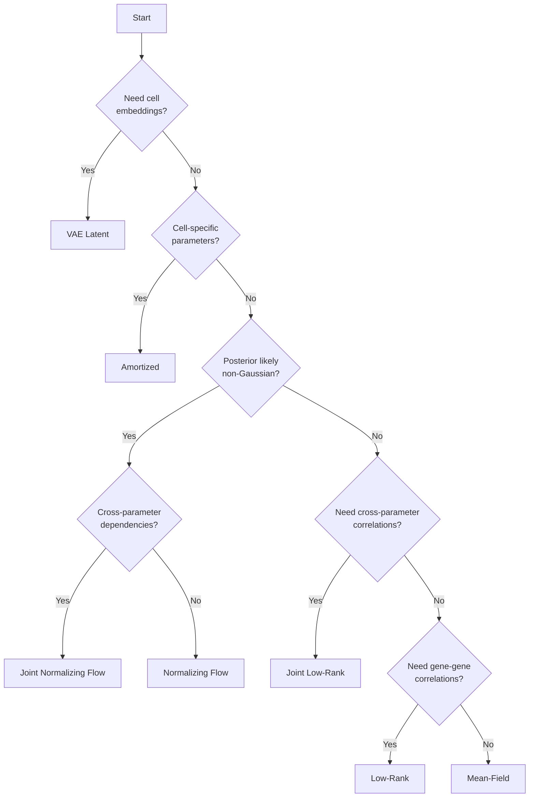

# Variational Guide Families

In variational inference, the **guide** (also called the variational
distribution) is the family of distributions used to approximate the true
posterior. The choice of guide family controls the trade-off between
computational cost, posterior accuracy, and the ability to capture correlations
between parameters.

SCRIBE supports seven guide families, configurable **per parameter** ---meaning
different parameters in the same model can use different guide families. For
example, gene-specific dispersion might use a normalizing flow guide while a
scalar success probability uses mean-field.

---

## At a glance

| Guide Family | Correlations | Memory | Speed | Best For |
|-------------|-------------|--------|-------|----------|
| [Mean-Field](#mean-field) | None | \(O(G)\) | Fastest | Default, most analyses |
| [Low-Rank](#low-rank) | Within a parameter group | \(O(Gk)\) | Fast | Gene-gene correlations |
| [Joint Low-Rank](#joint-low-rank) | Across parameter groups | \(O(Gk)\) | Moderate | Cross-parameter correlations (e.g., \(\mu\) and \(p\)) |
| [Normalizing Flow](#normalizing-flow) | Within a parameter group (non-Gaussian) | Network size | Moderate | Multimodal, skewed, heavy-tailed posteriors |
| [Joint Normalizing Flow](#joint-normalizing-flow) | Across parameter groups (non-Gaussian) | Network size | Slower | Non-linear cross-parameter dependencies |
| [Amortized](#amortized) | Data-driven | Network size | Moderate | Cell-specific parameters (capture probability) |
| [VAE Latent](#vae-latent) | Learned latent space | Network size | Slowest | Representation learning, embeddings |

---

## Mean-Field

The simplest and fastest guide family. Each parameter has an independent
variational distribution---no correlations are captured between parameters:

\[
q(\theta_1, \theta_2, \ldots) = q(\theta_1)\,q(\theta_2)\,\cdots
\]

This is the **default** for all parameters when no `guide_rank` is specified.

**Advantages:**

- Fast convergence, low memory
- Works well when parameters are approximately independent
- Good baseline for most analyses

**Limitations:**

- Ignores correlations between genes or parameters
- Can underestimate posterior uncertainty

```python
# Mean-field is the default --- no special arguments needed
results = scribe.fit(adata, model="nbdm")
```

!!! tip "When mean-field is sufficient"
    For many scRNA-seq analyses, mean-field provides excellent results.
    Upgrade to low-rank only when downstream tasks (DE, denoising)
    benefit from capturing gene correlations.

---

## Low-Rank

Captures correlations within a parameter group (e.g., between genes for the
dispersion parameter \(r_g\)) using a low-rank multivariate normal
approximation:

\[
\underline{\underline{\Sigma}} = \underline{\underline{W}}\,\underline{\underline{W}}^\top + \text{diag}(\underline{d}),
\]

where \(\underline{\underline{W}}\) is \((G, k)\) and \(\underline{d}\) is the
diagonal. The rank \(k\) controls how many correlation modes are captured, with
memory scaling as \(O(Gk)\) instead of \(O(G^2)\) for a full covariance.

**Advantages:**

- Captures the top-\(k\) correlations between genes
- Memory-efficient compared to full covariance
- Important for accurate DE and denoising (cross-gene uncertainty)

**Limitations:**

- More parameters to optimize than mean-field
- May be slower to converge

```python
# Low-rank guide with rank 8
results = scribe.fit(adata, model="nbdm", guide_rank=8)
```

| `guide_rank` | Use case |
|:---:|----------|
| 5--10 | Standard analysis, moderate gene correlations |
| 10--20 | DE analysis where cross-gene uncertainty matters |
| 20--50 | Large datasets with complex correlation structures |

---

## Joint Low-Rank

Extends the low-rank guide to capture correlations **across** parameter groups.
For example, the gene-specific mean \(\mu_g\) and the success probability may be
correlated in the posterior---a joint guide captures this structure.

Internally, the joint guide uses a chain-rule decomposition via the Woodbury
identity:

\[
q(\theta_1, \theta_2) = q(\theta_1)\,q(\theta_2 \mid \theta_1),
\]

where both the marginal and the conditional are low-rank MVN of the same rank.
This extends naturally to three or more parameter groups (e.g., \(\mu\), \(p\),
and gate in a ZINB model).

**Advantages:**

- Captures cross-parameter correlations (e.g., \(\mu_g\) and \(\phi\))
- Supports heterogeneous dimensions (scalar + gene-specific in one group)
- Each conditional is itself a low-rank MVN (efficient computation)

**Limitations:**

- At rank \(k\), within-group expressivity is reduced vs. separate
  rank-\(k\) guides
- More complex optimization landscape

```python
# Joint low-rank for mu and phi
results = scribe.fit(
    adata,
    model="nbdm",
    parameterization="mean_odds",  # alias: "odds_ratio"
    unconstrained=True,
    guide_rank=10,
    joint_params=["mu", "phi"],
)
```

### Dense vs. structured params

For models with many parameter groups, you can designate which parameters
get full cross-gene low-rank coupling (`dense_params`) while others only
couple locally:

```python
# mu gets cross-gene correlations; phi and gate only couple to mu per gene
results = scribe.fit(
    adata,
    model="zinb",
    unconstrained=True,
    guide_rank=10,
    joint_params=["mu", "phi", "gate"],
    dense_params=["mu"],
)
```

---

## Normalizing Flow

All the Gaussian-based families above (Mean-Field, Low-Rank, Joint Low-Rank)
share a fundamental limitation: the variational distribution is always a
(possibly correlated) Gaussian in unconstrained space. When the true posterior
is **multimodal, skewed, or heavy-tailed**, a Gaussian guide underestimates
the real uncertainty. A normalizing flow guide replaces the Gaussian with a
**learned invertible transformation** of a simple base distribution, enabling
arbitrarily complex densities.

!!! warning "Use affine coupling for scRNA-seq"
    In the high-dimensional setting of scRNA-seq (thousands to tens of
    thousands of genes), only **affine coupling** layers are numerically
    stable enough for reliable training. Spline coupling and autoregressive
    flows can produce NaN gradients at these dimensions because per-layer
    log-determinant contributions accumulate rapidly and the conditioner
    networks face enormous fan-in. SCRIBE recommends
    `guide_flow="affine_coupling"` for all guide-level flow usage.

    Spline coupling remains the recommended choice for **VAE-level flows**
    (`vae_flow_type="spline_coupling"`), where the latent dimension is low
    (typically 10--30) and the extra expressiveness per layer is beneficial.

### Stability features

Training coupling flows in 20,000+ dimensions is inherently challenging.
SCRIBE implements several stabilization techniques inspired by
[Andrade 2024 (arXiv:2402.16408)](https://arxiv.org/abs/2402.16408),
all **enabled by default**, that make high-dimensional affine coupling flows
practical:

| Feature | What it does | Why it matters |
|---------|-------------|----------------|
| **Zero-init output** | Conditioner output layer is initialized to zero so the flow starts as an identity transform | Prevents log-determinant overflow at initialization when G is large |
| **Layer normalization** | `LayerNorm` after each hidden Dense in the conditioner MLP | Stabilizes activations when fan-in is large (e.g. 20K inputs into a 64-wide bottleneck) |
| **Residual connections** | Skip connections between hidden layers of the same width | Improves gradient flow during training |
| **Soft clamping** | Smooth asymmetric arctan-based clamp on the affine log-scale | Replaces hard clipping; caps per-layer expansion to approximately 10% while preserving gradients at the boundary |
| **LOFT** | Log Soft Extension layer + trainable final affine after all coupling layers | Compresses extreme sample magnitudes logarithmically, then re-expands to match the target posterior's scale |
| **Float64 log-det** | Accumulate the log-determinant Jacobian in float64 | Prevents precision loss when summing many small per-layer contributions. Off by default; recommended only for datacenter GPUs (A100, H100) with full-rate float64 |

### Usage

```python
# Per-parameter affine coupling flow
results = scribe.fit(
    adata,
    model="nbdm",
    unconstrained=True,
    guide_flow="affine_coupling",
    guide_flow_num_layers=4,
    guide_flow_hidden_dims=[64, 64],
)
```

### Parameters

| Parameter | Default | Description |
|-----------|---------|-------------|
| `guide_flow` | `None` | Flow type: `"affine_coupling"` (recommended for guides), `"spline_coupling"`, `"maf"`, `"iaf"`. Mutually exclusive with `guide_rank` |
| `guide_flow_num_layers` | `4` | Number of coupling layers |
| `guide_flow_hidden_dims` | `[64, 64]` | Hidden layer sizes in the conditioner MLP |
| `guide_flow_activation` | `"relu"` | Activation function (`"relu"`, `"gelu"`, `"silu"`, `"leaky_relu"`, ...) |
| `guide_flow_n_bins` | `8` | Spline bins (only for `"spline_coupling"`) |
| `guide_flow_mixture_strategy` | `"independent"` | `"independent"` (separate flow per component) or `"shared"` (one flow conditioned on one-hot index) |
| `guide_flow_zero_init` | `True` | Zero-initialize conditioner output (identity-init) |
| `guide_flow_layer_norm` | `True` | Apply LayerNorm in conditioner MLP |
| `guide_flow_residual` | `True` | Residual connections in conditioner MLP |
| `guide_flow_soft_clamp` | `True` | Smooth asymmetric arctan clamp on affine log-scale |
| `guide_flow_loft` | `True` | LOFT compression + trainable final affine |
| `guide_flow_log_det_f64` | `True` | Float64 log-det accumulation. Auto-promotes `enable_x64=True` |

!!! tip "When to use flows vs. low-rank"
    For **nearly Gaussian** posteriors, `LowRankGuide` is faster and equally
    accurate---use it as your default when you need gene correlations.
    Switch to a flow guide when diagnostics suggest the posterior is
    substantially non-Gaussian (multimodality, skewness, heavy tails) and
    the low-rank approximation is visibly inadequate.

---

## Joint Normalizing Flow

Analogous to [Joint Low-Rank](#joint-low-rank) but uses normalizing flows
instead of Gaussians. Cross-parameter dependencies are captured via a
chain-rule decomposition:

\[
q(\theta_1, \theta_2) = q(\theta_1)\;q(\theta_2 \mid \theta_1),
\]

where each factor is a full normalizing flow. The conditional
\(q(\theta_2 \mid \theta_1)\) is implemented by passing the unconstrained
sample of \(\theta_1\) as a continuous **context** vector to the flow for
\(\theta_2\). This extends naturally to three or more parameters via
cumulative context.

**Advantages:**

- Captures **non-linear** cross-parameter dependencies
- Each conditional is a full flow --- more expressive than the Woodbury
  low-rank MVN conditionals
- Supports `dense_params` (same semantics as Joint Low-Rank)

**Limitations:**

- More flow parameters than Joint Low-Rank
- Context-conditioned flows add dimensionality to conditioner networks
- For approximately Gaussian joint posteriors, Joint Low-Rank is more
  parameter-efficient

```python
# Joint affine coupling flow for mu and phi
results = scribe.fit(
    adata,
    model="nbdm",
    parameterization="mean_odds",
    unconstrained=True,
    guide_flow="affine_coupling",
    joint_params=["mu", "phi"],
    guide_flow_num_layers=4,
)
```

Scalar parameters in a joint flow group (e.g. `phi` when it is not
gene-specific) automatically receive a context-conditioned Normal instead of
a full flow, since coupling flows require at least two features.

### Dense vs. structured params

Just like Joint Low-Rank, you can designate which parameters get a full flow
(`dense_params`) while others receive diagonal Normal treatment with learned
regression on the dense-flow residuals:

```python
# mu gets a full flow; phi and gate regress on mu per gene
results = scribe.fit(
    adata,
    model="zinb",
    unconstrained=True,
    guide_flow="affine_coupling",
    joint_params=["mu", "phi", "gate"],
    dense_params=["mu"],
)
```

### Mixture and dataset support

When a parameter has mixture components or dataset axes, the flow guide
creates per-component or per-dataset flow instances. The behavior is
controlled by `guide_flow_mixture_strategy`:

- **`"independent"`** (default) --- a separate flow chain per component,
  each with its own parameters. Maximum expressiveness.
- **`"shared"`** --- a single flow chain conditioned on a one-hot component
  index. More parameter-efficient when components share structure.

---

## Amortized

Instead of learning separate variational parameters for each data point, an
amortized guide uses a neural network to predict variational parameters from
data features (sufficient statistics like total UMI count). This is particularly
useful for cell-specific parameters where the number of variational parameters
would otherwise scale with the number of cells.

**Advantages:**

- Scales to arbitrarily many cells without per-cell parameters
- Shares statistical strength across similar cells
- Fewer total variational parameters

**Limitations:**

- Requires choosing a network architecture
- May not be as flexible as per-cell optimization
- Training can be more sensitive to hyperparameters

The primary use case in SCRIBE is **amortized capture probability** for
VCP models:

```python
# Amortized inference for capture probability
results = scribe.fit(
    adata,
    model="nbvcp",
    amortize_capture=True,
    capture_hidden_dims=[128, 64],
    capture_activation="leaky_relu",
)
```

| Parameter | Default | Description |
|-----------|---------|-------------|
| `amortize_capture` | `False` | Enable amortized capture inference |
| `capture_hidden_dims` | `[64, 32]` | MLP hidden layer sizes |
| `capture_activation` | `"leaky_relu"` | Activation function |
| `capture_output_transform` | `"softplus"` | Output transform for positive params |

---

## VAE Latent

The VAE guide uses an encoder-decoder neural network architecture. The encoder
maps each cell's counts to a low-dimensional latent representation, and the
decoder maps back to model parameters. This provides both a variational
approximation and a learned cell embedding.

**Advantages:**

- Produces low-dimensional cell embeddings for visualization/clustering
- Captures complex nonlinear relationships
- Can be enhanced with normalizing flow priors for richer latent
  distributions

**Limitations:**

- Most computationally expensive guide family
- Requires tuning network architecture
- Posterior quality depends on encoder/decoder capacity

```python
# Standard VAE
results = scribe.fit(
    adata,
    model="nbdm",
    inference_method="vae",
    vae_latent_dim=10,
    n_steps=100_000,
    batch_size=256,
)

# Cell embeddings
embeddings = results.get_latent_embeddings(data=adata.X, n_samples=100)
```

### Normalizing flow priors

For more expressive latent distributions, attach a normalizing flow:

```python
results = scribe.fit(
    adata,
    model="nbdm",
    inference_method="vae",
    vae_latent_dim=10,
    vae_flow_type="spline_coupling",
    vae_flow_num_layers=4,
    vae_flow_hidden_dims=[64, 64],
)
```

| Flow type | Description |
|-----------|-------------|
| `"affine_coupling"` | Fast baseline |
| `"spline_coupling"` | Expressive, recommended for production |
| `"maf"` | Fast density evaluation |
| `"iaf"` | Fast sampling |

---

## How to choose



**Rules of thumb:**

1. **Start with mean-field.** It is fast and works well for most
   analyses.
2. **Add low-rank when doing DE or denoising**, where cross-gene
   uncertainty propagation matters. Rank 8--15 is usually sufficient.
3. **Use joint low-rank for unconstrained models** with hierarchical
   priors, where \(\mu\) and \(\phi\) (or \(p\)) are expected to
   correlate.
4. **Upgrade to a normalizing flow guide** when Gaussian-based guides
   visibly struggle (multimodality, skewness, heavy tails). Use
   `guide_flow="affine_coupling"` for high-dimensional gene parameters.
5. **Use joint normalizing flow** when cross-parameter relationships are
   non-linear or the joint posterior is non-Gaussian (banana-shaped,
   multimodal).
6. **Use amortized for VCP models** with many cells, to avoid a
   per-cell variational parameter.
7. **Use VAE when you also need cell embeddings** for visualization or
   clustering.

---

## Combining guide families in one model

SCRIBE's guide families are per-parameter, so a single model can use
multiple families simultaneously. Via `scribe.fit()`:

- `guide_rank` + `joint_params` configure gene-specific parameters with
  low-rank or joint low-rank guides
- `guide_flow` + `joint_params` configure gene-specific parameters with
  normalizing flow or joint normalizing flow guides
- `amortize_capture` configures cell-specific capture probability with an
  amortized guide
- Parameters not covered by `joint_params` or `guide_flow`/`guide_rank`
  default to mean-field

!!! note "`guide_flow` and `guide_rank` are mutually exclusive"
    You cannot use both in the same `scribe.fit()` call. Choose one
    approach for gene-specific parameters: Gaussian-based (low-rank) or
    flow-based.

---

For more on how guide families fit into the broader inference workflow,
see the [Inference Methods](inference.md) page.
