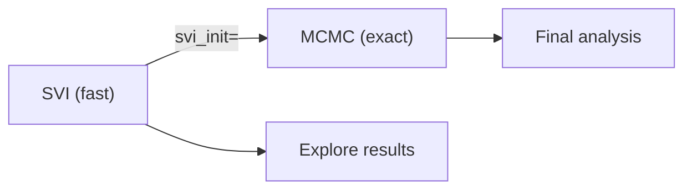
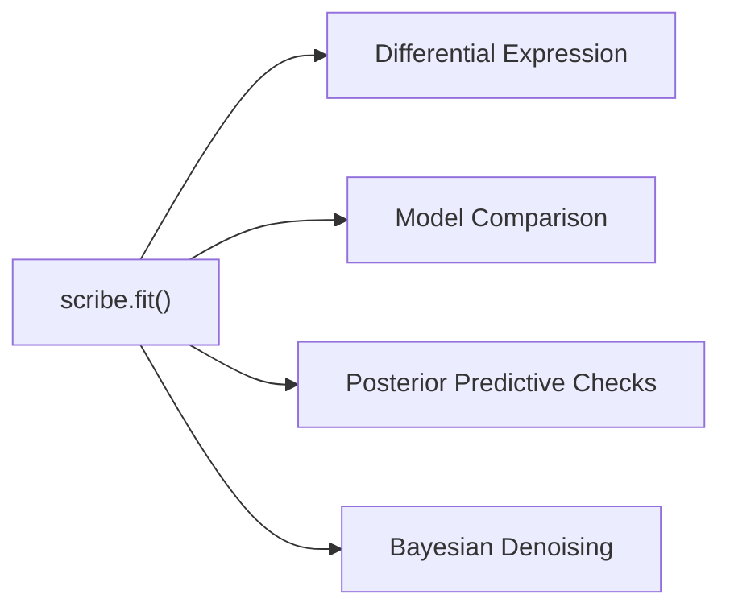

# Inference Methods

SCRIBE supports four inference backends that all share the same `scribe.fit()`
entry point. Choose the one that best fits your goals and computational budget.

## Choosing an Inference Method

| Criterion             | SVI                        | MCMC                      | VAE                        | Laplace                             |
| --------------------- | -------------------------- | ------------------------- | -------------------------- | ----------------------------------- |
| **Speed**             | Fast (minutes)             | Slow (hours)              | Moderate (tens of minutes) | Moderate (tens of minutes)          |
| **Scalability**       | Excellent (mini-batching)  | Limited (full data)       | Excellent (mini-batching)  | Good (mini-batching)                |
| **Posterior quality** | Approximate                | Exact                     | Approximate (neural)       | Approximate (Hessian)               |
| **Latent embeddings** | No                         | No                        | Yes                        | No                                  |
| **Models supported**  | All                        | NB-family                 | All                        | PLN, LNM, LNMVCP                    |
| **Best for**          | Exploration and production | Gold-standard uncertainty | Representation learning    | Correlation recovery, rigorous PPCs |

!!! tip "Default recommendation"
    Start with **SVI** for NB-family models. For PLN/LNM/LNMVCP models, use
    **Laplace** --- it avoids encoder collapse, produces rigorous per-cell
    posteriors from the Hessian, and has no aggregate-posterior drift. Switch to
    **MCMC** when you need exact posteriors for a publication, or use **VAE**
    when you need amortized scoring of new cells or low-dimensional embeddings.

---

## Stochastic Variational Inference (SVI)

SVI finds the best approximation to the posterior within a chosen variational
family using stochastic optimization. It is the default and most commonly used
inference method.

### Basic usage

```python
import scribe

# Default SVI inference (NBVCP model)
results = scribe.fit(adata)

# With custom parameters
results = scribe.fit(
    adata,
    zero_inflation=True,
    n_steps=100_000,
    batch_size=512,
    seed=0,
)
```

### Key parameters

| Parameter | Default | Description |
|-----------|---------|-------------|
| `n_steps` | 50,000 | Maximum optimization steps |
| `batch_size` | `None` (full batch) | Mini-batch size for stochastic optimization |
| `optimizer_config` | `None` | Custom optimizer specification (see below) |
| `stable_update` | `True` | Numerically stable parameter updates |
| `restore_best` | `False` | Track and restore the best variational parameters during training |
| `early_stopping` | `None` | Automatic convergence detection (see below) |
| `seed` | 42 | Random seed for reproducibility |

### Custom optimizer

By default SCRIBE uses Adam. Pass an `optimizer_config` dict to change the
optimizer or its learning rate:

```python
results = scribe.fit(
    adata,
    optimizer_config={"name": "clipped_adam", "step_size": 5e-4},
)
```

Supported optimizers: `"adam"`, `"clipped_adam"`, `"adagrad"`, `"rmsprop"`,
`"sgd"`, `"momentum"`.

### Best-params restoration

The `restore_best` flag tracks the lowest smoothed loss during training and
restores those parameters at the end, regardless of whether early stopping
is configured. This is especially useful for normalizing flow guides, where
the ELBO can fluctuate late in training:

```python
results = scribe.fit(
    adata,
    unconstrained=True,
    guide_flow="affine_coupling",
    restore_best=True,
    n_steps=100_000,
)
```

### Guide families

The variational guide controls the flexibility of the posterior approximation.
SCRIBE supports several families---mean-field (default), low-rank,
joint low-rank, normalizing flow, amortized, and VAE latent---each offering
different trade-offs between speed and the ability to capture correlations:

```python
# Low-rank guide for gene correlations
results = scribe.fit(adata, guide_rank=8)

# Joint low-rank across parameter groups
results = scribe.fit(
    adata, guide_rank=8, joint_params="biological",
)

# Normalizing flow guide for non-Gaussian posteriors
results = scribe.fit(
    adata, unconstrained=True,
    guide_flow="affine_coupling",
)

# Amortized capture for VCP models
results = scribe.fit(adata, variable_capture=True, amortize_capture=True)
```

**Full guide:** [Variational guide families](guide-families.md)

### Early stopping

SVI supports automatic convergence detection to avoid wasting computation:

```python
results = scribe.fit(
    adata,
    n_steps=200_000,
    early_stopping={
        "patience": 500,
        "min_delta": 1.0,
        "smoothing_window": 50,
        "restore_best": True,
    },
)
```

| Early stopping parameter | Default | Description |
|--------------------------|---------|-------------|
| `patience` | 500 | Steps without improvement before stopping |
| `min_delta` | 1.0 | Minimum loss improvement to count as progress |
| `smoothing_window` | 50 | Window size for moving-average loss |
| `restore_best` | `True` | Restore parameters from the best checkpoint |

### Results

`scribe.fit()` returns a `ScribeSVIResults` object. See the
[Results Class](results.md) page for the full API, including posterior
sampling, predictive checks, denoising, and normalization.

---

## Markov Chain Monte Carlo (MCMC)

MCMC generates samples from the true posterior distribution using the
No-U-Turn Sampler (NUTS). It provides the most accurate uncertainty
quantification but is slower than SVI.

### Basic usage

```python
import scribe

results = scribe.fit(
    adata,
    inference_method="mcmc",
    n_samples=2_000,
    n_warmup=1_000,
    n_chains=4,
)
```

### Key parameters

| Parameter | Default | Description |
|-----------|---------|-------------|
| `inference_method` | `"svi"` | Set to `"mcmc"` for MCMC inference |
| `n_samples` | 2,000 | Posterior samples per chain |
| `n_warmup` | 1,000 | Warmup (burn-in) samples |
| `n_chains` | 1 | Number of parallel chains |

!!! note "Float64 precision"
    MCMC defaults to 64-bit floating point for numerical stability during
    Hamiltonian dynamics. This doubles memory usage compared to SVI but is
    important for reliable sampling.

### Warm-starting from SVI

A common workflow is to run SVI first for exploration, then refine with MCMC
using the SVI result as initialization. This dramatically reduces warmup time:

```python
import scribe

# Step 1: fast SVI exploration
svi_results = scribe.fit(adata, n_steps=50_000)

# Step 2: refine with MCMC, initialized from SVI
mcmc_results = scribe.fit(
    adata,
    inference_method="mcmc",
    svi_init=svi_results,
    n_samples=2_000,
    n_warmup=500,
)
```

The `svi_init` parameter handles cross-parameterization mapping automatically
-- you can initialize MCMC from an SVI result that used a different
parameterization.

### Results

MCMC returns a `ScribeMCMCResults` object with the same analysis API as SVI
results (posterior sampling, predictive checks, denoising, etc.), plus
MCMC-specific diagnostics:

```python
# NUTS diagnostics
results.print_summary()

# Chain-grouped samples for convergence analysis
chain_samples = results.get_samples(group_by_chain=True)
```

---

## Variational Autoencoder (VAE)

The VAE backend uses neural networks (Flax NNX) for amortized variational
inference. It learns a low-dimensional latent representation of each cell while
simultaneously fitting the SCRIBE probabilistic model.

### Basic usage

```python
import scribe

results = scribe.fit(
    adata,
    inference_method="vae",
    vae_latent_dim=10,
    n_steps=100_000,
    batch_size=256,
)
```

### Key parameters

| Parameter | Default | Description |
|-----------|---------|-------------|
| `inference_method` | `"svi"` | Set to `"vae"` for VAE inference |
| `vae_latent_dim` | 10 | Dimensionality of the latent space |
| `vae_encoder_hidden_dims` | `None` | Encoder hidden layer sizes (e.g., `[512, 256]`) |
| `vae_decoder_hidden_dims` | `None` | Decoder hidden layer sizes |
| `vae_activation` | `None` | Activation function (`"relu"`, `"gelu"`, `"silu"`, etc.) |
| `vae_input_transform` | `"log1p"` | Input preprocessing (`"log1p"`, `"log"`, `"sqrt"`, `"identity"`) |

### VAE variants

**Standard VAE** -- single encoder-decoder pair with a standard normal prior.

**Decoupled Prior VAE (dpVAE)** -- separate priors for different parameter
groups, enabling more flexible modeling of parameter relationships.

### Normalizing flow priors

For more expressive latent distributions, attach a normalizing flow to the
VAE prior:

```python
results = scribe.fit(
    adata,
    inference_method="vae",
    vae_latent_dim=10,
    vae_flow_type="spline_coupling",
    vae_flow_num_layers=4,
    vae_flow_hidden_dims=[64, 64],
)
```

Available flow types: `"affine_coupling"` (fast baseline),
`"spline_coupling"` (expressive, recommended for production),
`"maf"` (fast density), `"iaf"` (fast sampling).

### Latent space analysis

VAE results provide cell embeddings that can be used for visualization and
clustering:

```python
# Cell embeddings in latent space
embeddings = results.get_latent_embeddings(data=adata.X, n_samples=100)

# Conditional posterior samples
latent_samples = results.get_latent_samples_conditioned_on_data(
    data=adata.X, n_samples=500,
)
```

---

## Laplace Approximation

The Laplace inference path finds each cell's MAP (maximum a posteriori)
latent via Newton iteration, then approximates the per-cell posterior as a
Gaussian centered at the MAP with covariance equal to the negative inverse
Hessian. The outer loop optimizes global parameters (decoder weights
\(\mu\), \(W\), \(d\)) via Adam on the Laplace-approximated ELBO. There is
**no encoder network**---each cell's posterior is computed locally.

### Basic usage

```python
import scribe

# PLN with Laplace inference
results = scribe.fit(
    adata,
    model="pln",
    inference_method="laplace",
    guide_rank=64,
    n_steps=50_000,
    batch_size=256,
)

# LNMVCP with Laplace inference
results = scribe.fit(
    adata,
    model="lnmvcp",
    inference_method="laplace",
    guide_rank=64,
    n_steps=50_000,
)
```

### Key parameters

| Parameter | Default | Description |
|-----------|---------|-------------|
| `inference_method` | `"svi"` | Set to `"laplace"` for Laplace inference |
| `model` | `"nbvcp"` | Must be `"pln"`, `"lnm"`, or `"lnmvcp"` for Laplace |
| `n_steps` | `50_000` | Outer optimization steps |
| `batch_size` | `None` | Mini-batch size for stochastic gradient estimation |
| `guide_rank` | `None` | Rank \(k\) of the low-rank covariance \(\Sigma = WW^\top + \text{diag}(d)\) |
| `laplace_config` | `None` | Dict of Newton solver settings (see below) |

### Laplace configuration

Fine-tune the inner Newton solver via `laplace_config`:

```python
results = scribe.fit(
    adata,
    model="lnmvcp",
    inference_method="laplace",
    laplace_config={
        "n_newton_steps": 15,       # more iterations for hard cells
        "damping": 1e-3,            # tighter Tikhonov regularization
        "newton_tolerance": 1e-3,   # relax for production fits
        "convergence_action": "warn",
    },
)
```

| Config key | Default | Description |
|------------|---------|-------------|
| `n_newton_steps` | `5` | Newton iterations per cell per outer step |
| `damping` | `1e-2` | Tikhonov regularization added to Hessian diagonal |
| `newton_tolerance` | `1e-4` | Gradient norm threshold for declaring convergence |
| `convergence_action` | `"warn"` | Action when cells don't converge: `"warn"`, `"raise"`, or `"ignore"` |

### How it works

The training loop alternates two steps per outer iteration:

1. **Inner Newton** on per-cell latents (holding globals fixed). For PLN:
   joint \((\underline{x}, \eta)\) Newton via Schur-complement
   back-substitution. For LNM/LNMVCP: composition Newton
   (\(\underline{z}\) or \(\underline{y}_\text{ALR}\)) plus scalar
   \(\eta\) Newton.

2. **Outer Adam step** on global parameters \((\mu, W, d)\) using the
   gradient of the Laplace ELBO with MAPs treated as `stop_gradient`
   constants.

Each Newton step costs \(O(Gk + k^3)\) per cell using nested Woodbury
identities on the low-rank covariance --- no \(G \times G\) matrices are
ever formed.

### When to use Laplace

| Use Laplace when... | Use SVI/VAE when... |
|---------------------|---------------------|
| You need rigorous per-cell posteriors from the Hessian | You need amortized inference for new cells |
| You suspect the encoder is collapsing on a per-cell latent | The encoder is well-calibrated |
| You want no aggregate-posterior drift | You need fast serving-time scoring |
| Your data has high cell-to-cell variability | The dataset is small enough that encoder collapse isn't a concern |

### Progress-bar diagnostics

During training, the progress bar reports per-cell Newton convergence:

```text
LNM Laplace (learned + capture):  21%|██  |
  init loss: -8.857e+07,
  avg. loss [10001-10500]: -8.896e+07,
  comp max/p99/med 1.38e+01/3.42e+00/2.51e-03;
  η    max/p99/med 1.79e-06/1.61e-06/4.92e-07
```

The `comp` and `η` lines show per-cell Newton gradient norms (max, 99th
percentile, median) for the composition and capture blocks respectively.

**Healthy fit:** `median` well below tolerance, `max` trending down.

**Problem cells:** `median` small but `max` large and bouncing --- a few
pathological cells (typically low-count) are slow to converge but don't
affect the bulk fit.

### Divergence handling

The engine has three layered defenses against single-cell explosive
divergence:

1. **Sherman--Morrison denominator floor** --- prevents catastrophic float32
   cancellation in the `y_alr` Newton step.
2. **Per-cell NaN/Inf mask** --- divergent cells are masked from the current
   step's gradient on globals.
3. **Outer-loop divergence detector** --- clean abort with diagnostic context
   if loss becomes NaN or grows by > 1000× from init.

If a divergence abort fires, typical remedies are:

- Increase `n_newton_steps` to 20--30
- Tighten `damping` to 1e-3 or below
- Pre-filter outlier cells (very low \(u_T\) or extreme compositional skew)

### Results

`scribe.fit()` with `inference_method="laplace"` returns a
`ScribeLaplaceResults` object. See the [Results Class](results.md) page for
the full API, including MAP-only and Laplace-uncertainty posterior predictive
checks.

---

## Combining Inference Methods

### SVI then MCMC

The most common multi-method workflow is SVI for fast exploration followed by
MCMC for publication-quality posteriors:



### SVI then DE / Model Comparison

SVI results feed directly into downstream analyses:



See the [Differential Expression](differential-expression.md) and
[Model Comparison](model-comparison.md) guides for details on these
downstream analyses.
