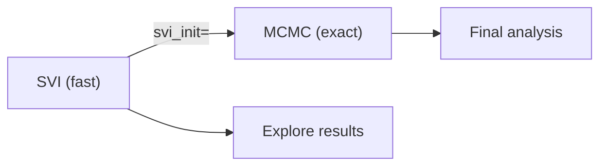
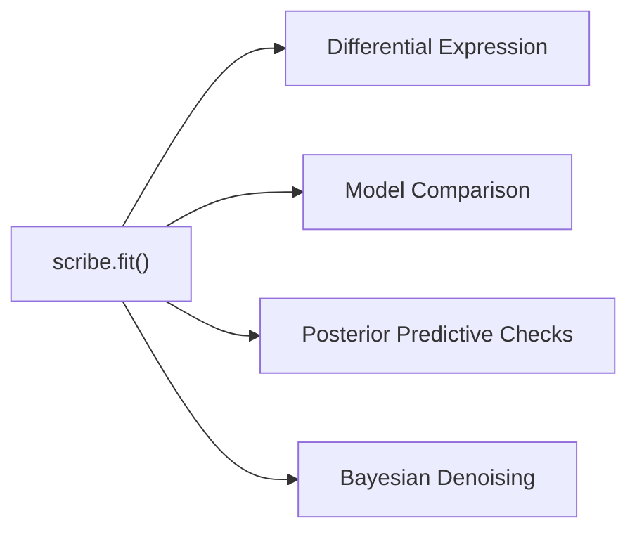

# Inference Methods

SCRIBE supports three inference backends that all share the same `scribe.fit()`
entry point. Choose the one that best fits your goals and computational budget.

## Choosing an Inference Method

| Criterion | SVI | MCMC | VAE |
|-----------|-----|------|-----|
| **Speed** | Fast (minutes) | Slow (hours) | Moderate (tens of minutes) |
| **Scalability** | Excellent (mini-batching) | Limited (full data) | Excellent (mini-batching) |
| **Posterior quality** | Approximate | Exact | Approximate (neural) |
| **Latent embeddings** | No | No | Yes |
| **Best for** | Exploration and production | Gold-standard uncertainty | Representation learning |

!!! tip "Default recommendation"
    Start with **SVI** for most analyses. Switch to **MCMC** when you need
    exact posteriors for a publication or when SVI diagnostics are
    unsatisfactory. Use **VAE** when you also want low-dimensional cell
    embeddings.

---

## Stochastic Variational Inference (SVI)

SVI finds the best approximation to the posterior within a chosen variational
family using stochastic optimization. It is the default and most commonly used
inference method.

### Basic usage

```python
import scribe

# Default SVI inference
results = scribe.fit(adata, model="nbdm")

# With custom parameters
results = scribe.fit(
    adata,
    model="zinb",
    n_steps=100_000,
    batch_size=512,
    seed=0,
)
```

### Key parameters

| Parameter | Default | Description |
|-----------|---------|-------------|
| `n_steps` | 50,000 | Maximum optimization steps |
| `batch_size` | `None` (full batch) | Mini-batch size for stochastic optimization |
| `stable_update` | `True` | Numerically stable parameter updates |
| `early_stopping` | `None` | Automatic convergence detection (see below) |
| `seed` | 42 | Random seed for reproducibility |

### Guide families

The variational guide controls the flexibility of the posterior approximation.
SCRIBE supports several families---mean-field (default), low-rank,
joint low-rank, amortized, and VAE latent---each offering different
trade-offs between speed and the ability to capture correlations:

```python
# Low-rank guide for gene correlations
results = scribe.fit(adata, model="nbdm", guide_rank=8)

# Joint low-rank across parameter groups
results = scribe.fit(
    adata, model="nbdm", guide_rank=8, joint_params=["r", "p"],
)

# Amortized capture for VCP models
results = scribe.fit(adata, model="nbvcp", amortize_capture=True)
```

**Full guide:** [Variational guide families](guide-families.md)

### Early stopping

SVI supports automatic convergence detection to avoid wasting computation:

```python
results = scribe.fit(
    adata,
    model="nbdm",
    n_steps=200_000,
    early_stopping={
        "patience": 500,
        "min_delta": 1.0,
        "smoothing_window": 50,
        "restore_best": True,
    },
)
```

| Early stopping parameter | Default | Description |
|--------------------------|---------|-------------|
| `patience` | 500 | Steps without improvement before stopping |
| `min_delta` | 1.0 | Minimum loss improvement to count as progress |
| `smoothing_window` | 50 | Window size for moving-average loss |
| `restore_best` | `True` | Restore parameters from the best checkpoint |

### Results

`scribe.fit()` returns a `ScribeSVIResults` object. See the
[Results Class](results.md) page for the full API, including posterior
sampling, predictive checks, denoising, and normalization.

---

## Markov Chain Monte Carlo (MCMC)

MCMC generates samples from the true posterior distribution using the
No-U-Turn Sampler (NUTS). It provides the most accurate uncertainty
quantification but is slower than SVI.

### Basic usage

```python
import scribe

results = scribe.fit(
    adata,
    model="nbdm",
    inference_method="mcmc",
    n_samples=2_000,
    n_warmup=1_000,
    n_chains=4,
)
```

### Key parameters

| Parameter | Default | Description |
|-----------|---------|-------------|
| `inference_method` | `"svi"` | Set to `"mcmc"` for MCMC inference |
| `n_samples` | 2,000 | Posterior samples per chain |
| `n_warmup` | 1,000 | Warmup (burn-in) samples |
| `n_chains` | 1 | Number of parallel chains |

!!! note "Float64 precision"
    MCMC defaults to 64-bit floating point for numerical stability during
    Hamiltonian dynamics. This doubles memory usage compared to SVI but is
    important for reliable sampling.

### Warm-starting from SVI

A common workflow is to run SVI first for exploration, then refine with MCMC
using the SVI result as initialization. This dramatically reduces warmup time:

```python
import scribe

# Step 1: fast SVI exploration
svi_results = scribe.fit(adata, model="nbdm", n_steps=50_000)

# Step 2: refine with MCMC, initialized from SVI
mcmc_results = scribe.fit(
    adata,
    model="nbdm",
    inference_method="mcmc",
    svi_init=svi_results,
    n_samples=2_000,
    n_warmup=500,
)
```

The `svi_init` parameter handles cross-parameterization mapping automatically
-- you can initialize MCMC from an SVI result that used a different
parameterization.

### Results

MCMC returns a `ScribeMCMCResults` object with the same analysis API as SVI
results (posterior sampling, predictive checks, denoising, etc.), plus
MCMC-specific diagnostics:

```python
# NUTS diagnostics
results.print_summary()

# Chain-grouped samples for convergence analysis
chain_samples = results.get_samples(group_by_chain=True)
```

---

## Variational Autoencoder (VAE)

The VAE backend uses neural networks (Flax NNX) for amortized variational
inference. It learns a low-dimensional latent representation of each cell while
simultaneously fitting the SCRIBE probabilistic model.

### Basic usage

```python
import scribe

results = scribe.fit(
    adata,
    model="nbdm",
    inference_method="vae",
    vae_latent_dim=10,
    n_steps=100_000,
    batch_size=256,
)
```

### Key parameters

| Parameter | Default | Description |
|-----------|---------|-------------|
| `inference_method` | `"svi"` | Set to `"vae"` for VAE inference |
| `vae_latent_dim` | 10 | Dimensionality of the latent space |
| `vae_encoder_hidden_dims` | `None` | Encoder hidden layer sizes (e.g., `[512, 256]`) |
| `vae_decoder_hidden_dims` | `None` | Decoder hidden layer sizes |
| `vae_activation` | `None` | Activation function (`"relu"`, `"gelu"`, `"silu"`, etc.) |
| `vae_input_transform` | `"log1p"` | Input preprocessing (`"log1p"`, `"log"`, `"sqrt"`, `"identity"`) |

### VAE variants

**Standard VAE** -- single encoder-decoder pair with a standard normal prior.

**Decoupled Prior VAE (dpVAE)** -- separate priors for different parameter
groups, enabling more flexible modeling of parameter relationships.

### Normalizing flow priors

For more expressive latent distributions, attach a normalizing flow to the
VAE prior:

```python
results = scribe.fit(
    adata,
    model="nbdm",
    inference_method="vae",
    vae_latent_dim=10,
    vae_flow_type="spline_coupling",
    vae_flow_num_layers=4,
    vae_flow_hidden_dims=[64, 64],
)
```

Available flow types: `"affine_coupling"` (fast baseline),
`"spline_coupling"` (expressive, recommended for production),
`"maf"` (fast density), `"iaf"` (fast sampling).

### Latent space analysis

VAE results provide cell embeddings that can be used for visualization and
clustering:

```python
# Cell embeddings in latent space
embeddings = results.get_latent_embeddings(data=adata.X, n_samples=100)

# Conditional posterior samples
latent_samples = results.get_latent_samples_conditioned_on_data(
    data=adata.X, n_samples=500,
)
```

---

## Combining Inference Methods

### SVI then MCMC

The most common multi-method workflow is SVI for fast exploration followed by
MCMC for publication-quality posteriors:



### SVI then DE / Model Comparison

SVI results feed directly into downstream analyses:



See the [Differential Expression](differential-expression.md) and
[Model Comparison](model-comparison.md) guides for details on these
downstream analyses.
