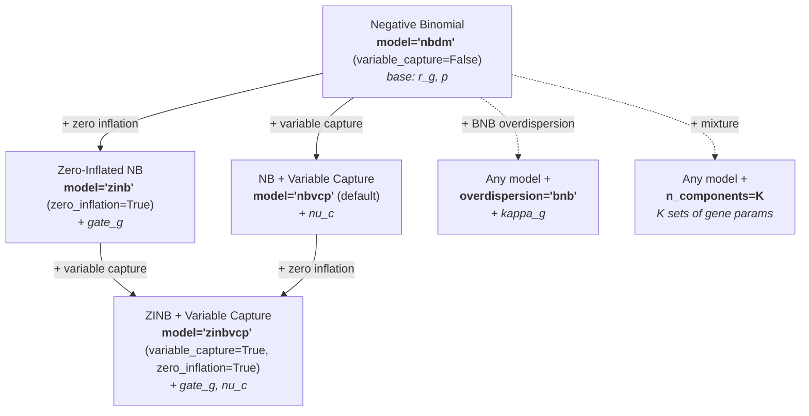
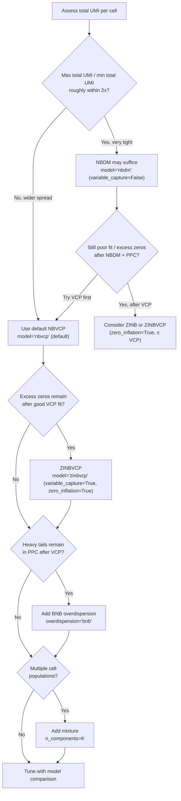

# Model Selection

SCRIBE provides a family of probabilistic models for scRNA-seq data, all built
on the foundational **Negative Binomial** (NB) distribution dictated by the
biophysics of transcription and mRNA capture. You choose a **likelihood** by
setting **`variable_capture`** and **`zero_inflation`** on `scribe.fit()`. The
default model is **NBVCP** (variable capture on). Setting
`variable_capture=False` gives **NBDM**; adding `zero_inflation=True` gives
**ZINBVCP** (or **ZINB** when combined with `variable_capture=False`). The same four variants are still
available as `model="nbdm"` / `"nbvcp"` / `"zinb"` / `"zinbvcp"` if you prefer a
single string. Optional extensions (BNB overdispersion, mixture components) use
other `scribe.fit()` arguments.

---

## Default: variable capture (NBVCP)

In typical scRNA-seq data, **per-cell total UMI counts vary widely** across the
experiment. SCRIBE defaults to **NBVCP** (`model="nbvcp"`), which absorbs
library-size variation into a cell-specific technical capture channel.
Empirically, we have **not yet encountered a dataset** that does not benefit
from this extension.

```python
# Default: variable capture is on
results = scribe.fit(adata)

# Add a low-rank guide for gene-gene correlations
results = scribe.fit(adata, guide_rank=64)
```

The `guide_rank` parameter adds a low-rank component to the variational
posterior, giving SCRIBE a parameter-efficient way to capture **gene-gene
correlations** that a mean-field guide would miss. A rank of 64 is a good
initial value (you can always increase the rank or switch to a normalizing flow
guide if you want a more expressive posterior); see [Variational Guide
Families](guide-families.md) for details.

**When NBDM is reasonable** (`variable_capture=False`, same as `model="nbdm"`):
total UMIs per cell are **very homogeneous** (e.g. max/min total UMI within
roughly a factor of two, after basic QC), so a shared effective capture is a
good approximation.

!!! tip "Zero inflation is often optional"
    **Explicit zero inflation** (`zero_inflation=True`; **ZINB** / **ZINBVCP**,
    or `model="zinb"` / `"zinbvcp"`) is not always necessary. Apparent "excess
    zeros" frequently arise because **low capture cells** produce many zeros
    across genes. Fitting **variable capture first** (`variable_capture=True`;
    **NBVCP**) often explains those zeros without a separate dropout layer. Add
    zero inflation only when diagnostics and **model comparison** show a clear
    gain after a good VCP fit.

---

## The model family at a glance



---

## Decision guide



Use [model comparison](model-comparison.md) and
[goodness-of-fit diagnostics](model-comparison.md#goodness-of-fit-diagnostics)
to justify adding ZI, BNB, or extra mixture components.

---

## Variable capture probability (NBVCP)

When cells differ in mRNA capture efficiency, the same underlying expression
can produce very different total UMIs. The VCP extension introduces a
cell-specific capture probability \(\nu^{(c)}\) that modifies the base success
probability:

\[
\hat{p}^{(c)} = \frac{p\,\nu^{(c)}}{1 - p\,(1 - \nu^{(c)})},
\]

so
\(u_g^{(c)} \mid r_g, \hat{p}^{(c)}\) is distributed as
\(\text{NB}(r_g, \hat{p}^{(c)})\).
Genes are modelled independently given \(\nu^{(c)}\) (no Dirichlet-Multinomial
factorization in this likelihood).

```python
# NBVCP; equivalent to model="nbvcp"
results = scribe.fit(adata, variable_capture=True)
```

For many cells, **amortized** capture inference scales better:

```python
results = scribe.fit(adata, variable_capture=True, amortize_capture=True)
```

**See also:** [Theory: Anchoring priors](../theory/anchoring-priors.md) (capture
identifiability and priors).

---

## Base: Negative Binomial (NBDM)

When total UMIs per cell are **homogeneous**, a single effective capture shared
across cells is often adequate. The NB likelihood for UMIs is

\[
u_g \mid r_g, \hat{p}
\;\text{ is distributed as }\;
\text{NB}(r_g, \hat{p}),
\]

with gene-specific \(r_g\). When \(\hat{p}\) is shared across genes, the joint
distribution factorizes into a **Negative Binomial for totals** and a
**Dirichlet-Multinomial for compositions**---principled normalization without
ad-hoc library-size scaling.

```python
# NBDM: plain NB without variable capture
results = scribe.fit(adata, variable_capture=False)
```

**See also:** [Theory: Dirichlet-Multinomial](../theory/dirichlet-multinomial.md).

---

## Zero inflation (ZINB)

Adds a per-gene **gate** \(\pi_g\) for technical dropout:

\[
u_g \mid \pi_g, r_g, \hat{p}
\;\text{ is distributed as }\;
\pi_g\,\delta_0 + (1 - \pi_g)\,\text{NB}(r_g, \hat{p}).
\]

Prefer **`variable_capture=True` first** when library sizes vary; add
`zero_inflation=True` (ZINB or ZINBVCP, or `model="zinb"` / `"zinbvcp"`) only
when the data still need an explicit dropout layer after a strong VCP fit.

```python
# ZINB; equivalent to model="zinb"
results = scribe.fit(adata, zero_inflation=True)
```

---

## Both: ZINBVCP

Combines zero inflation and variable capture:

\[
u_g^{(c)} \mid \pi_g, r_g, \hat{p}^{(c)}
\;\text{ is distributed as }\;
\pi_g\,\delta_0 + (1 - \pi_g)\,\text{NB}(r_g, \hat{p}^{(c)}).
\]

Highest flexibility and cost; use when both mechanisms are supported by
diagnostics.

```python
# ZINBVCP; equivalent to model="zinbvcp"
results = scribe.fit(adata, variable_capture=True, zero_inflation=True)
```

---

## BNB overdispersion

**Beta Negative Binomial** adds heavy tails via a Beta randomization of the NB
success probability and an extra \(\kappa_g\). Requires `unconstrained=True`.

!!! warning "Fit variable capture first"
    What looks like heavy tails in the raw data can often be explained by
    **variable capture efficiency**: cells with high capture produce counts
    in the upper tail while low-capture cells pile up near zero, mimicking
    a heavier-tailed distribution. Fit an NBVCP model first, then check
    the posterior predictive distribution. Add BNB only when genuine
    per-gene excess dispersion remains after accounting for capture.

```python
results = scribe.fit(
    adata,
    overdispersion="bnb",
    unconstrained=True,
    # Any likelihood: default NBVCP, or e.g. variable_capture=False,
    # zero_inflation=True, or both (same as model="nbdm" / "nbvcp" / …).
)
```

**See also:** [Theory: Beta Negative Binomial](../theory/beta-negative-binomial.md).

---

## Mixture components

Any of the above supports `n_components=K` for subpopulations. Gene-specific
parameters (\(r_g\), and \(\pi_g\) if applicable) are usually
component-specific; global \(p\) and cell-specific \(\nu^{(c)}\) stay shared as
in the base construction.

```python
results = scribe.fit(
    adata,
    variable_capture=True,
    n_components=3,
    n_steps=150_000,
)

assignments = results.cell_type_assignments(counts=adata.X)
```

```python
results = scribe.fit(
    adata,
    zero_inflation=True,
    n_components=3,
    mixture_params="mean",  # only expression-level param varies by component
)
```

**See also:** [Results class](results.md) (mixture assignments and components).

---

## Comparison table

| Model | Zero Inflated | Variable Capture | BNB | Mixture | Best For |
|-------|:---:|:---:|:---:|:---:|----------|
| `"nbdm"` (`variable_capture=False`) | -- | -- | opt. | opt. | **Tight** total-UMI distribution (~within 2x) |
| `"nbvcp"` (**default**) | -- | Yes | opt. | opt. | **Typical** data; heterogeneous library sizes |
| `"zinb"` (`zero_inflation=True`) | Yes | -- | opt. | opt. | Excess zeros **after** VCP ruled out / no VCP |
| `"zinbvcp"` (`variable_capture=True`, `zero_inflation=True`) | Yes | Yes | opt. | opt. | Strong evidence for **both** ZI and VCP |

"opt." = add `overdispersion="bnb"` or `n_components=K`.

---

## Parameterizations

Each model can be parameterized in three ways (how the NB parameters are
represented internally). SCRIBE names them **canonical**, **mean probs**, and
**mean odds**; the `parameterization=` string uses the codes below (aliases in
parentheses).

| Name | `parameterization=` | Samples | Derives | Best For |
|------|---------------------|---------|---------|----------|
| **Canonical** | `"canonical"` (alias `"standard"`) | \(p, r\) | -- | Direct interpretation |
| **Mean probs** | `"mean_prob"` (alias `"linked"`) | \(p, \mu\) | \(r = \mu(1-p)/p\) | Couples mean and success probability |
| **Mean odds** | `"mean_odds"` (alias `"odds_ratio"`) | \(\phi, \mu\) | \(p = 1/(1+\phi)\), \(r = \mu\phi\) | Stable when \(p\) is near 1 |

```python
results = scribe.fit(
    adata,
    variable_capture=True,
    parameterization="mean_prob",
)
# equivalent: parameterization="linked"
```

For a complete mapping of every parameter name to its symbol, domain, and
equation context, see the [Parameter Reference](parameters.md).

**Constrained** (default) vs **unconstrained** (Normal + transforms; required for
hierarchical priors and BNB):

```python
results = scribe.fit(adata, unconstrained=True)
```

---

## Hierarchical priors

With `unconstrained=True`, you can use hierarchical priors on gene-specific
parameters (\(\mu\), \(p\), gate, overdispersion):

```python
results = scribe.fit(
    adata,
    unconstrained=True,
    expression_prior="horseshoe",
    prob_prior="gaussian",
)
```

**See also:** [Theory: Hierarchical priors](../theory/hierarchical-priors.md).

---

## Performance considerations

### Computational cost

All models are \(O(N \times G)\) per step. VCP adds cell-level structure;
mixtures scale with \(K\).

### Typical SVI step counts

| Model | Canonical / mean probs | Mean odds | Unconstrained |
|-------|------------------------|-----------|---------------|
| NBDM, ZINB | 50k--100k | 25k--50k | 100k--200k |
| NBVCP, ZINBVCP | 100k--150k | 50k--100k | 150k--300k |
| Mixture | 150k--300k | 100k--200k | 300k--500k |

Validate choices with [model comparison](model-comparison.md) and the
[Theory section](../theory/index.md) for full derivations.
