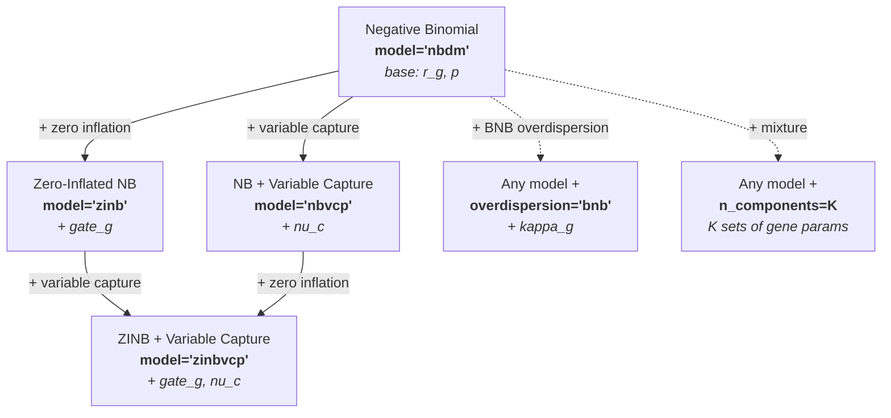
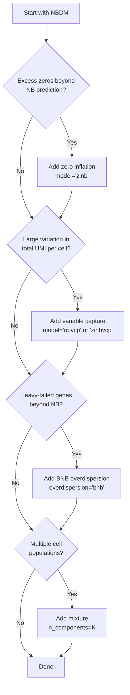

# Model Selection

SCRIBE provides a family of probabilistic models for scRNA-seq data, all built
on the foundational **Negative Binomial** (NB) distribution dictated by the
biophysics of transcription and mRNA capture. Rather than choosing between
completely different models, you extend the base NB by layering on the features
your data requires---zero inflation, variable capture probability, BNB
overdispersion, or mixture components---then pass a model string to
`scribe.fit()`.

---

## The model family at a glance



---

## Decision guide



!!! tip "Start simple"
    Begin with `model="nbdm"` and add complexity only when diagnostics
    (posterior predictive checks, goodness-of-fit residuals) indicate the
    simpler model is insufficient. Use
    [model comparison](model-comparison.md) to verify that added
    complexity improves out-of-sample prediction.

---

## Base: Negative Binomial (NBDM)

The biophysics of transcription and degradation produce a steady-state mRNA
distribution that is well-described by a Negative Binomial. During library
preparation, each molecule is independently captured with some probability, and
marginalizing over the latent mRNA counts yields an NB likelihood for the
observed UMIs:

\[
u_g \mid r_g, \hat{p}
\;\text{ is distributed as }\;
\text{NB}(r_g, \hat{p}),
\]

where \(r_g\) is the gene-specific dispersion and \(\hat{p}\) is the effective
success probability (absorbing the capture efficiency). When \(\hat{p}\) is
shared across genes, the joint distribution factorizes into a **Negative
Binomial for totals** and a **Dirichlet-Multinomial for compositions**---a
principled normalization that avoids ad-hoc library-size corrections.

```python
results = scribe.fit(adata, model="nbdm")
```

[:octicons-arrow-right-24: Theory: Dirichlet-Multinomial](../theory/dirichlet-multinomial.md)

---

## + Zero Inflation (ZINB)

Some genes show more zeros than the NB predicts, due to technical dropouts
(failed capture, amplification failure). The ZINB model adds a per-gene **gate**
probability \(\pi_g\) that a zero is produced by a technical dropout rather than
genuine absence:

\[
u_g \mid \pi_g, r_g, \hat{p}
\;\text{ is distributed as }\;
\pi_g\,\delta_0 + (1 - \pi_g)\,\text{NB}(r_g, \hat{p}).
\]

Each gene is fitted to an independent zero-inflated NB (no Dirichlet-Multinomial
factorization). If all zero-inflation is technical, the \(r_g\) parameters still
govern each gene's share of the transcriptome.

```python
results = scribe.fit(adata, model="zinb")
```

---

## + Variable Capture Probability (NBVCP)

When cells vary significantly in their total UMI counts, this may reflect
differences in mRNA capture efficiency rather than true biology. The VCP
extension introduces a cell-specific capture probability \(\nu^{(c)}\) that
modifies the base success probability:

\[
\hat{p}^{(c)} = \frac{p\,\nu^{(c)}}{1 - p\,(1 - \nu^{(c)})},
\]

so each cell's counts are
\(u_g^{(c)} \mid r_g, \hat{p}^{(c)} \text{ distributed as } \text{NB}(r_g, \hat{p}^{(c)})\).
Once the capture effect is removed, the remaining variation can be
normalized using the same \(r_g\) parameters as NBDM.

```python
results = scribe.fit(adata, model="nbvcp")
```

For large cell counts, amortized inference is recommended:

```python
results = scribe.fit(adata, model="nbvcp", amortize_capture=True)
```

[:octicons-arrow-right-24: Theory: Anchoring Priors (capture identifiability)](../theory/anchoring-priors.md)

---

## + Both: ZINBVCP

Combines zero inflation and variable capture. Each cell has its own effective
\(\hat{p}^{(c)}\) and each gene has its own gate \(\pi_g\):

\[
u_g^{(c)} \mid \pi_g, r_g, \hat{p}^{(c)}
\;\text{ is distributed as }\;
\pi_g\,\delta_0 + (1 - \pi_g)\,\text{NB}(r_g, \hat{p}^{(c)}).
\]

The most comprehensive single-cell artifact model, at the highest computational
cost.

```python
results = scribe.fit(adata, model="zinbvcp")
```

---

## + BNB Overdispersion

For genes with power-law tails that exceed the NB's variance, the **Beta
Negative Binomial** (BNB) replaces the fixed \(\hat{p}\) with a Beta-distributed
random variable per observation, introducing an extra dispersion parameter
\(\kappa_g\). A sparsity-inducing hierarchical prior defaults to NB behaviour
unless the data demands heavier tails.

```python
results = scribe.fit(
    adata,
    model="nbdm",         # or any other model
    overdispersion="bnb",
    unconstrained=True,   # required for BNB
)
```

[:octicons-arrow-right-24: Theory: Beta Negative Binomial](../theory/beta-negative-binomial.md)

---

## + Mixture Components

Any of the above models can be extended to \(K\)-component mixtures for
cell-type discovery. Gene-specific parameters (\(r_g\), and \(\pi_g\) if
applicable) become component-specific, while global parameters (\(\hat{p}\), and
\(\nu^{(c)}\) if applicable) are shared.

```python
results = scribe.fit(
    adata,
    model="zinb",
    n_components=3,
    n_steps=150_000,
)

# Cell type assignments
assignments = results.cell_type_assignments(counts=adata.X)
```

You can control which parameters become component-specific with
`mixture_params`:

```python
results = scribe.fit(
    adata,
    model="zinb",
    n_components=3,
    mixture_params=["r"],  # only r varies by component; gate is shared
)
```

[:octicons-arrow-right-24: Working with mixture results](results.md)

---

## Comparison table

| Model | Zero Inflated | Variable Capture | BNB | Mixture | Best For |
|-------|:---:|:---:|:---:|:---:|----------|
| `"nbdm"` | -- | -- | opt. | opt. | Clean data, fast baseline |
| `"zinb"` | Yes | -- | opt. | opt. | Excess zeros / technical dropouts |
| `"nbvcp"` | -- | Yes | opt. | opt. | Variable library sizes |
| `"zinbvcp"` | Yes | Yes | opt. | opt. | Complex technical artifacts |

"opt." = can be added with `overdispersion="bnb"` or `n_components=K`.

---

## Parameterizations

Each model can be parameterized in three ways, controlling how the NB parameters
are represented internally:

| Parameterization | Code | Samples | Derives | Best For |
|---|---|---|---|---|
| **Canonical** | `"canonical"` | \(p, r\) | -- | Direct interpretation |
| **Linked** | `"linked"` | \(p, \mu\) | \(r = \mu(1-p)/p\) | Captures p-r correlation |
| **Odds-ratio** | `"odds_ratio"` | \(\phi, \mu\) | \(p = 1/(1+\phi)\) | Numerically stable near p close to 1 |

```python
results = scribe.fit(adata, model="nbdm", parameterization="linked")
```

Additionally, each parameterization can run in **constrained** (default;
Beta/LogNormal/BetaPrime priors) or **unconstrained** mode (Normal + sigmoid/exp
transforms; required for hierarchical priors):

```python
results = scribe.fit(adata, model="nbdm", unconstrained=True)
```

---

## Hierarchical priors

Any unconstrained model can be extended with hierarchical priors on
gene-specific parameters (\(\mu\), \(p\), gate, overdispersion), enabling
adaptive shrinkage across genes:

```python
results = scribe.fit(
    adata,
    model="nbdm",
    unconstrained=True,
    mu_prior="horseshoe",  # or "gaussian", "neg"
    p_prior="gaussian",
)
```

[:octicons-arrow-right-24: Theory: Hierarchical Priors](../theory/hierarchical-priors.md)

---

## Performance considerations

### Computational cost

All models are \(O(N \times G)\) per step. VCP adds \(N\) cell parameters,
mixtures multiply by \(K\) components.

### Typical SVI convergence

| Model | Standard | Odds-Ratio | Unconstrained |
|-------|----------|------------|---------------|
| NBDM, ZINB | 50k--100k | 25k--50k | 100k--200k |
| NBVCP, ZINBVCP | 100k--150k | 50k--100k | 150k--300k |
| Mixture | 150k--300k | 100k--200k | 300k--500k |

### Recommendation

Start with the simplest model that matches your data characteristics.
Add complexity incrementally and use
[model comparison](model-comparison.md) (WAIC, PSIS-LOO) to verify that
added features improve out-of-sample prediction. Check fit quality with
[goodness-of-fit diagnostics](model-comparison.md#goodness-of-fit-diagnostics).

For the full mathematical details behind each model component, see the
[Theory section](../theory/index.md).
