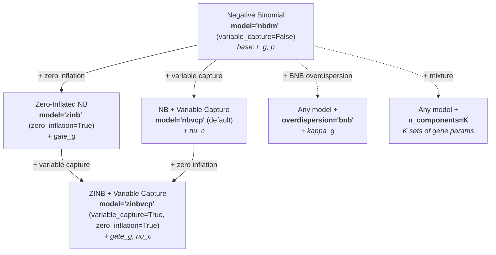
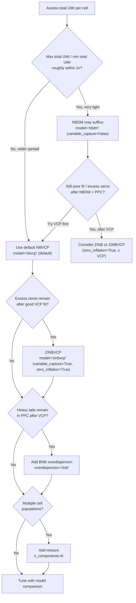
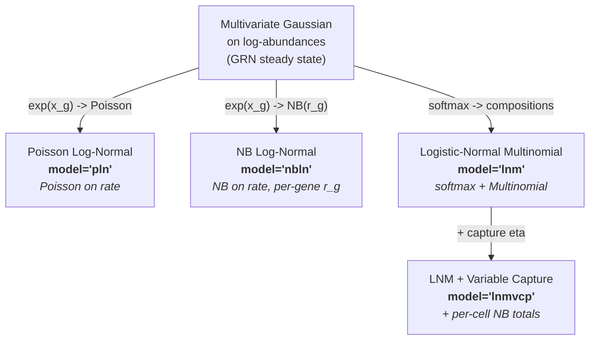

# Model Selection

SCRIBE provides a family of probabilistic models for scRNA-seq data, all built
on the foundational **Negative Binomial** (NB) distribution dictated by the
biophysics of transcription and mRNA capture. You choose a **likelihood** by
setting **`variable_capture`** and **`zero_inflation`** on `scribe.fit()`. The
default model is **NBVCP** (variable capture on). Setting
`variable_capture=False` gives **NBDM**; adding `zero_inflation=True` gives
**ZINBVCP** (or **ZINB** when combined with `variable_capture=False`). The same four variants are still
available as `model="nbdm"` / `"nbvcp"` / `"zinb"` / `"zinbvcp"` if you prefer a
single string. Optional extensions (BNB overdispersion, mixture components) use
other `scribe.fit()` arguments.

---

## Default: variable capture (NBVCP)

In typical scRNA-seq data, **per-cell total UMI counts vary widely** across the
experiment. SCRIBE defaults to **NBVCP** (`model="nbvcp"`), which absorbs
library-size variation into a cell-specific technical capture channel.
Empirically, we have **not yet encountered a dataset** that does not benefit
from this extension.

```python
# Default: variable capture is on
results = scribe.fit(adata)

# Add a low-rank guide for gene-gene correlations
results = scribe.fit(adata, guide_rank=64)
```

The `guide_rank` parameter adds a low-rank component to the variational
posterior, giving SCRIBE a parameter-efficient way to capture **gene-gene
correlations** that a mean-field guide would miss. A rank of 64 is a good
initial value (you can always increase the rank or switch to a normalizing flow
guide if you want a more expressive posterior); see [Variational Guide
Families](guide-families.md) for details.

**When NBDM is reasonable** (`variable_capture=False`, same as `model="nbdm"`):
total UMIs per cell are **very homogeneous** (e.g. max/min total UMI within
roughly a factor of two, after basic QC), so a shared effective capture is a
good approximation.

!!! tip "Zero inflation is often optional"
    **Explicit zero inflation** (`zero_inflation=True`; **ZINB** / **ZINBVCP**,
    or `model="zinb"` / `"zinbvcp"`) is not always necessary. Apparent "excess
    zeros" frequently arise because **low capture cells** produce many zeros
    across genes. Fitting **variable capture first** (`variable_capture=True`;
    **NBVCP**) often explains those zeros without a separate dropout layer. Add
    zero inflation only when diagnostics and **model comparison** show a clear
    gain after a good VCP fit.

---

## The model family at a glance



---

## Decision guide



Use [model comparison](model-comparison.md) and
[goodness-of-fit diagnostics](model-comparison.md#goodness-of-fit-diagnostics)
to justify adding ZI, BNB, or extra mixture components.

---

## Variable capture probability (NBVCP)

When cells differ in mRNA capture efficiency, the same underlying expression
can produce very different total UMIs. The VCP extension introduces a
cell-specific capture probability \(\nu^{(c)}\) that modifies the base success
probability:

\[
\hat{p}^{(c)} = \frac{p\,\nu^{(c)}}{1 - p\,(1 - \nu^{(c)})},
\]

so
\(u_g^{(c)} \mid r_g, \hat{p}^{(c)}\) is distributed as
\(\text{NB}(r_g, \hat{p}^{(c)})\).
Genes are modelled independently given \(\nu^{(c)}\) (no Dirichlet-Multinomial
factorization in this likelihood).

```python
# NBVCP; equivalent to model="nbvcp"
results = scribe.fit(adata, variable_capture=True)
```

For many cells, **amortized** capture inference scales better:

```python
results = scribe.fit(adata, variable_capture=True, amortize_capture=True)
```

**See also:** [Theory: Anchoring priors](../theory/anchoring-priors.md) (capture
identifiability and priors).

---

## Base: Negative Binomial (NBDM)

When total UMIs per cell are **homogeneous**, a single effective capture shared
across cells is often adequate. The NB likelihood for UMIs is

\[
u_g \mid r_g, \hat{p}
\;\text{ is distributed as }\;
\text{NB}(r_g, \hat{p}),
\]

with gene-specific \(r_g\). When \(\hat{p}\) is shared across genes, the joint
distribution factorizes into a **Negative Binomial for totals** and a
**Dirichlet-Multinomial for compositions**---principled normalization without
ad-hoc library-size scaling.

```python
# NBDM: plain NB without variable capture
results = scribe.fit(adata, variable_capture=False)
```

**See also:** [Theory: Dirichlet-Multinomial](../theory/dirichlet-multinomial.md).

---

## Zero inflation (ZINB)

Adds a per-gene **gate** \(\pi_g\) for technical dropout:

\[
u_g \mid \pi_g, r_g, \hat{p}
\;\text{ is distributed as }\;
\pi_g\,\delta_0 + (1 - \pi_g)\,\text{NB}(r_g, \hat{p}).
\]

Prefer **`variable_capture=True` first** when library sizes vary; add
`zero_inflation=True` (ZINB or ZINBVCP, or `model="zinb"` / `"zinbvcp"`) only
when the data still need an explicit dropout layer after a strong VCP fit.

```python
# ZINB; equivalent to model="zinb"
results = scribe.fit(adata, zero_inflation=True)
```

---

## Both: ZINBVCP

Combines zero inflation and variable capture:

\[
u_g^{(c)} \mid \pi_g, r_g, \hat{p}^{(c)}
\;\text{ is distributed as }\;
\pi_g\,\delta_0 + (1 - \pi_g)\,\text{NB}(r_g, \hat{p}^{(c)}).
\]

Highest flexibility and cost; use when both mechanisms are supported by
diagnostics.

```python
# ZINBVCP; equivalent to model="zinbvcp"
results = scribe.fit(adata, variable_capture=True, zero_inflation=True)
```

---

## BNB overdispersion

**Beta Negative Binomial** adds heavy tails via a Beta randomization of the NB
success probability and an extra \(\kappa_g\). Requires `unconstrained=True`.

!!! warning "Fit variable capture first"
    What looks like heavy tails in the raw data can often be explained by
    **variable capture efficiency**: cells with high capture produce counts
    in the upper tail while low-capture cells pile up near zero, mimicking
    a heavier-tailed distribution. Fit an NBVCP model first, then check
    the posterior predictive distribution. Add BNB only when genuine
    per-gene excess dispersion remains after accounting for capture.

```python
results = scribe.fit(
    adata,
    overdispersion="bnb",
    unconstrained=True,
    # Any likelihood: default NBVCP, or e.g. variable_capture=False,
    # zero_inflation=True, or both (same as model="nbdm" / "nbvcp" / …).
)
```

**See also:** [Theory: Beta Negative Binomial](../theory/beta-negative-binomial.md).

---

## Mixture components

Any of the above supports `n_components=K` for subpopulations. Gene-specific
parameters (\(r_g\), and \(\pi_g\) if applicable) are usually
component-specific; global \(p\) and cell-specific \(\nu^{(c)}\) stay shared as
in the base construction.

```python
results = scribe.fit(
    adata,
    variable_capture=True,
    n_components=3,
    n_steps=150_000,
)

assignments = results.cell_type_assignments(counts=adata.X)
```

```python
results = scribe.fit(
    adata,
    zero_inflation=True,
    n_components=3,
    mixture_params="mean",  # only expression-level param varies by component
)
```

**See also:** [Results class](results.md) (mixture assignments and components).

---

## Log-Normal model family (PLN / NBLN / LNM / LNMVCP)

Beyond the Negative Binomial family above, SCRIBE offers a second model family
rooted in the [biophysics of gene regulatory networks](../theory/grn-biophysics.md).
When genes interact, the steady-state distribution of log-abundances is a
**multivariate Gaussian**, whose covariance encodes regulatory structure.
Several observation models connect this latent Gaussian to observed counts:



### When to use the log-normal family

| Criterion                  |                                         NB family (default) |                                        Log-normal family |
| -------------------------- | ----------------------------------------------------------: | -------------------------------------------------------: |
| **Gene-gene correlations** | Captured only in the variational posterior (not generative) | Explicit in the generative model via low-rank \(\Sigma\) |
| **Compositional analysis** |             Dirichlet (pairwise-negative correlations only) |                 Logistic-normal (arbitrary correlations) |
| **Biophysical grounding**  |            Independent-gene exact (NB from bursty promoter) |            Interacting-gene approximate (LNA / Lyapunov) |
| **Recommended inference**  |                                               SVI (default) |                   Laplace (`inference_method="laplace"`) |

### Poisson Log-Normal (`model="pln"`)

Models each gene's count as Poisson from the exponentiated log-abundance. Total
count distribution emerges naturally (no separate NB for totals). Capture enters
as an additive log-rate offset.

```python
results = scribe.fit(
    adata,
    model="pln",
    inference_method="laplace",
    guide_rank=64,
    n_steps=50_000,
)
```

**Best for:** Gene-level denoising with full correlation structure, heavy-tailed
total counts, log-concave posterior guarantees.

**See also:** [Theory: Poisson Log-Normal](../theory/poisson-lognormal.md)

### NB Log-Normal (`model="nbln"`)

PLN's heavier-tailed sibling: same multivariate-Gaussian prior on
log-rates, but replaces the Poisson observation channel with a
Negative Binomial that gives each gene an explicit dispersion
parameter \(r_g\). Restores bursty-transcription overdispersion at the
per-gene level while preserving PLN's log-concave posterior and
cross-gene covariance structure. Recommended pipeline is an
**SVI-cascade + freeze + loadings shrinkage** fit:

```python
import numpy as np

# Step 1: NBVCP-SVI cascade source
svi_results = scribe.fit(
    adata, model="nbvcp", parameterization="mean_odds",
    priors={"capture_efficiency": (np.log(100_000), 0.5)},
    inference_method="svi", n_steps=50_000,
)

# Step 2: NBLN-Laplace with cascade freeze + loadings shrinkage
laplace_results = scribe.fit(
    adata, model="nbln", inference_method="laplace",
    informative_priors_from=svi_results,        # Phase-1 soft cascade
    informative_priors_freeze=("r", "eta"),     # Phase-2 freeze (default)
    priors={
        "capture_efficiency": (np.log(100_000), 0.5),
        "loadings": {                            # Phase-3 shrinkage
            "type": "horseshoe_columnwise", "tau_scale": 1.0,
        },
    },
    latent_dim=16,
    n_steps=20_000,
)

# Inspect effective rank + correlation structure
print(laplace_results.w_prior_diagnostics["effective_rank"])
W_perp = laplace_results.get_W_compositional()
```

**Best for:** Bursty scRNA-seq data, cross-gene regulatory correlation
recovery, cascade-frozen fits with adaptive rank selection.

**Key concepts:**

- [**Per-cell rigid-translation gauge**](../theory/nb-lognormal.md):
  NBLN has a \(C\)-dimensional gauge (one per cell) that the Phase-2
  freeze on \(\eta\) pins structurally.
- [**Loadings shrinkage**](../theory/loadings-shrinkage.md): adaptive
  rank selection via `priors={"loadings": {...}}` — lets you keep
  `latent_dim` generous.
- **`get_W_compositional()`**: gauge-invariant projection
  \(\underline{\underline{W}}_\perp\). Use this (not raw
  \(\underline{\underline{W}}\)) for cross-gene correlation analysis.
- **`get_gauge_diagnostics()`**: quantifies how much of raw
  \(\underline{\underline{W}}\) is gauge slop. **Without loadings
  shrinkage**, clean fits show `gauge_contamination_ratio < 0.05`.
  **With loadings shrinkage active**, ratios of 0.5–0.8 are routine
  and benign — the prior shrinks `W_⟂` much faster than `W_∥`, so
  the ratio climbs by design; inspect absolute norms instead.
  See [Loadings Shrinkage](../theory/loadings-shrinkage.md#gauge-contamination-diagnostic-in-the-shrinkage-regime).

**See also:** [Theory: NB Log-Normal](../theory/nb-lognormal.md) and
[Theory: Loadings Shrinkage](../theory/loadings-shrinkage.md).

### Logistic-Normal Multinomial (`model="lnm"`)

Factorizes counts into NB totals and Multinomial compositions drawn from a
logistic-normal distribution on the simplex.

```python
results = scribe.fit(
    adata,
    model="lnm",
    inference_method="laplace",
    guide_rank=64,
    n_steps=50_000,
)
```

**Best for:** Compositional analysis where explicit normalization is desired and
total-composition independence is acceptable.

**See also:** [Theory: Logistic-Normal Multinomial](../theory/logistic-normal-multinomial.md)

### LNM with Variable Capture (`model="lnmvcp"`)

Adds a per-cell capture latent \(\eta^{(c)}\) that modifies the total count
distribution while leaving the composition block unchanged. The composition and
capture have a block-diagonal Hessian, so they decouple cleanly during Newton
iteration.

```python
results = scribe.fit(
    adata,
    model="lnmvcp",
    inference_method="laplace",
    guide_rank=64,
    n_steps=50_000,
)
```

**Best for:** Compositional analysis with heterogeneous library sizes; avoids
encoder collapse on the capture latent.

---

## Two-state promoter (Poisson-Beta)

For genes that the NB family cannot fit — typically bursty / bimodal genes
with simultaneous excess zeros AND a heavy right tail, or a literal bimodal
count histogram — the **two-state promoter** likelihood replaces the NB
with a Poisson-Beta compound:

\[
p_g^{(c)} \;\sim\; \text{Beta}(\alpha_g, \beta_g),
\qquad
u_g^{(c)} \;\sim\; \text{Poisson}\!\bigl(\hat r_g \, p_g^{(c)} \, \nu^{(c)}\bigr),
\]

with \(p_g^{(c)}\) independent per (gene, cell). The NB is recovered as a
limiting case at large \(k^-\), so the two-state model **nests inside the
NB family** rather than competing with it. Use it when posterior predictive
checks of the NB family show a systematic mismatch you cannot fix with NB
parameter changes (excess zeros next to a heavy right tail, or a literal
bimodal histogram).

```python
# Bursty genes with variable capture
results = scribe.fit(
    adata,
    model="twostatevcp",
    parameterization="natural",
    unconstrained=True,
    inference_method="svi",
)
```

The TwoState family ships with **four parameterizations** of the gene-level
shape. All four sample `mu` and two additional per-gene parameters; all four
are mean-preserving by construction; `mean_fano` and `moment_delta`
additionally preserve the Fano factor:

| Parameterization          | Sampled extras                                            | When to choose                                                       |
| ------------------------- | --------------------------------------------------------- | -------------------------------------------------------------------- |
| `two_state_natural`       | `burst_size`, `k_off`                                     | Biophysical interpretation; NUTS                                     |
| `two_state_ratio`         | `burst_size`, `switching_ratio` (\(k^-/k^+\))             | Mean-field SVI across widely varying \(\mu\)                         |
| `two_state_mean_fano`     | `excess_fano` (\(F\)), `concentration` (\(\kappa\))       | When PPC bands are systematically wider than the observed variance   |
| `two_state_moment_delta`  | `excess_fano`, `inv_concentration` (\(\delta = 1/(\kappa+1)\)) | When \(\kappa\) posterior tracks its prior under mean_fano   |

See [Two-state promoter theory](../theory/two-state-promoter.md) for the
full math and a decision guide.

**Phase 1 limitations**: mixtures, VAE inference, multi-dataset indexing,
BNB overdispersion, biology-informed capture priors, and the existing
biological-PPC / denoising helpers are not yet wired for TwoState.
Build-time validation rejects these combinations with a clear error.

---

## Comparison table

| Model                                                        | Zero Inflated | Variable Capture |  BNB  | Mixture | Best For                                      |
| ------------------------------------------------------------ | :-----------: | :--------------: | :---: | :-----: | --------------------------------------------- |
| `"nbdm"` (`variable_capture=False`)                          |      --       |        --        | opt.  |  opt.   | **Tight** total-UMI distribution (~within 2x) |
| `"nbvcp"` (**default**)                                      |      --       |       Yes        | opt.  |  opt.   | **Typical** data; heterogeneous library sizes |
| `"zinb"` (`zero_inflation=True`)                             |      Yes      |        --        | opt.  |  opt.   | Excess zeros **after** VCP ruled out / no VCP |
| `"zinbvcp"` (`variable_capture=True`, `zero_inflation=True`) |      Yes      |       Yes        | opt.  |  opt.   | Strong evidence for **both** ZI and VCP       |
| `"pln"`                                                      |      --       |   log-offset     |  --   |   --    | Gene-level correlation recovery, heavy tails  |
| `"nbln"`                                                     |      --       |   log-offset     |  --   |   --    | Bursty cross-gene correlations, cascade-frozen fits |
| `"lnm"`                                                      |      --       |        --        |  --   |   --    | Compositional analysis, arbitrary correlations |
| `"lnmvcp"`                                                   |      --       |   per-cell η     |  --   |   --    | Compositional + heterogeneous library sizes   |
| `"twostate"`                                                 |      --       |        --        |  --   |   --    | Bursty / bimodal genes the NB cannot fit (no capture) |
| `"twostatevcp"`                                              |      --       |   per-cell ν     |  --   |   --    | Bursty / bimodal genes with variable library sizes |

"opt." = add `overdispersion="bnb"` or `n_components=K`.

---

## Parameterizations

### NB family (`nbdm` / `zinb` / `nbvcp` / `zinbvcp`)

Each NB-family model can be parameterized in three ways (how the NB
parameters are represented internally). SCRIBE names them **canonical**,
**mean probs**, and **mean odds**; the `parameterization=` string uses the
codes below (aliases in parentheses).

| Name           | `parameterization=`                  | Samples       | Derives                             | Best For                             |
| -------------- | ------------------------------------ | ------------- | ----------------------------------- | ------------------------------------ |
| **Canonical**  | `"canonical"` (alias `"standard"`)   | \(p, r\)      | --                                  | Direct interpretation                |
| **Mean probs** | `"mean_prob"` (alias `"linked"`)     | \(p, \mu\)    | \(r = \mu(1-p)/p\)                  | Couples mean and success probability |
| **Mean odds**  | `"mean_odds"` (alias `"odds_ratio"`) | \(\phi, \mu\) | \(p = 1/(1+\phi)\), \(r = \mu\phi\) | Stable when \(p\) is near 1          |

```python
results = scribe.fit(
    adata,
    variable_capture=True,
    parameterization="mean_prob",
)
# equivalent: parameterization="linked"
```

### TwoState family (`twostate` / `twostatevcp`)

The TwoState family has its own four parameterizations of the gene-level
shape. All four sample `mu` and two additional per-gene parameters; all
four are mean-preserving by construction. Each successive variant fixes a
distinct geometric pathology of mean-field variational inference:

| Name             | `parameterization=`             | Aliases               | Samples                                   |
| ---------------- | ------------------------------- | --------------------- | ----------------------------------------- |
| **Natural**      | `"two_state_natural"`           | `natural`             | \(\mu, b, k^-\)                           |
| **Ratio**        | `"two_state_ratio"`             | `ratio`               | \(\mu, b, s = k^-/k^+\)                   |
| **Mean-Fano**    | `"two_state_mean_fano"`         | `mean_fano`, `fano`   | \(\mu, F, \kappa\)                        |
| **Moment-delta** | `"two_state_moment_delta"`      | `moment_delta`, `delta` | \(\mu, F, \delta = 1/(\kappa+1) \in (0, 1)\) |

The **natural** variant is the physics-natural choice and is recommended
for NUTS or for biophysical interpretation. For mean-field SVI across
many genes with widely varying expression, the **ratio** variant decouples
the regime axis from gene magnitude. When posterior-predictive variance
is the visible failure mode, **mean_fano** samples the Fano factor
directly, which bounds the PPC width by construction. **Moment-delta**
additionally maps the unbounded NB-limit ridge to a bounded shape
coordinate \(\delta \in (0, 1)\) so the variational guide doesn't waste
mass on arbitrarily-large concentration values. See
[Two-state promoter theory](../theory/two-state-promoter.md) for the
math.

For a complete mapping of every parameter name to its symbol, domain, and
equation context, see the [Parameter Reference](parameters.md).

**Constrained** (default) vs **unconstrained** (Normal + transforms; required for
hierarchical priors and BNB):

```python
results = scribe.fit(adata, unconstrained=True)
```

---

## Hierarchical priors

With `unconstrained=True`, you can use hierarchical priors on gene-specific
parameters (\(\mu\), \(p\), gate, overdispersion):

```python
results = scribe.fit(
    adata,
    unconstrained=True,
    expression_prior="horseshoe",
    prob_prior="gaussian",
)
```

**See also:** [Theory: Hierarchical priors](../theory/hierarchical-priors.md).

---

## Performance considerations

### Computational cost

All models are \(O(N \times G)\) per step. VCP adds cell-level structure;
mixtures scale with \(K\).

### Typical SVI step counts

| Model | Canonical / mean probs | Mean odds | Unconstrained |
|-------|------------------------|-----------|---------------|
| NBDM, ZINB | 50k--100k | 25k--50k | 100k--200k |
| NBVCP, ZINBVCP | 100k--150k | 50k--100k | 150k--300k |
| Mixture | 150k--300k | 100k--200k | 300k--500k |

Validate choices with [model comparison](model-comparison.md) and the
[Theory section](../theory/index.md) for full derivations.
