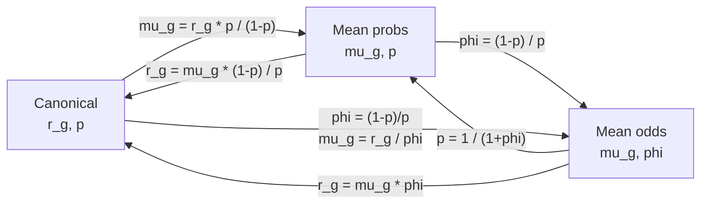

# Parameter Reference

This page is a one-stop cheatsheet mapping every internal parameter name in
SCRIBE's generative model to its mathematical symbol, its role in the likelihood
equations, the parameterization(s) it belongs to, and its biological
interpretation. Prior hyperparameters and dataset-level extensions are covered
at the end.

For guidance on *choosing* a model, see [Model Selection](model-selection.md).
For the `scribe.fit()` keyword arguments that configure these parameters, see
[The `scribe.fit()` Interface](fit.md).

---

## Color legend

The equations below use a consistent color code so you can track each
parameter across model variants.

| Color | Parameter | Meaning |
|:-----:|-----------|---------|
| \(\color{#e07a5f}{r_g}\) | `r` | Gene-specific dispersion (burst rate) |
| \(\color{#3d85c6}{p}\) | `p` | Success probability |
| \(\color{#81b29a}{\mu_g}\) | `mu` | Biological mean expression |
| \(\color{#f2cc8f}{\phi}\) | `phi` | Odds \((1-p)/p\) |
| \(\color{#9b59b6}{\nu^{(c)}}\) | `p_capture` | Cell-specific capture probability |
| \(\color{#e74c3c}{\pi_g}\) | `gate` | Per-gene zero-inflation probability |
| \(\color{#f39c12}{\kappa_g}\) | `bnb_concentration` | BNB concentration (tail heaviness) |

---

## Core likelihood equations

Each model variant adds one structural layer. The equations below highlight
exactly where each parameter sits.

### NBDM (base Negative Binomial)

\[
u_g \;\sim\; \text{NB}\!\bigl(\color{#e07a5f}{r_g},\;\color{#3d85c6}{p}\bigr)
\]

Gene-specific dispersion \(\color{#e07a5f}{r_g}\) controls per-gene
overdispersion; a single success probability \(\color{#3d85c6}{p}\) is shared
across genes. The joint distribution across genes factorizes into a Negative
Binomial for totals and a Dirichlet-Multinomial for compositions (see
[Theory](../theory/dirichlet-multinomial.md)).

### NBVCP (+ variable capture)

\[
\hat{p}^{(c)} = \frac{\color{#3d85c6}{p}\;\color{#9b59b6}{\nu^{(c)}}}{1 - \color{#3d85c6}{p}\,(1 - \color{#9b59b6}{\nu^{(c)}})},
\qquad
u_g^{(c)} \;\sim\; \text{NB}\!\bigl(\color{#e07a5f}{r_g},\;\hat{p}^{(c)}\bigr)
\]

The cell-specific capture probability
\(\color{#9b59b6}{\nu^{(c)}}\) absorbs library-size variation. Genes are
modelled independently given \(\color{#9b59b6}{\nu^{(c)}}\).

### ZINB / ZINBVCP (+ zero inflation)

\[
u_g^{(c)} \;\sim\;
\color{#e74c3c}{\pi_g}\;\delta_0
\;+\;
(1 - \color{#e74c3c}{\pi_g})\;\text{NB}\!\bigl(\color{#e07a5f}{r_g},\;\hat{p}^{(c)}\bigr)
\]

The per-gene gate \(\color{#e74c3c}{\pi_g}\) mixes a point mass at zero
(technical dropout) with the NB (or NBVCP) count distribution. In ZINBVCP,
\(\hat{p}^{(c)}\) includes the capture factor as above; in ZINB,
\(\hat{p}^{(c)} = \color{#3d85c6}{p}\).

### BNB overdispersion (any model + `overdispersion="bnb"`)

\[
\tilde{p} \;\sim\; \text{Beta}\!\bigl(\alpha_{gc},\;\color{#f39c12}{\kappa_g}\bigr),
\qquad
u_g^{(c)} \;\sim\; \text{NB}\!\bigl(\color{#e07a5f}{r_g},\;\tilde{p}\bigr)
\]

where \(\alpha_{gc}\) is set to preserve the NB mean:
\(\alpha_{gc} = \hat{p}^{(c)} \cdot \color{#f39c12}{\kappa_g}\,/\,(1 - \hat{p}^{(c)})\).
As \(\color{#f39c12}{\kappa_g} \to \infty\) the Beta concentrates at
\(\hat{p}^{(c)}\) and the BNB recovers the NB.

### Mixture models (any model + `n_components=K`)

With \(K\) components, gene-specific parameters gain a component axis. Each
cell's count is drawn from a mixture:

\[
u_g^{(c)} \;\sim\; \sum_{k=1}^{K} w_k \;\cdot\; f_k\!\bigl(u_g^{(c)} \;\mid\; \theta_g^{(k)}\bigr),
\]

where \(w_k\) are the mixing weights and \(\theta_g^{(k)}\) includes the
component-specific gene parameters. The `mixture_params` argument controls
which parameters vary by component (default: `r` and `gate` if applicable).

---

## Parameterization mappings

The NB distribution can be parameterized in three equivalent ways. The
`parameterization` argument to `scribe.fit()` controls which variables are
**sampled** (free parameters the optimizer targets) and which are **derived**
(deterministic functions of the sampled parameters).

### Conversion table

| Parameterization | `parameterization=` | Sampled | Derived | Conversion |
|------------------|---------------------|---------|---------|------------|
| **Canonical** | `"canonical"` (alias `"standard"`) | \(\color{#e07a5f}{r_g}\), \(\color{#3d85c6}{p}\) | --- | --- |
| **Mean probs** | `"mean_prob"` (alias `"linked"`) | \(\color{#81b29a}{\mu_g}\), \(\color{#3d85c6}{p}\) | \(\color{#e07a5f}{r_g}\) | \(r_g = \mu_g\,(1-p)\,/\,p\) |
| **Mean odds** | `"mean_odds"` (alias `"odds_ratio"`) | \(\color{#81b29a}{\mu_g}\), \(\color{#f2cc8f}{\phi}\) | \(\color{#3d85c6}{p}\), \(\color{#e07a5f}{r_g}\) | \(p = 1/(1+\phi)\), \(r_g = \mu_g \cdot \phi\) |

All three produce the **same NB distribution** for any given
\((\mu_g, r_g, p)\) triple --- they differ only in which quantities the
optimizer directly targets.

### Conversion diagram

### How capture parameters change with parameterization

The VCP capture parameter name depends on the parameterization:

| Parameterization | Capture parameter | Symbol | Domain |
|------------------|-------------------|--------|--------|
| Canonical, Mean probs | `p_capture` | \(\nu^{(c)}\) | \((0, 1)\) |
| Mean odds | `phi_capture` | \(\phi^{(c)}_{\text{cap}}\) | \((0, \infty)\) |
| Biology-informed (any) | `eta_capture` | \(\eta_c = \log(M_c / L_c)\) | \((0, \infty)\) |

Exact relationships:

\[
\nu^{(c)} = \exp(-\eta_c), \qquad
\phi^{(c)}_{\text{cap}} = \exp(\eta_c) - 1.
\]

When the **biology-informed capture prior** is enabled (via
`priors={"organism": "human"}`), `eta_capture` is the sampled site and
`p_capture` or `phi_capture` is registered as a deterministic.

---

## Master parameter table

| Parameter name | Symbol | Role | Domain | Models | Parameterization |
|----------------|--------|------|--------|--------|------------------|
| `r` | \(\color{#e07a5f}{r_g}\) | Gene-specific NB dispersion (burst rate). Higher \(r_g\) means less overdispersion | \(\mathbb{R}^+\) | All | Sampled in canonical; derived in mean_prob and mean_odds |
| `p` | \(\color{#3d85c6}{p}\) | NB success probability. Shared across genes in NBDM; gene-specific \(p_g\) when hierarchical | \((0, 1)\) | All | Sampled in canonical and mean_prob; derived in mean_odds |
| `mu` | \(\color{#81b29a}{\mu_g}\) | Biological mean expression per gene (before capture) | \(\mathbb{R}^+\) | All | Sampled in mean_prob and mean_odds; not directly in canonical |
| `phi` | \(\color{#f2cc8f}{\phi}\) | Odds of success probability: \(\phi = (1-p)/p\) | \(\mathbb{R}^+\) | All | Sampled only in mean_odds |
| `gate` | \(\color{#e74c3c}{\pi_g}\) | Per-gene zero-inflation probability (technical dropout) | \((0, 1)\) | ZINB, ZINBVCP | All parameterizations |
| `p_capture` | \(\color{#9b59b6}{\nu^{(c)}}\) | Cell-specific capture probability (library-size factor) | \((0, 1)\) | NBVCP, ZINBVCP | Canonical, mean_prob |
| `phi_capture` | \(\phi^{(c)}_{\text{cap}}\) | Cell-specific capture odds | \(\mathbb{R}^+\) | NBVCP, ZINBVCP | Mean odds only |
| `eta_capture` | \(\eta_c\) | Latent log-ratio \(\log(M_c / L_c)\) under biology-informed prior | \(\mathbb{R}^+\) | NBVCP, ZINBVCP | Any (when biology-informed prior is active) |
| `bnb_concentration` | \(\color{#f39c12}{\kappa_g}\) | Beta concentration controlling BNB tail heaviness. \(\kappa_g \to \infty\) recovers NB | \((2, \infty)\) | Any + `overdispersion="bnb"` | All parameterizations |
| `mixing_weights` | \(w_k\) | Dirichlet-distributed component probabilities | Simplex | Any + `n_components >= 2` | All parameterizations |
| `z` | \(\underline{z}^{(c)}\) | Per-cell latent embedding (VAE only) | \(\mathbb{R}^d\) | Any + `inference_method="vae"` | All parameterizations |

### Derived quantities (not directly sampled)

| Quantity | Formula | Appears in |
|----------|---------|------------|
| \(\hat{p}^{(c)}\) | \(\dfrac{p \cdot \nu^{(c)}}{1 - p\,(1 - \nu^{(c)})}\) | NBVCP / ZINBVCP effective success probability |
| \(\omega_g\) | \(\dfrac{r_g + 1}{\kappa_g - 2}\) | BNB excess dispersion fraction (prior applied to this) |
| \(\alpha_{gc}\) | \(\dfrac{\hat{p}^{(c)} \cdot \kappa_g}{1 - \hat{p}^{(c)}}\) | BNB Beta shape (mean-preserving) |

---

## Constrained vs. unconstrained mode

By default, parameters are sampled in their **constrained** domain (e.g.,
\(p \in (0,1)\) via a Beta distribution). With `unconstrained=True`, all
parameters are lifted to \(\mathbb{R}\) via standard transforms and sampled
as Normals:

| Parameter | Transform | Unconstrained name |
|-----------|-----------|-------------------|
| \(p \in (0,1)\) | logit | `p_unconstrained` |
| \(\mu \in \mathbb{R}^+\) | log | `mu_unconstrained` |
| \(\phi \in \mathbb{R}^+\) | log | `phi_unconstrained` |
| \(r \in \mathbb{R}^+\) | log | `r_unconstrained` |
| \(\pi_g \in (0,1)\) | logit | `gate_unconstrained` |

Unconstrained mode is **required** for hierarchical priors and BNB
overdispersion, and is the natural setting for
[normalizing flow guides](guide-families.md#normalizing-flow).

---

## Hierarchical prior hyperparameters

Hierarchical priors operate on the **unconstrained** transforms of gene-level
parameters (logit for probabilities, log for positive quantities). All three
prior families share the same template:

\[
\theta_g = \mu_{\text{pop}} + \sigma_g \cdot z_g,
\qquad z_g \sim \mathcal{N}(0, 1),
\]

where \(\sigma_g\) is the family-specific per-element scale.

### Gaussian hierarchy

A single shared scale for all genes:

\[
\sigma_g = \sigma \quad \forall\, g,
\qquad \sigma \sim \text{Softplus}(\mathcal{N}(\mu_\sigma, s_\sigma)).
\]

No user-configurable hyperparameters beyond the choice `"gaussian"` itself.

### Regularized Horseshoe

Per-gene local scales plus a global scale and regularization slab:

\[
\theta_g = \mu_{\text{pop}} + \color{#3d85c6}{\tau} \cdot \tilde{\lambda}_g \cdot z_g,
\qquad
\tilde{\lambda}_g = \frac{\color{#81b29a}{c}\,\lambda_g}{\sqrt{\color{#81b29a}{c}^2 + \color{#3d85c6}{\tau}^2 \lambda_g^2}}
\]

| `scribe.fit()` parameter | Symbol | Default | Role |
|---------------------------|--------|---------|------|
| `horseshoe_tau0` | \(\color{#3d85c6}{\tau_0}\) | `1.0` | Scale of Half-Cauchy prior on global \(\tau\). Controls overall sparsity level |
| `horseshoe_slab_df` | \(\nu\) | `4` | Degrees of freedom for Inv-Gamma slab on \(c^2\). Lower = heavier tails |
| `horseshoe_slab_scale` | \(s\) | `2.0` | Scale of the slab. Bounds the maximum effective local scale |

### Normal-Exponential-Gamma (NEG)

Gamma-Gamma hierarchy with a finite peak at zero (SVI-friendly):

\[
\zeta_g \sim \text{Gamma}(\color{#f2cc8f}{a},\; \color{#e07a5f}{\tau}),
\qquad
\psi_g \mid \zeta_g \sim \text{Gamma}(\color{#81b29a}{u},\; \zeta_g),
\qquad
\theta_g \sim \mathcal{N}(\mu_{\text{pop}},\; \sqrt{\psi_g}).
\]

| `scribe.fit()` parameter | Symbol | Default | Role |
|---------------------------|--------|---------|------|
| `neg_u` | \(\color{#81b29a}{u}\) | `1.0` | Inner Gamma shape. \(u=1\) gives NEG (finite peak); \(u=0.5\) recovers horseshoe (infinite spike) |
| `neg_a` | \(\color{#f2cc8f}{a}\) | `1.0` | Outer Gamma shape. Controls concentration near zero |
| `neg_tau` | \(\color{#e07a5f}{\tau}\) | `1.0` | Global rate for the outer Gamma. Higher = stronger global shrinkage |

### Mean anchoring prior

Anchors the gene mean \(\mu_g\) to a data-implied value to resolve
the multiplicative degeneracy between expression and capture:

\[
\hat{\mu}_g = \frac{\bar{u}_g + \epsilon}{\bar{\nu}},
\qquad
\log(\mu_g) \sim \mathcal{N}(\log(\hat{\mu}_g),\; \sigma_\mu^2).
\]

| `scribe.fit()` parameter | Symbol | Default | Role |
|---------------------------|--------|---------|------|
| `mu_mean_anchor` | --- | `False` | Enable mean anchoring |
| `mu_mean_anchor_sigma` | \(\sigma_\mu\) | `0.3` | Width of the anchor. Smaller = tighter regularization toward data mean |

See [Theory: Anchoring Priors](../theory/anchoring-priors.md).

### Biology-informed capture prior

Anchors the capture probability to the ratio of library size to total mRNA
content:

\[
\eta_c \sim \mathcal{N}^{+}\!\bigl(\log M_0 - \log L_c,\; \sigma_M^2\bigr),
\qquad \nu_c = \exp(-\eta_c).
\]

| `scribe.fit()` parameter | Symbol | Default | Role |
|---------------------------|--------|---------|------|
| `priors={"organism": "human"}` | \(M_0\) | --- | Sets organism-specific expected total mRNA (e.g., 200,000 for human/mouse) |
| `priors={"eta_capture": (log_M0, sigma_M)}` | \(\log M_0, \sigma_M\) | --- | Direct specification of capture prior parameters |

See [Theory: Anchoring Priors](../theory/anchoring-priors.md).

---

## Which prior applies where

Hierarchical priors are selected via the `*_prior` arguments. Each argument
targets a specific parameter at a specific level:

| `scribe.fit()` argument | Target parameter | Level | Accepted values | Requires |
|--------------------------|-----------------|-------|-----------------|----------|
| `p_prior` | \(p_g\) (gene-specific) | Gene | `"gaussian"`, `"horseshoe"`, `"neg"` | --- |
| `mu_prior` | \(\mu_g^{(k)}\) (across components) | Gene x component | `"gaussian"`, `"horseshoe"`, `"neg"` | `n_components >= 2`, `unconstrained=True` |
| `gate_prior` | \(\pi_g\) | Gene | `"gaussian"`, `"horseshoe"`, `"neg"` | ZI model |
| `overdispersion_prior` | \(\kappa_g\) (via \(\omega_g\)) | Gene | `"horseshoe"`, `"neg"` | `overdispersion="bnb"` |
| `mu_dataset_prior` | \(\mu_g^{(d)}\) | Gene x dataset | `"gaussian"`, `"horseshoe"`, `"neg"` | `dataset_key` |
| `p_dataset_prior` | \(p^{(d)}\) or \(p_g^{(d)}\) | Dataset (or gene x dataset) | `"gaussian"`, `"horseshoe"`, `"neg"` | `dataset_key` |
| `gate_dataset_prior` | \(\pi_g^{(d)}\) | Gene x dataset | `"gaussian"`, `"horseshoe"`, `"neg"` | `dataset_key`, ZI model |
| `overdispersion_dataset_prior` | \(\kappa_g^{(d)}\) | Gene x dataset | `"gaussian"`, `"horseshoe"`, `"neg"` | `overdispersion="bnb"`, `dataset_key` |

---

## Dataset-level parameters

When fitting multiple datasets jointly (`dataset_key="batch"`), single-dataset
parameters gain a **dataset axis**. The naming convention follows:

| Single-dataset | Multi-dataset | Hierarchy argument |
|----------------|---------------|--------------------|
| \(\mu_g\) | \(\mu_g^{(d)}\) | `mu_dataset_prior` |
| \(p\) or \(p_g\) | \(p^{(d)}\) or \(p_g^{(d)}\) | `p_dataset_prior` + `p_dataset_mode` |
| \(\pi_g\) | \(\pi_g^{(d)}\) | `gate_dataset_prior` |
| \(\kappa_g\) | \(\kappa_g^{(d)}\) | `overdispersion_dataset_prior` |
| \(\log M_0\) | \(\log M_0^{(d)}\) | `mu_eta_prior` (captures dataset-level total mRNA scaling) |

The `p_dataset_mode` argument controls the granularity of the
dataset-specific \(p\):

| Mode | Meaning |
|------|---------|
| `"scalar"` | One \(p^{(d)}\) per dataset, shared across genes |
| `"gene_specific"` (default) | Independent \(p_g^{(d)}\) per gene per dataset |
| `"two_level"` | Each dataset has its own \((\mu_p^{(d)}, \sigma_p^{(d)})\), from which gene-level \(p_g^{(d)}\) are drawn |

See [Theory: Hierarchical Priors --- Multi-dataset](../theory/hierarchical-priors.md#extension-to-multiple-datasets).

---

## Quick-look matrix

Which parameters appear in which model configuration:

| Parameter | NBDM | NBVCP | ZINB | ZINBVCP | + BNB | + Mixture |
|-----------|:----:|:-----:|:----:|:-------:|:-----:|:---------:|
| `r` / `r_g` | yes | yes | yes | yes | yes | per-component |
| `p` | yes | yes | yes | yes | yes | yes |
| `mu` | MP/MO | MP/MO | MP/MO | MP/MO | MP/MO | per-component |
| `phi` | MO | MO | MO | MO | MO | MO |
| `gate` | --- | --- | yes | yes | yes | per-component |
| `p_capture` / `phi_capture` | --- | yes | --- | yes | yes | yes |
| `eta_capture` | --- | opt | --- | opt | opt | opt |
| `bnb_concentration` | --- | --- | --- | --- | yes | per-component |
| `mixing_weights` | --- | --- | --- | --- | --- | yes |
| `z` (VAE latent) | VAE | VAE | VAE | VAE | VAE | VAE |

**Legend:** "yes" = always present; "MP/MO" = only with mean_prob or mean_odds
parameterization; "MO" = only with mean_odds; "opt" = optional (biology-informed
prior); "VAE" = only with `inference_method="vae"`; "per-component" = one per
mixture component.

---

For the full derivations behind these equations, see the
[Theory section](../theory/index.md). For practical guidance on configuring
these parameters via `scribe.fit()`, see
[The `scribe.fit()` Interface](fit.md).
