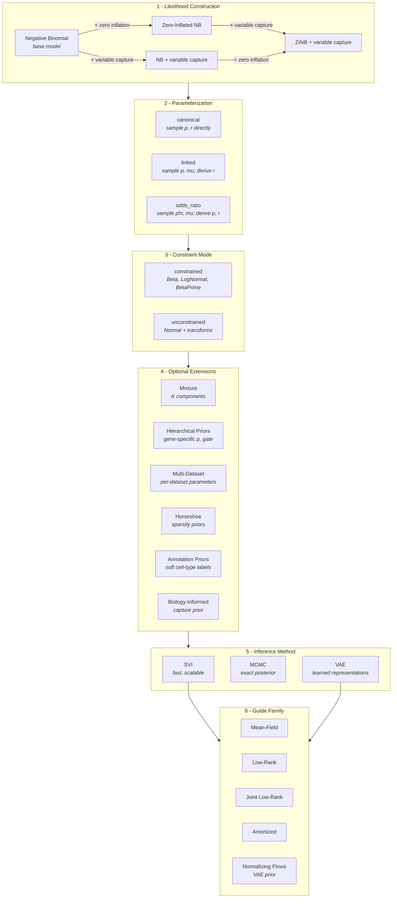

# Welcome to SCRIBE

**SCRIBE** (Single-Cell RNA-seq Inference with Bayesian Estimation) is a
comprehensive Python package for
[Bayesian](https://en.wikipedia.org/wiki/Bayesian_inference) analysis of
[single-cell RNA
sequencing](https://en.wikipedia.org/wiki/Single-cell_transcriptomics)
(scRNA-seq) data. Built on [JAX](https://jax.readthedocs.io/en/latest/) and
[NumPyro](https://num.pyro.ai/en/stable/index.html), SCRIBE provides a unified
framework for probabilistic modeling, [variational
inference](https://en.wikipedia.org/wiki/Variational_Bayesian_methods),
[uncertainty
quantification](https://en.wikipedia.org/wiki/Uncertainty_quantification),
[differential
expression](https://en.wikipedia.org/wiki/Gene_expression), and
model comparison in single-cell
genomics.

## Generative Model

<figure markdown="span">
  { width="600" }
  <figcaption>
    Biophysical generative model underlying SCRIBE. Transcription and
    degradation set the steady-state mRNA content per gene, giving rise to a
    Negative Binomial distribution. Binomial capture sub-sampling yields the
    observed UMI counts.
  </figcaption>
</figure>

SCRIBE is grounded in a biophysical generative model of scRNA-seq count data.
Transcription (rate \(b\)) and degradation (rate \(\gamma\)) set the
steady-state mRNA content per gene, giving rise to a [Negative Binomial
distribution](https://en.wikipedia.org/wiki/Negative_binomial_distribution) over
true molecular counts \(m_g\) with parameters \(r_g\) and \(p_g\). During
library preparation each
molecule is independently captured with cell-specific probability \(\nu^{(c)}\),
so the observed [UMI](https://en.wikipedia.org/wiki/Unique_molecular_identifier)
count \(u_g\) follows a
[Binomial](https://en.wikipedia.org/wiki/Binomial_distribution) sub-sampling of
\(m_g\). Marginalizing over the latent counts yields a Negative Binomial
likelihood for the observations with an effective success probability
\(\hat{p}_g^{(c)}\) that absorbs the capture efficiency.

For the full mathematical derivation, see the
[Theory section](theory/index.md).

## Why SCRIBE?

- **Unified Framework**: Single `scribe.fit()` interface for
  [SVI](https://en.wikipedia.org/wiki/Variational_Bayesian_methods),
  [MCMC](https://en.wikipedia.org/wiki/Markov_chain_Monte_Carlo), and
  [VAE](https://en.wikipedia.org/wiki/Variational_autoencoder) inference methods
- **Compositional Models**: Four constructive likelihoods -- from the base
  Negative Binomial up to
  [zero-inflated](https://en.wikipedia.org/wiki/Zero-inflated_model) models with
  variable capture probability
- **Compositional Differential Expression**: Bayesian DE in log-ratio
  coordinates with proper uncertainty propagation and error control (lfsr, PEFP)
- **Model Comparison**:
  [WAIC](https://en.wikipedia.org/wiki/Watanabe%E2%80%93Akaike_information_criterion),
  [PSIS-LOO](https://en.wikipedia.org/wiki/Cross-validation_(statistics)#Leave-one-out_cross-validation),
  stacking weights, and goodness-of-fit diagnostics for principled model
  selection
- **GPU Accelerated**: JAX-based implementation with automatic GPU support
- **Flexible Architecture**: Three parameterizations, constrained/unconstrained
  modes, hierarchical priors,
  horseshoe sparsity, and
  [normalizing flows](https://en.wikipedia.org/wiki/Flow-based_generative_model)
- **Scalable**: From small experiments to large-scale atlases with mini-batch
  support

## Key Features

- **Three Inference Methods**:
    - SVI for speed and scalability
    - MCMC ([NUTS](https://en.wikipedia.org/wiki/Hamiltonian_Monte_Carlo#No_U-Turn_Sampler)) for exact
      Bayesian inference
    - VAE for representation learning with normalizing flow priors
- **Constructive Likelihood System**: Negative Binomial as the base, extended
  with zero inflation and/or variable capture probability
- **Multiple Parameterizations**: Canonical, linked (mean-prob), and odds-ratio
  with constrained or unconstrained priors
- **Advanced Guide Families**:
  [Mean-field](https://en.wikipedia.org/wiki/Mean-field_approximation),
  low-rank, joint low-rank, and amortized variational guides
- **Mixture Models**: K-component mixtures for cell type discovery with
  annotation-guided priors
- **Hierarchical Priors**: Gene-specific and dataset-level hierarchical
  structures with optional horseshoe sparsity
- **Bayesian Differential Expression**: Parametric, empirical (Monte Carlo), and
  shrinkage ([empirical
  Bayes](https://en.wikipedia.org/wiki/Empirical_Bayes_method)) methods in
  [CLR/ILR](https://en.wikipedia.org/wiki/Compositional_data) coordinates
- **Model Comparison**: WAIC, PSIS-LOO, stacking, per-gene elpd, and
  goodness-of-fit via randomized quantile residuals
- **Seamless Integration**: Works with AnnData and the scanpy ecosystem

## Model Construction Space

SCRIBE models are built compositionally. The likelihood is constructed by
layering extensions on top of a base Negative Binomial (NB) model, then
configured with a parameterization, constraint mode, optional extensions, and
an inference method:



This compositional design means you can combine **4 likelihoods x 3
parameterizations x 2 constraint modes** as a starting point, then layer on
mixture components, hierarchical priors, multi-dataset structure, and more.

## Available Models

### Likelihood Construction

SCRIBE's four likelihoods build on each other -- the base Negative Binomial
model can be extended with zero inflation and/or variable capture probability:

| Likelihood | Code | Construction | Extra Parameters | Best For |
|---|---|---|---|---|
| **Negative Binomial** | `"nbdm"` | Base model | -- | Baseline analysis, fast |
| **Zero-Inflated NB** | `"zinb"` | NB + zero inflation | `gate` | Data with excess zeros |
| **NB + variable capture** | `"nbvcp"` | NB + capture probability | `p_capture` | Variable sequencing depth |
| **ZINB + variable capture** | `"zinbvcp"` | ZINB + capture probability | `gate`, `p_capture` | Complex technical variation |

Any of the above can be extended to **mixture models** with `n_components=K`
for subpopulation analysis.

### Parameterizations

Each likelihood can be parameterized in three ways:

| Parameterization | Aliases | Core Parameters | Derived | When to Use |
|---|---|---|---|---|
| **canonical** | `standard` | p, r | -- | Direct interpretation |
| **linked** | `mean_prob` | p, mu | r = mu(1-p)/p | Captures p-r correlation |
| **odds_ratio** | `mean_odds` | phi, mu | p = 1/(1+phi), r = mu*phi | Numerically stable near p ~ 1 |

### Constrained vs Unconstrained

| Mode | Prior Distributions | Use Case |
|---|---|---|
| **Constrained** | Beta, LogNormal, BetaPrime | Default; interpretable parameters |
| **Unconstrained** | Normal + sigmoid/exp transforms | Optimization-friendly; required for hierarchical priors |

## Quick Start

```python
import scribe
import scanpy as sc

# Load your single-cell data
adata = sc.read_h5ad("your_data.h5ad")

# Run SCRIBE with default settings (SVI inference, NB model)
results = scribe.fit(adata, model="nbdm")

# Analyze results
posterior_samples = results.get_posterior_samples()
```

### Customize with Simple Arguments

```python
# Zero-inflated model with more optimization steps
results = scribe.fit(
    adata,
    model="zinb",
    n_steps=100_000,
    batch_size=512,
)

# Linked parameterization with low-rank guide
results = scribe.fit(
    adata,
    model="nbdm",
    parameterization="linked",
    guide_rank=15,
)

# Mixture model for cell type discovery
results = scribe.fit(
    adata,
    model="zinb",
    n_components=3,
    n_steps=150_000,
)
```

### Choose Your Inference Method

| Method | Engine | Precision | Use Case |
|---|---|---|---|
| **SVI** | [Adam optimizer](https://en.wikipedia.org/wiki/Adam_(optimization_algorithm)) | float32 | Fast exploration, large datasets |
| **MCMC** | NUTS sampler | float64 | Exact posterior, gold standard |
| **VAE** | [Encoder-decoder](https://en.wikipedia.org/wiki/Autoencoder) | float32 | Latent representations, embeddings |

```python
# Fast exploration with SVI (default)
svi_results = scribe.fit(adata, model="zinb", n_steps=75_000)

# Exact inference with MCMC
mcmc_results = scribe.fit(
    adata,
    model="nbdm",
    inference_method="mcmc",
    n_samples=3000,
    n_chains=4,
)

# Representation learning with VAE
vae_results = scribe.fit(
    adata,
    model="nbdm",
    inference_method="vae",
    n_steps=50_000,
)
```

## Differential Expression

SCRIBE provides a fully Bayesian differential expression framework that
respects the compositional nature of scRNA-seq data. All comparisons are
performed in log-ratio coordinates (CLR/ILR), propagating full posterior
uncertainty.

| Method | Description | Use Case |
|---|---|---|
| **Parametric** | Analytic Gaussian in ALR space | Fast, requires low-rank logistic-normal fit |
| **Empirical** | Monte Carlo CLR differences | Assumption-free, from posterior samples |
| **Shrinkage** | Empirical Bayes scale-mixture prior | Improved per-gene inference, borrows strength across genes |

```python
import jax.numpy as jnp
from scribe import compare

# Fit two conditions
results_ctrl = scribe.fit(adata_ctrl, model="nbdm", n_components=3)
results_treat = scribe.fit(adata_treat, model="nbdm", n_components=3)

# Empirical DE between component 0 across conditions
de = compare(
    results_treat, results_ctrl,
    method="empirical",
    component_A=0, component_B=0,
)

# Gene-level results with practical significance threshold
gene_results = de.gene_level(tau=jnp.log(1.1))

# Call DE genes controlling false sign rate
is_de = de.call_genes(lfsr_threshold=0.05)
```

[:octicons-arrow-right-24: Full Differential Expression guide](guide/differential-expression.md)

## Model Comparison

Principled Bayesian model comparison with WAIC, PSIS-LOO, stacking weights,
per-gene elpd differences, and goodness-of-fit diagnostics:

```python
from scribe import compare_models

mc = compare_models(
    [results_nb, results_hierarchical],
    counts=counts,
    model_names=["NB", "Hierarchical"],
    gene_names=gene_names,
)

# Ranked comparison table
print(mc.summary())

# Per-gene elpd differences
gene_df = mc.gene_level_comparison("NB", "Hierarchical")
```

[:octicons-arrow-right-24: Full Model Comparison guide](guide/model-comparison.md)

## Getting Started

<div class="grid cards" markdown>

-   :material-download:{ .lg .middle } **Installation**

    ---

    Install SCRIBE and set up your environment

    [:octicons-arrow-right-24: Installation guide](getting-started/installation.md)

-   :material-book-open-variant:{ .lg .middle } **Quick Overview**

    ---

    Understand the probabilistic approach behind SCRIBE

    [:octicons-arrow-right-24: Quick overview](getting-started/quick-overview.md)

-   :material-rocket-launch:{ .lg .middle } **Quickstart**

    ---

    Run your first inference in minutes

    [:octicons-arrow-right-24: Quickstart tutorial](getting-started/quickstart.md)

-   :material-function-variant:{ .lg .middle } **Theory**

    ---

    Mathematical foundations of the SCRIBE models

    [:octicons-arrow-right-24: Theory](theory/index.md)

-   :material-view-grid:{ .lg .middle } **Model Selection**

    ---

    Choose the right model for your data

    [:octicons-arrow-right-24: Model Selection](guide/model-selection.md)

-   :material-book-open-page-variant:{ .lg .middle } **User Guide**

    ---

    Inference methods, DE, model comparison, and more

    [:octicons-arrow-right-24: User guide](guide/index.md)

-   :material-api:{ .lg .middle } **API Reference**

    ---

    Full reference for all modules and classes

    [:octicons-arrow-right-24: API reference](reference/)

</div>
