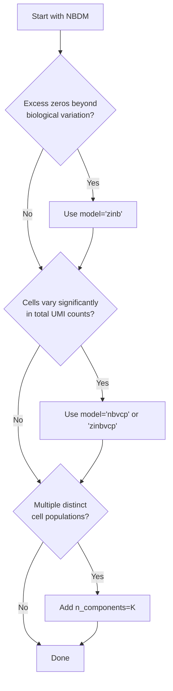

# Available Models

SCRIBE provides a family of probabilistic models for single-cell RNA sequencing
data, all built on the foundational **Negative Binomial-Dirichlet Multinomial
(NBDM)** framework. Rather than choosing between completely different models,
you select the variant that best matches your data characteristics by passing a
model string to `scribe.fit()`.

## Quick Start

All models are accessed through the same unified interface:

```python
import scribe

# Basic NBDM model with SVI
results = scribe.fit(adata, model="nbdm")

# Zero-inflated model for data with excess zeros
results = scribe.fit(adata, model="zinb")

# Variable capture model for cells with different capture efficiencies
results = scribe.fit(adata, model="nbvcp")

# Combined model addressing both issues
results = scribe.fit(adata, model="zinbvcp")

# Mixture model for multiple cell populations
results = scribe.fit(adata, model="nbdm", n_components=3)

# MCMC inference with any model
results = scribe.fit(
    adata, model="zinb",
    inference_method="mcmc", n_samples=2000,
)
```

## Model Selection Guide

Choose your model by answering these questions:



## Model Family Overview

| Model | Zero Inflated | Variable Capture | Key Feature | Best For | Cost |
|-------|:---:|:---:|-------------|----------|------|
| [NBDM](nbdm.md) | -- | -- | Compositional normalization | Clean data, moderate overdispersion | Low |
| [ZINB](zinb.md) | Yes | -- | Technical dropout modeling | Data with excess zeros | Low-Medium |
| [NBVCP](nbvcp.md) | -- | Yes | Cell-specific capture rates | Variable library sizes | Medium |
| [ZINBVCP](zinbvcp.md) | Yes | Yes | Both dropouts and capture variation | Complex technical artifacts | High |
| [Mixture](mixture.md) | Any | Any | Multiple cell populations | Heterogeneous samples | High |

## Detailed Comparison

### Basic Models

**NBDM (Negative Binomial-Dirichlet Multinomial)**
:   The foundational model that provides principled compositional normalization
    by modeling total UMI count per cell (Negative Binomial) and gene-wise
    allocation of UMIs (Dirichlet-Multinomial).
    *Use when*: Data is relatively clean with moderate overdispersion.

**ZINB (Zero-Inflated Negative Binomial)**
:   Extends NBDM by adding a zero-inflation component to handle technical
    dropouts, with gene-specific dropout probabilities and independent modeling
    of each gene.
    *Use when*: Excessive zeros beyond what NBDM predicts.

**NBVCP (NB with Variable Capture Probability)**
:   Extends NBDM by modeling cell-specific mRNA capture efficiencies, accounting
    for technical variation in library preparation.
    *Use when*: Large variation in total UMI counts across cells.

**ZINBVCP (Zero-Inflated NB with Variable Capture Probability)**
:   Combines both zero-inflation and variable capture modeling. Most
    comprehensive single-cell artifact modeling at the highest computational
    cost.
    *Use when*: Data has both excess zeros and variable capture efficiency.

### Mixture Models

Any of the above models can be extended to mixture variants by adding
`n_components=K`:

```python
# ZINB mixture model for 3 cell populations
results = scribe.fit(adata, model="zinb", n_components=3)
```

*Use when*: Your sample contains multiple distinct cell types or states.

## Code Examples

### Standard Analysis with SVI

```python
import scribe
import anndata as ad

# Load data
adata = ad.read_h5ad("data.h5ad")

# Fit basic model using SVI
results = scribe.fit(adata, model="nbdm", n_steps=100_000)

# Get posterior predictive samples
ppc_samples = results.ppc_samples(n_samples=100)

# Visualize results
scribe.viz.plot_parameter_posteriors(results)
```

### MCMC Analysis

```python
# Fit model using MCMC
mcmc_results = scribe.fit(
    adata,
    model="zinb",
    inference_method="mcmc",
    n_samples=2000,
    n_warmup=1000,
)

# Check convergence diagnostics
print(mcmc_results.summary)
```

### Comparing Models

```python
# Fit different models
basic_results = scribe.fit(adata, model="nbdm")
zinb_results = scribe.fit(adata, model="zinb")

# Compare model fit using WAIC
from scribe import compare_models

mc = compare_models(
    [basic_results, zinb_results],
    counts=adata.X,
    model_names=["NBDM", "ZINB"],
)
print(mc.summary())
```

### Mixture Model Analysis

```python
# Fit mixture model
mixture_results = scribe.fit(
    adata,
    model="nbdm",
    n_components=3,
    n_steps=150_000,
)

# Get cell type assignments
assignments = mixture_results.cell_type_assignments(counts=counts)
mean_probs = assignments["mean_probabilities"]

# Analyze component-specific parameters
posterior_samples = mixture_results.get_posterior_samples(n_samples=1000)
for k in range(3):
    r_k = posterior_samples[f"r_{k}"]
    print(f"Component {k} mean dispersion: {r_k.mean():.3f}")
```

## Performance Considerations

### Computational Complexity

- **NBDM**: \(O(N \times G)\) — linear in cells and genes
- **ZINB**: \(O(N \times G)\) — similar to NBDM
- **NBVCP**: \(O(N \times G)\) — additional cell parameters
- **ZINBVCP**: \(O(N \times G)\) — most parameters per model
- **Mixtures**: \(O(K \times \text{base model})\) — scales with components

### SVI Convergence (typical `n_steps`)

| Model Type | Standard | Odds-Ratio | Unconstrained |
|------------|----------|------------|---------------|
| NBDM, ZINB | 50k–100k | 25k–50k | 100k–200k |
| NBVCP, ZINBVCP | 100k–150k | 50k–100k | 150k–300k |
| Mixture Models | 150k–300k | 100k–200k | 300k–500k |

### MCMC Convergence (typical requirements)

| Model Type | Warmup | Samples | Chains |
|------------|--------|---------|--------|
| NBDM, ZINB | 1,000 | 2,000 | 2–4 |
| NBVCP, ZINBVCP | 2,000 | 3,000 | 4 |
| Mixture Models | 3,000 | 5,000 | 4–8 |

### Parameterization Guide

- **Standard**: Good default choice, uses natural parameter distributions
- **Odds-Ratio**: Often converges faster in SVI, good for optimization
- **Linked**: Alternative parameterization for specific use cases
- **Unconstrained**: Best for MCMC, allows unrestricted parameter space

## Mathematical Foundation

All SCRIBE models build on the core insight that single-cell RNA-seq data can
be decomposed into:

1. **Total transcriptome size** (how many molecules per cell)
2. **Gene-wise allocation** (how molecules are distributed among genes)

This decomposition enables principled normalization and uncertainty
quantification. For the full theoretical background, see the
[Theory section](../theory/index.md), which covers:

- The [Dirichlet-Multinomial derivation](../theory/dirichlet-multinomial.md)
  showing how independent negative binomials factorize into the NBDM
  formulation
- The [Hierarchical Gene-Specific \(p\)](../theory/hierarchical-p.md) extension
  that relaxes the shared success probability assumption

Model variants extend this foundation by:

- **Zero-inflation**: Adding technical dropout layers
- **Variable capture**: Cell-specific efficiency parameters
- **Mixtures**: Multiple parameter sets for different populations

## Next Steps

1. **Start with the basic NBDM model** to establish baseline performance
2. **Check model diagnostics** to identify potential issues
3. **Add complexity incrementally** based on your data characteristics
4. **Compare models** using information criteria and posterior predictive checks
