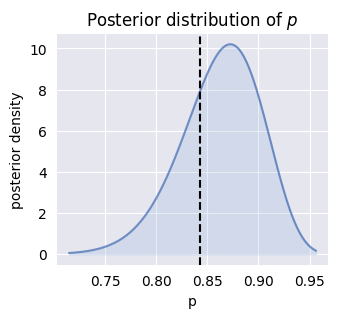

Quick Overview
==============

SCRIBE (Single-Cell RNA-Seq Inference using Bayesian Estimation) takes a
fundamentally different approach to single-cell RNA sequencing analysis. Instead
of treating cells as isolated data points that need to be normalized,
batch-corrected, and processed, SCRIBE views each cell as a sample from a
statistical model that describes the entire dataset.

The Power of Probabilistic Modeling
-----------------------------------

At its core, SCRIBE embraces the inherent uncertainty in scRNA-seq data through
Bayesian modeling. Consider a typical dataset with 10,000 cells and 20,000 genes
—that's 200 million data points! Rather than making point estimates about
expression levels, SCRIBE learns probability distributions that capture:

* How variable each gene's expression truly is
* Which zeros represent technical dropouts versus biological absence
* How capture efficiency varies between cells
* Whether cells belong to distinct subpopulations

   
   Rather than single values, SCRIBE learns complete probability distributions for model parameters. Here, the posterior distribution for the success probability parameter shows the range of plausible values given the data.

Why `Variational Inference <https://en.wikipedia.org/wiki/Variational_Bayesian_methods>`_?
------------------------------------------------------------------------------------------

With such high-dimensional data, traditional Bayesian methods such as `Markov
Chain Monte Carlo (MCMC)
<https://en.wikipedia.org/wiki/Markov_chain_Monte_Carlo>`_ would take
prohibitively long to converge. SCRIBE uses variational inference—a method that
transforms Bayesian inference into an optimization problem—to learn approximate
posterior distributions efficiently. This allows SCRIBE to:

* Scale to datasets with millions of cells
* Accelerate inference with GPUs
* Provide results in minutes to hours rather than days
* Maintain uncertainty quantification despite approximations

What Can You Do with SCRIBE?
----------------------------

Once SCRIBE learns your model, you can:

* Generate normalized expression values with principled uncertainty estimates
* Identify technical artifacts and batch effects probabilistically
* Find cell subpopulations without arbitrary clustering
* Make predictions about new cells
* Compare different models to understand your data's structure

.. figure:: _static/images/nbdm_sim/example_ppc.png
   :width: 350
   :alt: Posterior predictive checks
   
   SCRIBE can generate synthetic data (blue bands) that matches the statistical properties of your real data (black line), allowing you to validate model fit and make predictions.

The Bayesian Advantage
----------------------

The Bayesian framework provides several key benefits for single-cell analysis:

* **Uncertainty Quantification**: Every estimate comes with credible regions
  (what most scientist confuse with confidence intervals from the frequentist
  world)
* **Model Comparison**: Rigorous ways to choose between competing models
* **Missing Data**: Principled handling of dropouts and technical zeros
* **Integration**: Natural ways to combine data from multiple experiments (to be
  developed)
* **Predictions**: Generate synthetic data with realistic properties

SCRIBE makes these powerful Bayesian methods accessible through a simple Python
interface, while maintaining the mathematical rigor necessary for proper
statistical inference. Whether you're interested in basic normalization or
complex mixture modeling, SCRIBE provides a principled foundation for your
single-cell analysis.