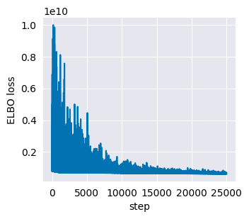
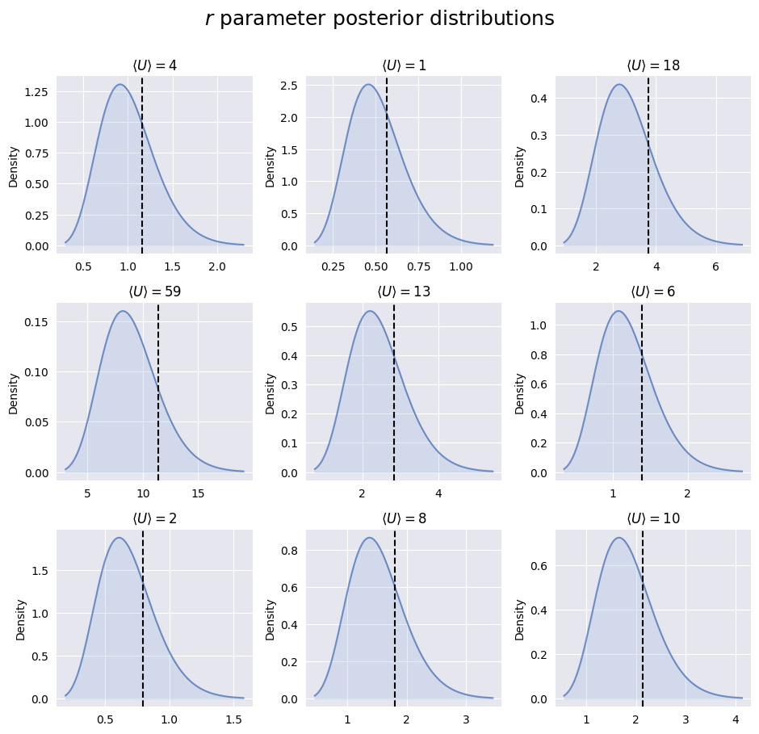
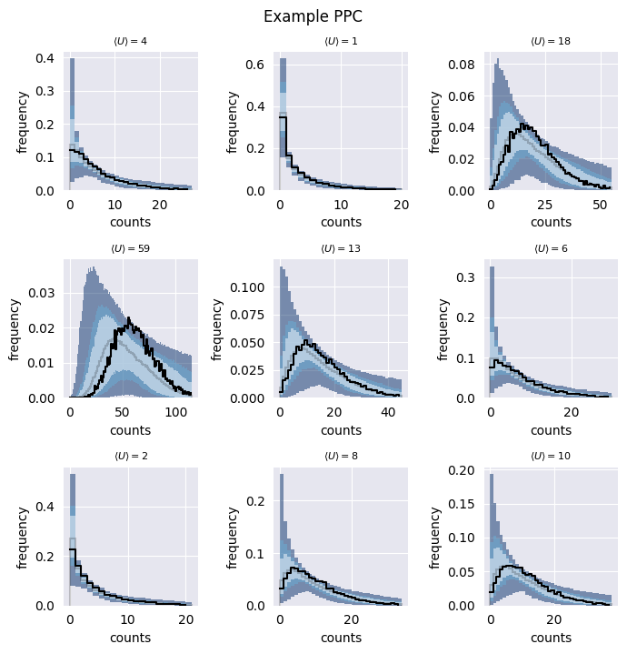

Quickstart
==========

This tutorial will walk you through simulating data from a :doc:`Negative
Binomial-Dirichlet Multinomial (NBDM) model <models/nbdm>`, fitting it with
SCRIBE, and visualizing the results. See all the available models in the
:doc:`models section <models/index>`.

Setup
-----

First, let's import the necessary libraries and set up our directories:

.. code-block:: python

    import os
    import pickle
    import jax
    from jax import random
    import jax.numpy as jnp
    import numpy as np
    import scribe

    # Define model type and directories
    model_type = "nbdm"
    OUTPUT_DIR = "path/to/output"
    FIG_DIR = "path/to/figures"
    
    # Create output directory
    os.makedirs(OUTPUT_DIR, exist_ok=True)

Simulating Data
---------------

Next, we'll simulate data from the :doc:`NBDM model <models/nbdm>`. We'll
generate data for 10,000 cells and 20,000 genes. For memory efficiency, we'll
use batching when generating samples, generating the samples in the GPU using
`JAX <https://jax.readthedocs.io/en/latest/>`_ and then moving the samples to
the CPU using `NumPy <https://numpy.org/>`_.

First, let's set up our simulation parameters:

.. code-block:: python

    # Setup random seed
    rng_key = random.PRNGKey(42)
    
    # Define dimensions
    n_cells = 10_000
    n_genes = 20_000
    batch_size = 4096
    
    # Define prior parameters
    r_prior = (2, 1)  # Shape and rate for Gamma prior on r
    p_prior = (1, 1)  # Alpha and beta for Beta prior on p

Now we'll sample the true parameters from their respective prior distributions:

.. code-block:: python

    # Split random keys
    key1, key2 = random.split(rng_key, 2)
    
    # Sample true parameters
    r_true = random.gamma(key1, r_prior[0], shape=(n_genes,)) / r_prior[1]
    p_true = random.beta(key2, p_prior[0], p_prior[1])

With our true parameters in hand, we can generate the count data. We'll do this
in batches to manage memory usage:

.. code-block:: python

    counts_true = np.zeros((n_cells, n_genes))
    
    # Sample in batches
    for i in range(0, n_cells, batch_size):
        current_batch_size = min(batch_size, n_cells - i)
        key_batch = random.fold_in(rng_key, i)
        
        # Sample from Negative Binomial distribution
        batch_samples = dist.NegativeBinomialProbs(
            r_true, p_true
        ).sample(key_batch, sample_shape=(current_batch_size,))
        
        counts_true[i:i+current_batch_size] = np.array(batch_samples)

Fitting the Model
-----------------

Now that we have our simulated data, we can fit it using SCRIBE. We'll run the
inference for 25,000 steps:

.. code-block:: python

    n_steps = 25_000
    
    # Run SCRIBE inference
    results = scribe.svi.run_scribe(
        model_type="nbdm",
        counts=counts_true,
        n_steps=n_steps,
        batch_size=batch_size,
        prior_params={
            "p_prior": p_prior,
            "r_prior": r_prior
        }
    )

Visualizing Results
-----------------

Let's create some visualizations to assess our model fit. First, let's look at
the ELBO loss history. This is stored in the `results` object as a list of
loss values:

.. code-block:: python

    import matplotlib.pyplot as plt
    
    # Plot loss history
    fig, ax = plt.subplots(figsize=(3.5, 3))
    ax.plot(results.loss_history)
    ax.set_xlabel("step")
    ax.set_ylabel("ELBO loss")
    plt.show()

   
   ELBO loss history showing convergence of the model fitting process. The spiky
   nature of the loss is due to the batching process.

We can also compare our inferred parameters to the true values. Let's look at
the posterior distribution for p:

.. code-block:: python

    fig, ax = plt.subplots(figsize=(3.5, 3))
    
    # Get posterior distribution
    distribution = results.get_distributions()['p']
    
    # Plot posterior with true value
    scribe.viz.plot_posterior(
        ax,
        distribution,
        ground_truth=p_true,
        ground_truth_color="black",
        color=scribe.viz.colors()["dark_blue"],
        fill_color=scribe.viz.colors()["light_blue"],
    )
    
    ax.set_xlabel("p")
    ax.set_ylabel("posterior density")
    plt.show()

.. figure:: _static/images/nbdm_sim/example_p_posterior.png
   :width: 350
   :alt: Posterior distribution for p
   
   Posterior distribution for the :math:`p` parameter. The true value from
   simulation is shown in black.

Let's generate a similar plot for various examples of the inferred :math:`r`
parameter:

.. code-block:: python

    # Initialize figure
    fig, ax = plt.subplots(3, 3, figsize=(9.5, 9))

    # Flatten axes
    ax = ax.flatten()

    fig.suptitle(r"$r$ parameter posterior distributions", y=1.005, fontsize=18)

    # Loop through each gene in shared genes
    for i, ax in enumerate(ax):
        # Extract distribution for first type
        distribution = stats.gamma(
            results.params["alpha_r"][np.sort(selected_idx)[i]],
            loc=0,
            scale=1 / results.params["beta_r"][np.sort(selected_idx)[i]]
        )

        # Plot distribution
        scribe.viz.plot_posterior(
            ax,
            distribution,
            ground_truth=data["r"][np.sort(selected_idx)[i]],
            ground_truth_color="black",
            color=scribe.viz.colors()["dark_blue"],
            fill_color=scribe.viz.colors()["light_blue"],
        )

    plt.tight_layout()
    plt.show()

   
   Posterior distribution for multiple examples of the :math:`r` parameter. The
   true value from simulation is shown in black.

Finally, we can generate posterior predictive checks (PPCs) to assess model fit:

.. code-block:: python

    # Generate PPC samples
    n_samples = 500
    results.get_ppc_samples(n_samples=n_samples)
    
    # Plot PPCs for a subset of genes
    fig, ax = plt.subplots(figsize=(3.5, 3))
    
    # Compute and plot credible regions
    credible_regions = scribe.stats.compute_histogram_credible_regions(
        results.posterior_samples["predictive_samples"][:, :, 0],
        credible_regions=[95, 68, 50]
    )
    
    scribe.viz.plot_histogram_credible_regions_stairs(
        ax, 
        credible_regions,
        cmap='Blues',
        alpha=0.5
    )
    
    plt.show()

   
   Posterior predictive checks for the data generative process. The distribution
   of counts observed in the simulated data is shown in black. The shades of
   blue show the credible regions for the distribution of counts under the
   posterior predictive distribution.

The visual assessment of the model fit to some of the genes reveals that the
model is able to capture the data generating process. From here, we can continue
our analysis with the inferred parameters.

.. warning::

    Never trust any model fit (either from SCRIBE or any other analysis
    pipeline) without at least visualizing how the fit compares to the observed
    data. There are no silver bullets in statistics, and the best assessment of
    any fitting procedure is to visualize how the fit compares to the observed
    data.

This completes our quickstart guide! You've now learned how to:

- Simulate data from the :doc:`NBDM model <models/nbdm>`
- Fit the model using SCRIBE
- Visualize and assess the results

For more detailed examples and advanced usage, check out our tutorials section.