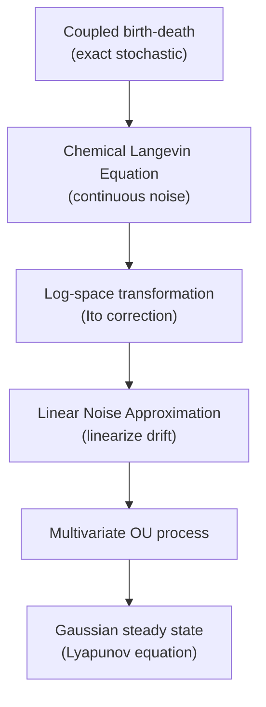

# GRN Biophysics and Log-Normal Abundances

This page develops the biophysical derivation showing that the steady-state
distribution of gene expression in a gene regulatory network (GRN) is a
**multivariate Gaussian on log-abundances**. This result is universal: it follows
from any microscopic promoter model satisfying first-order mRNA degradation and
coarse-grainable production, under the linear noise approximation (LNA). It
provides the shared biophysical foundation for both the
[Poisson Log-Normal](poisson-lognormal.md) (PLN) and
[Logistic-Normal Multinomial](logistic-normal-multinomial.md) (LNM)
observation models.

---

## The starting point: bursty transcription

The simplest microscopic model of gene expression that produces the Negative
Binomial distribution **exactly** is the one-state bursty promoter. A gene
\(g\) whose promoter is constitutively active receives transcription bursts at
rate \(k_{i,g}\), where each burst deposits a geometric-distributed number of
mRNA molecules with mean \(b_g\). Between bursts, mRNA degrades at first-order
rate \(\gamma_g\).

The exact steady-state mRNA distribution is:

\[
m_g \sim \text{NB}\!\left(r_g = \frac{k_{i,g}}{\gamma_g},\;
p_g = \frac{1}{1 + b_g}\right).
\]

Equivalently, via the Poisson--Gamma mixture representation, the effective
mRNA production rate \(\lambda_g\) follows a Gamma distribution:

\[
\lambda_g \sim \text{Gamma}\!\left(r_g,\, b_g\right),
\quad m_g \mid \lambda_g \sim \text{Poisson}(\lambda_g).
\]

This is the connection to the Dirichlet-Multinomial model: independent Gamma
rates normalize to the Dirichlet (see [Dirichlet-Multinomial](dirichlet-multinomial.md)).

---

## Gene regulatory coupling

When genes regulate one another, the burst initiation rate becomes a function of
the regulatory state: \(k_{i,g}(\underline{\lambda})\). Conservation of mass
gives the mesoscopic ODE:

\[
\frac{d\lambda_g}{dt} =
\underbrace{b_g(\underline{\lambda})}_{\text{production}} -
\underbrace{\gamma_g \lambda_g}_{\text{first-order degradation}},
\]

where \(b_g(\underline{\lambda})\) encodes how the regulatory network modulates
production. This ODE form is **universal**: it follows from any microscopic model
satisfying (i) first-order mRNA degradation and (ii) coarse-grainable
production, regardless of the specific promoter kinetics.

---

## From stochastic dynamics to the multivariate Gaussian

The derivation proceeds through a chain of well-established approximations:

### Chemical Langevin Equation (CLE)

Adding continuous Gaussian noise to the deterministic ODE:

\[
d\lambda_g = \left[b_g(\underline{\lambda}) - \gamma_g \lambda_g\right] dt
+ \sigma_g(\lambda_g)\, dW_g(t),
\]

where \(\sigma_g\) captures the intrinsic transcription noise amplitude.

### Log-space and linearization

Applying Itô's lemma to \(x_g = \log \lambda_g\) transforms the CLE into
log-abundance space. Linearizing the drift around the deterministic steady state
\(\underline{\bar{x}}\) (the Linear Noise Approximation) gives a multivariate
**Ornstein--Uhlenbeck** process:

\[
d\underline{x} =
\underline{\underline{J}}\,
(\underline{x} - \underline{\bar{x}})\, dt
+ \underline{\underline{B}}\, d\underline{W}(t),
\]

where \(\underline{\underline{J}}\) is the **Jacobian** of the GRN dynamics in
log-space. Its entries encode the regulatory interactions directly:
\(J_{gg'} > 0\) means gene \(g'\) activates gene \(g\), and
\(J_{gg'} < 0\) means repression.

### The Lyapunov equation

The OU process has a Gaussian steady state with covariance satisfying the
**continuous Lyapunov equation**:

\[
\underline{\underline{J}}\, \underline{\underline{\Sigma}}
+ \underline{\underline{\Sigma}}\, \underline{\underline{J}}^\top
+ 2\underline{\underline{D}} = 0,
\]

where \(\underline{\underline{D}} = \frac{1}{2}
\underline{\underline{B}}\underline{\underline{B}}^\top\) is the diffusion
matrix. This equation balances drift contraction against noise broadening.

---

## The central result

The steady-state distribution of log-abundances is multivariate Gaussian:

\[
\boxed{
\underline{x}^{(c)} \sim \mathcal{N}(\underline{\bar{x}},\,
\underline{\underline{\Sigma}}),
\quad x_g = \log \lambda_g.
}
\]

This result holds independently of how one subsequently models the observation
process (i.e., how discrete counts are generated from the latent abundances).
The covariance \(\underline{\underline{\Sigma}}\) is the Lyapunov solution
to the OU process governing the GRN---its entries are direct consequences of the
regulatory interactions in \(\underline{\underline{J}}\) and the intrinsic noise
in \(\underline{\underline{D}}\).

---

## Low-rank covariance as regulatory architecture

In practice, \(\underline{\underline{\Sigma}}\) is parameterized with a
low-rank-plus-diagonal factorization:

\[
\underline{\underline{\Sigma}} =
\underline{\underline{W}}\,\underline{\underline{W}}^\top
+ \text{diag}(\underline{d}),
\quad W \in \mathbb{R}^{G \times k}.
\]

This decomposition has a natural biological interpretation:

| Component | Interpretation |
|-----------|----------------|
| **Columns of \(W\)** | Transcription factor programs---the dominant regulatory modes of the GRN (eigenvectors of the Lyapunov solution) |
| **Diagonal \(d\)** | Gene-intrinsic noise not explained by shared regulatory programs |
| **Rank \(k\)** | Number of independent TF programs driving variation (typically tens to low hundreds) |

The low-rank assumption is a biological expectation, not merely a computational
convenience: the number of active TF programs in a mammalian cell type is
vastly smaller than the number of genes (\(k \ll G\)).

!!! note "Identifiability"
    The likelihood depends on \(W\) only through \(WW^\top\). The column
    **space** of \(W\) is identifiable, but individual columns are not (any
    rotation \(W \to WR\) with \(RR^\top = I_k\) gives the same model).
    Rotation-invariant analyses (gene clustering, correlation structure) are
    unaffected; interpretable programs require post-hoc rotation or
    sparsification.

---

## Connecting the two regimes

The biophysics clarifies the relationship between the Dirichlet-Multinomial
model and the multivariate Gaussian:

| Regime | Assumption | Steady-state | Correlation structure |
|--------|------------|--------------|---------------------|
| **Independent genes (DM)** | Autonomous promoters (\(J\) diagonal) | Product of Gammas (exact) | Fixed by \(\underline{r}\); always negative on simplex |
| **Interacting genes (GRN)** | Gene regulatory network (\(J\) general) | Multivariate Gaussian in log-space (LNA) | Free \(\Sigma\), determined by GRN via Lyapunov |

The two regimes converge for non-interacting, high-expression genes (where
the Gamma is well-approximated by a log-normal). The key difference emerges for
**interacting genes**: the Dirichlet has no mechanism to represent cross-gene
correlations from \(\underline{\underline{J}}\), regardless of expression level.

!!! info "The trade-off"
    The Gaussian log-abundance model trades *exactness for non-interacting,
    low-expression genes* against *expressivity in the coupled regime*. For genes
    that are both weakly coupled and lowly expressed, the DM remains the better
    marginal model.

---

## From log-abundances to observed counts

The multivariate Gaussian is **upstream** of any particular observation model.
Two natural paths connect latent log-abundances to observed counts:

### Path 1: Logistic-Normal Multinomial (compositional)

Apply the softmax map to obtain compositions, then model counts as Multinomial:

\[
\underline{\rho}^{(c)} = \text{softmax}(\underline{x}^{(c)}),
\quad
\underline{u}^{(c)} \mid u_T^{(c)} \sim
\text{Multinomial}(u_T^{(c)},\, \underline{\rho}^{(c)}).
\]

Since \(\underline{x}^{(c)}\) is Gaussian, \(\underline{\rho}^{(c)}\) follows
a **logistic-normal** distribution on the simplex.

**Full development:** [Logistic-Normal Multinomial](logistic-normal-multinomial.md)

### Path 2: Poisson Log-Normal (direct emission)

Model each gene's count directly as Poisson from the exponentiated
log-abundance:

\[
u_g^{(c)} \mid x_g^{(c)} \sim
\text{Poisson}(e^{x_g^{(c)}}).
\]

This is the most direct connection to the biophysics (the Poisson--Gamma mixture
already established \(m_g \mid \lambda_g \sim \text{Poisson}(\lambda_g)\)).

**Full development:** [Poisson Log-Normal](poisson-lognormal.md)

### Choosing between observation models

| Criterion | LNM | PLN |
|-----------|-----|-----|
| Primary target | Compositions (\(\underline{\rho}\)) | Absolute counts (\(\underline{u}\)) |
| Total count model | Separate (NB, specified) | Emergent (sum of Poissons) |
| Total-composition coupling | Assumed independent | Naturally coupled |
| Posterior geometry | Non-log-concave (multinomial) | Log-concave |
| Capture probability | NB-thinning (convolution) | Log-rate offset (addition) |
| Biophysical directness | Softmax detour | Direct Poisson emission |

Both models use the same low-rank covariance
\(\Sigma = WW^\top + \text{diag}(d)\) and both can be fit using Laplace
approximation or variational inference. The columns of \(W\) retain the same
regulatory-program interpretation regardless of observation model.

---

## Universality

The multivariate Gaussian result does not depend on a particular microscopic
promoter model. Both the **one-state bursty promoter** and the **two-state
promoter** (which produces a scaled Beta for \(\lambda_g\) in the
independent-gene limit) converge to the same mesoscopic ODE form. Any
microscopic model satisfying first-order degradation and coarse-grainable
production yields the same result.

The microscopic model enters only through the **noise amplitude** \(\sigma_g\)
(a quantitative detail affecting marginal variance), not through the qualitative
form of the steady-state distribution.

!!! tip "For practitioners"
    You do not need to understand the full derivation to use SCRIBE's PLN and
    LNM models effectively. The key takeaway is: **correlated gene expression
    from regulatory networks produces a multivariate Gaussian on log-abundances**,
    which is the shared prior for both the PLN and LNM observation models.
    Choose PLN for gene-level analysis; choose LNM for compositional analysis.
    See [Model Selection](../guide/model-selection.md) for practical guidance.
