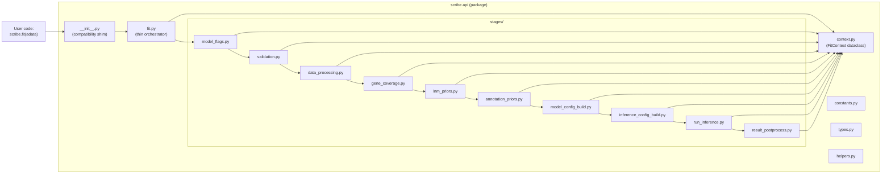
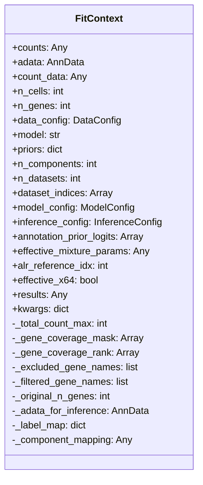

# `scribe.api` — Simplified Inference API

This package provides the user-facing entry point for SCRIBE inference
(`scribe.fit`). It wraps the full SCRIBE inference stack behind a single
function with flat keyword arguments and sensible defaults, so that most users
never need to construct `ModelConfig` or `InferenceConfig` objects directly.

---

## Table of Contents

1. [Architecture Overview](#architecture-overview)
2. [Pipeline Stages](#pipeline-stages)
3. [FitContext — The State Bag](#fitcontext--the-state-bag)
4. [Compatibility Shim (`__init__.py`)](#compatibility-shim-__init__py)
5. [File Inventory](#file-inventory)
6. [Data Flow Diagram](#data-flow-diagram)
7. [Stage Contract Reference](#stage-contract-reference)
8. [Extending the Pipeline](#extending-the-pipeline)
9. [Testing & Monkeypatch Targets](#testing--monkeypatch-targets)

---

## Architecture Overview

The original `api.py` was a single ~2,300-line file containing the monolithic
`fit()` function. This refactor partitions it into a **stage-oriented pipeline**
while preserving 100% backward compatibility for imports, monkeypatch targets,
and user-facing behavior.



### Design Principles

- **Thin orchestrator**: `fit.py` contains only the function signature,
  docstring, `FitContext` initialization, and sequential stage calls (~30 lines
  of logic). All domain logic lives in the stage modules.
- **Shared state bag**: Stages communicate through `FitContext`, a mutable
  dataclass. Each stage reads fields it needs and writes the fields it produces.
  No deeply nested function arguments.
- **Backward-compatible shim**: `__init__.py` re-exports every public symbol
  that existed on the old `scribe.api` module, including `_run_inference` for
  monkeypatch compatibility.

---

## Pipeline Stages

The `fit()` function executes stages in this order:

```mermaid
flowchart TD
    START([fit called]) --> S0

    S0["Stage 0: resolve_model_flags<br/>──────────────────<br/>Boolean flags → model string"]
    S0 --> S1

    S1["Stage 1: validate_inputs<br/>──────────────────<br/>Model/param/method validation<br/>Deprecated alias normalization"]
    S1 --> S2

    S2["Stage 2: process_data_and_datasets<br/>──────────────────<br/>Counts → JAX array<br/>Dataset indices<br/>Single-dataset downgrade"]
    S2 --> S2b

    S2b["Stage 2b: apply_gene_coverage_and_alr<br/>──────────────────<br/>Gene coverage filtering<br/>ALR reference resolution"]
    S2b --> S2c

    S2c{"LNM model?"}
    S2c -->|Yes| S2c1["Stage 2c-LNM: resolve_lnm_auto_priors<br/>──────────────────<br/>Auto-calibrate r_T/mu_T/phi_T"]
    S2c -->|No| S2c2
    S2c1 --> S2c2

    S2c2["Stage 2c-ann: build_annotation_priors<br/>──────────────────<br/>n_components inference<br/>Annotation logit matrix<br/>Auto-downgrade ≤1 class"]
    S2c2 --> S3

    S3["Stage 3: build_model_config<br/>──────────────────<br/>Preset builder call<br/>Expression anchor injection<br/>LNM/PLN VAE init injection"]
    S3 --> S4

    S4["Stage 4: build_inference_config<br/>──────────────────<br/>SVI/MCMC/VAE/Laplace config<br/>SVI→MCMC init strategy<br/>Float64 resolution"]
    S4 --> S5

    S5["Stage 5: dispatch_inference<br/>──────────────────<br/>Call _run_inference dispatcher"]
    S5 --> S6

    S6["Stage 6: postprocess_results<br/>──────────────────<br/>Attach metadata to results:<br/>gene coverage, annotations,<br/>total_count_max"]
    S6 --> DONE([return ctx.results])
```



---

## FitContext — The State Bag

`FitContext` is a `@dataclass` defined in `context.py` that threads mutable
state through the pipeline. It has four categories of fields:

| Category | Examples | Written by |
|----------|----------|------------|
| **Inputs** | `counts`, `adata`, `count_data`, `n_cells`, `n_genes`, `data_config` | Orchestrator + `data_processing` |
| **Evolving state** | `model`, `priors`, `n_components`, `model_config`, `inference_config` | Multiple stages |
| **Derived/cached** | `_total_count_max`, `_gene_coverage_mask`, `_label_map` | `data_processing`, `gene_coverage`, `annotation_priors` |
| **Pass-through kwargs** | `kwargs` dict | Orchestrator (set once) |

The `kwargs` dict stores every original `fit()` keyword argument so that stages
can access them without the orchestrator having to pass each one individually.
Stages that resolve or modify a kwarg (e.g., `expression_dataset_prior` after
single-dataset downgrade) write the new value back into `ctx.kwargs`.



---

## Compatibility Shim (`__init__.py`)

The `__init__.py` file makes `scribe.api` behave identically to the old
monolithic `api.py` module. It re-exports:

| Symbol | Source | Why re-exported |
|--------|--------|-----------------|
| `fit` | `.fit` | Main entry point; `scribe.__init__` imports `from .api import fit` |
| `VALID_MODELS` | `.constants` | Imported by `tests/models/families/test_lnm_factory.py`, `tests/models/families/test_pln_factory.py` |
| `VALID_PARAMETERIZATIONS` | `.constants` | Validation sets used by tests |
| `VALID_INFERENCE_METHODS` | `.constants` | Validation sets used by tests |
| `ScribeResults` | `.types` | Return-type alias |
| `_run_inference` | `..inference.dispatcher` | **14 test sites** patch `scribe.api._run_inference` |
| `build_config_from_preset` | `..inference.preset_builder` | Import compatibility |
| `process_counts_data` | `..inference.utils` | Import compatibility |

### Monkeypatch Protocol

Tests use `unittest.mock.patch("scribe.api._run_inference")` to mock out
inference. The shim imports `_run_inference` from `scribe.inference.dispatcher`
so the attribute lives on the `scribe.api` module object. The
`stages/run_inference.py` stage looks up `_run_inference` at **call time** via
`sys.modules["scribe.api"]` rather than binding it at import time, ensuring the
mock is honored.

---

## File Inventory

```
src/scribe/api/
├── __init__.py              # Compatibility shim (re-exports)
├── fit.py                   # Thin orchestrator (signature + docstring + stage calls)
├── context.py               # FitContext dataclass
├── constants.py             # VALID_MODELS, VALID_PARAMETERIZATIONS, etc.
├── types.py                 # ScribeResults type alias
├── helpers.py               # Pure utility functions shared across stages
├── README.md                # This file
└── stages/
    ├── __init__.py           # Package marker
    ├── model_flags.py        # Stage 0: boolean flags → model string
    ├── validation.py         # Stage 1: input validation
    ├── data_processing.py    # Stage 2: count data + dataset indices
    ├── gene_coverage.py      # Stage 2b: gene filtering + ALR reference
    ├── lnm_priors.py         # Stage 2c-LNM: auto-calibrate priors
    ├── annotation_priors.py  # Stage 2c-ann: annotation logits
    ├── model_config_build.py # Stage 3: build ModelConfig
    ├── inference_config_build.py  # Stage 4: build InferenceConfig + x64
    ├── run_inference.py      # Stage 5: dispatch inference
    └── result_postprocess.py # Stage 6: attach metadata to results
```

### Line Counts (approximate)

| File | Lines | Role |
|------|------:|------|
| `fit.py` | ~910 | Signature (140) + docstring (560) + body (30) + imports (70) |
| `model_config_build.py` | ~250 | Largest stage (preset builder delegation) |
| `inference_config_build.py` | ~280 | SVI/MCMC/VAE/Laplace branching |
| `gene_coverage.py` | ~210 | Coverage filtering + ALR |
| `data_processing.py` | ~175 | Count processing + dataset indexing |
| `annotation_priors.py` | ~140 | Annotation logit construction |
| `context.py` | ~130 | FitContext dataclass |
| `helpers.py` | ~130 | Shared utility functions |
| `model_flags.py` | ~120 | Boolean flag resolution |
| `validation.py` | ~100 | Input validation |
| `result_postprocess.py` | ~85 | Metadata attachment |
| `lnm_priors.py` | ~65 | LNM auto-prior calibration |
| `run_inference.py` | ~50 | Inference dispatch |
| Others | ~100 | constants, types, __init__ files |

---

## Data Flow Diagram

This diagram shows which stages produce and consume the key `FitContext` fields:

```mermaid
flowchart LR
    subgraph "Producers → Consumers"
        direction TB
        MF["model_flags"] -->|ctx.model| VAL["validation"]
        VAL -->|ctx.model| DP["data_processing"]
        DP -->|ctx.count_data<br/>ctx.adata<br/>ctx.n_cells/n_genes<br/>ctx.dataset_indices| GC["gene_coverage"]
        GC -->|ctx.count_data (filtered)<br/>ctx.alr_reference_idx<br/>ctx._gene_coverage_mask| LNM["lnm_priors"]
        LNM -->|ctx.priors| ANN["annotation_priors"]
        ANN -->|ctx.annotation_prior_logits<br/>ctx.n_components<br/>ctx._label_map| MCB["model_config_build"]
        MCB -->|ctx.model_config| ICB["inference_config_build"]
        ICB -->|ctx.inference_config<br/>ctx.effective_x64| RI["run_inference"]
        RI -->|ctx.results| RP["result_postprocess"]
    end
```

---

## Stage Contract Reference

Each stage module exports a single public function with signature `(ctx:
FitContext) -> None`. The stage mutates `ctx` in place.

| Stage | Function | Reads | Writes |
|-------|----------|-------|--------|
| 0 | `resolve_model_flags` | `model`, `priors`, `kwargs[variable_capture, zero_inflation]` | `model` |
| 1 | `validate_inputs` | `model`, `kwargs[parameterization, inference_method, svi_init, model_config, inference_config]` | `model` |
| 2 | `process_data_and_datasets` | `counts`, `kwargs[cells_axis, layer, dataset_key, n_datasets, ...]` | `count_data`, `adata`, `n_cells`, `n_genes`, `data_config`, `dataset_indices`, `n_datasets`, `_total_count_max`, `_original_n_genes`, `_adata_for_inference` |
| 2b | `apply_gene_coverage_and_alr` | `count_data`, `n_genes`, `adata`, `dataset_indices`, `model`, `kwargs[gene_coverage, alr_reference_idx]` | `count_data`, `n_genes`, `alr_reference_idx`, `_gene_coverage_mask`, `_gene_coverage_rank`, `_excluded_gene_names`, `_filtered_gene_names`, `_adata_for_inference` |
| 2c-LNM | `resolve_lnm_auto_priors` | `model`, `count_data`, `priors`, `kwargs[parameterization]` | `priors` |
| 2c-ann | `build_annotation_priors` | `adata`, `n_cells`, `n_components`, `kwargs[annotation_key, ...]` | `annotation_prior_logits`, `n_components`, `effective_mixture_params`, `_label_map`, `_component_mapping` |
| 3 | `build_model_config` | `model`, `priors`, `n_components`, `n_datasets`, `alr_reference_idx`, `effective_mixture_params`, `count_data`, `_component_mapping`, many kwargs | `model_config` |
| 4 | `build_inference_config` | `model_config`, `n_cells`, many kwargs | `inference_config`, `effective_x64` |
| 5 | `dispatch_inference` | `model_config`, `count_data`, `inference_config`, `_adata_for_inference`, `n_cells`, `n_genes`, `data_config`, `annotation_prior_logits`, `dataset_indices`, `effective_x64`, `kwargs[seed]` | `results` |
| 6 | `postprocess_results` | `results`, `_total_count_max`, `_gene_coverage_mask`, `_gene_coverage_rank`, `_excluded_gene_names`, `_filtered_gene_names`, `_original_n_genes`, `_adata_for_inference`, `adata`, `n_genes`, `_label_map`, `_component_mapping`, `kwargs[gene_coverage]` | `results` (metadata attrs) |

---

## Extending the Pipeline

To add a new stage:

1. Create `stages/my_new_stage.py` with a single function `def my_new_stage(ctx:
   FitContext) -> None`.
2. Add any new fields to `FitContext` in `context.py`.
3. Import and call the stage in `fit.py` at the appropriate position in the
   pipeline.
4. Document the reads/writes contract in the module docstring header.

To add a new re-exported symbol (for backward compatibility):

1. Import it in `__init__.py`.
2. Add it to `__all__`.

---

## Testing & Monkeypatch Targets

### Key Monkeypatch Targets

| Patch target | Test files | Purpose |
|-------------|-----------|---------|
| `scribe.api._run_inference` | `test_x64_precision.py`, `test_gene_coverage.py`, `test_svi_mcmc_init.py` (14 sites total) | Mock out inference to test config assembly |
| `scribe.api.VALID_MODELS` | `test_lnm_factory.py`, `test_pln_factory.py` | Import validation sets |

### Why `sys.modules` Lookup in `run_inference.py`

`stages/run_inference.py` resolves `_run_inference` at **call time** via
`sys.modules["scribe.api"]._run_inference` rather than binding it at import time
with `from ... import _run_inference`. This is because
`unittest.mock.patch("scribe.api._run_inference")` replaces the attribute on the
`scribe.api` module object. An import-time binding would create a local name
that points to the original function, making the mock invisible to the calling
code.

### Running API-Specific Tests

```bash
# All tests that exercise the api/ package directly
python -m pytest tests/integration/test_x64_precision.py \
                 tests/core/test_gene_coverage.py \
                 tests/inference/test_svi_mcmc_init.py \
                 tests/models/families/test_lnm_factory.py \
                 tests/models/families/test_pln_factory.py \
                 tests/core/test_lnm_stability.py \
                 tests/core/test_annotation_prior.py \
                 -v
```
